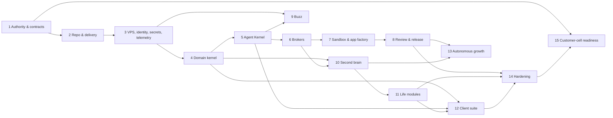

# FRANK Architecture Overview

FRANK is a modular system organised around a durable centre with replaceable edges. This document describes the canonical data stores, the key broker and port seams, and how every fast-moving component plugs into stable contracts.

## The durable centre

The defining principle (FRANK-§29) is **stability at the core, replaceability at the edges**:

**Canonical, durable truth:**

- personal and build data (PostgreSQL);
- work and workflow state;
- policy and identity;
- source provenance and accepted knowledge;
- evidence and audit logs;
- simple human control through the browser, PWA, Tauri shell, and extension.

**Everything else is pluggable:**

- Models route through the Model Broker (replaceable providers, harnesses, and fallback pools).
- Coding and general agents route through the Harness Broker (ACP-capable, multiple harnesses).
- Tools and connectors route through the Capability Broker (signed capabilities, declared authority).
- Skills are versioned instruction packages, not ambient authority.
- Memory engines sit behind the `MemoryProjection` port (Postgres/pgvector is canonical; Cognee and others are rebuildable projections).
- Buzz is a collaboration relay, never canonical state.
- Customer products are later isolated cells with their own data and policy.

This separation means FRANK remains functional when any single provider, model family, or harness vendor changes, and new AI capacity can be evaluated without rewriting the core.

## Architectural shape (§5.1)

```
Steven (Browser · Mobile Web · Desktop · Extension)
         ↓
Edge and Identity (TLS · SSO · Passkeys · Rate Limits)
         ↓
    FRANK Web / BFF
         ↓
    FRANK Domain API
         ↓
    ┌────────────────────────────────────────────┐
    │ Agent Kernel  │ Domain Modules  │ Broker │
    └────────────────────────────────────────────┘
         ↓                ↓               ↓
  Durable Workflow  PostgreSQL    Harness Broker
   (Temporal)      Object Store    Model Broker
                   Transactional   Capability Broker
                   Outbox          Sandbox Provider
         ↓
   Event Transport (NATS JetStream)
         ↓
┌─────────────────────────────────────────────┐
│ Search/Vector/Graph Projections             │
│ Analytics Projections                       │
│ Buzz Collaboration Relay                    │
└─────────────────────────────────────────────┘
```

## Key broker and port seams

Every broker and port is a stable contract that allows implementations to change without affecting the rest of the system.

| Broker / Port | Governs | §6 Contract | ADR | Status |
|---|---|---|---|---|
| **Harness Broker** | Agent selection, lifecycle, checkpointing, cross-harness resumption | §6.2 `AgentHarnessAdapter` | ADR-001, ADR-008 | Slice 2 |
| **Model Broker** | Model selection, capability routing, provider pools, fallback, cost | §6.3 `ModelProviderAdapter`, `ModelRoutePolicy` | ADR-009 | Slice 1 |
| **Capability Broker** | Tool and connector authority, scoped credentials, idempotency | §6.5 `ConnectorAdapter` | ADR-008 | Slice 1 |
| **Sandbox Provider** | Execution boundary for untrusted code, microVM pools, resource limits | §6.12 `SandboxProvider` | ADR-013 | Slice 2 |
| **Deployment Provider** | Preview, canary, production promotion, traffic, rollback | §6.11 `DeploymentProvider` | ADR-014 | Slice 4 |
| **MemoryProjection** | Knowledge search, semantic retrieval, rebuild semantics | §6.6 `MemoryProjection` | ADR-010, ADR-019 | Slice 3 |
| **ObjectStore** | Content-addressed immutable storage, versioning, retention, deletion | §6.13 `ObjectStore` | ADR-003 | Slice 1 |
| **WorkflowPort** | Durable run state, retries, signals, timers, compensation | ADR-005 | Temporal adapter | Slice 1 |
| **BuzzPort** | Human-agent rooms, signed events, collaboration, not canonical state | §4.13, §6.10 events | ADR-011 | Slice 6 |

## Core data contracts

These schemas are frozen in the listed slice and never fork:

| Schema | Purpose | Slice | Governs |
|---|---|---|---|
| `frank.screen/v1` (§3.8) | User-facing routes, layouts, commands, state | 0 | Client navigation, authorization checks, deep linking |
| `frank.module/v1` (§6.1) | Module manifest, dependencies, data scopes | 0 | Module registry, build order, permission checking |
| `EventEnvelope` (§6.7) | Business event format, correlation, causation | 0 | Event-driven state changes, audit, replay |
| `EvidenceManifest` (§6.8) | Work artifacts, tests, reviews, evidence | 4 | Evidence-ready promotion, rollback, recovery |
| `PolicyDecision` (§6.9) | Authorization, standing policies, actions | 1 | Action boundary enforcement, audit |
| `DataRouteDecision` (§2.3) | Classification, trust, redaction, provider routing | 1 | Privacy enforcement, scope isolation |
| `ModuleManifest` (§6.1) | Module capabilities, dependencies, health checks | 0 | Package seams, composition, pack support |

## Workstream dependency graph (§21)



**Key ordering:**

- Workstreams 1–2 establish authority and toolchain.
- Workstream 3 stands up infrastructure.
- Workstreams 4–5 build the kernel and domain API.
- Workstream 6 adds brokers; only then does cross-harness work become possible.
- Workstream 7 (execution boundary) is gated by Workstream 6, because §15.4 forbids running agent-written code anywhere else.
- Workstreams 9–15 are agent-built using the machinery from Workstreams 1–8.

**Two acknowledged relaxations:**

- Slice 1 ships a minimal client (`/today`, `/ask`, `/system`) while Workstream 12's full suite lands in Slice 6 (W12 explicitly permits this).
- Within Slice 2, the W7 execution substrate precedes the W6 brokers, because harness-written code cannot run anywhere else.

## Slice structure and exit gates

| Slice | Outcome | Key contracts frozen | Run count |
|---|---|---|---|
| **T0** | Legacy inventory backed up safely | None (parallel track) | 5–15 |
| **0** | Contracts validate, CI refuses violations, environments defined | Schemas, registry, ADRs | 30–60 |
| **1** | Capture → durable run → Today, full provenance | `WorkItem`, source envelope, `DurableRunState` | 70–130 |
| **2** | Reroute on provider death, harness failure without state loss | `HarnessAdapter`, `ModelRoute`, `SandboxProvider` | 50–90 |
| **3** | Source-grounded Q&A, correction sticks, deletion retracts | `Source`, `Assertion`, `MemoryProjection` | 50–90 |
| **4** | **Inflection:** Issue → overnight build → evidence pack ready | Evidence seals, review lattice, app factory | 80–150 |
| **5** | Life modules (calendar, email, contacts, etc.) through Slice 4's machinery | Per-module specs | 100–200 |
| **6** | Five-destination product + Buzz collaboration | Client suite, Buzz events | 100–180 |
| **7** | Research, deal scout, autonomous growth overnight | Evals, candidate scoring | 50–100 |
| **8** | Production operation, cutover from `frank.fail` | Runbooks, recovery drills | 60–120 |

## How to read this architecture

1. **For dependency questions:** See the workstream graph. If a change touches multiple slices, it is likely too large. See the delivery plan's "run contract" for the right size.
2. **For schema questions:** The contract tables above list which §6 contract governs each domain. Read that section of the specification.
3. **For why a technology was chosen:** See the ADR index in `/docs/adr/`. Every major decision has an ADR with context, alternatives, and exit triggers.
4. **For requirement implementation:** See `/docs/requirements/registry.json`. Every requirement ID links to its owner, implementation, test, and status.
5. **For operational runbooks and failure recovery:** See `/docs/runbooks/`. These are exercises at each slice gate and provide recovery procedures for production incidents.

The specification (§5.1, §29) and ADRs are the source of truth. This document is a summary for contributors.
