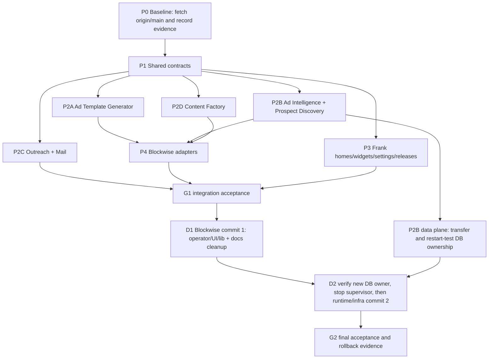

# Blockwise → Frank tool migration runbook

Status: executable migration runbook; documentation only

Audience: a low-context implementation agent working in the Frank repository,
the canonical Blockwise checkout, or the canonical VPS checkout

This document is mechanical. Execute the named checks and actions in order.
Do not invent a new product boundary, rename a capability, delete an
unlisted path, or substitute a provider. If an instruction cannot be executed
exactly, stop at the named stop condition and report the evidence.

## 0. Authority, evidence, and non-negotiable outcome

### 0.1 Authority order

Read these files before touching either repository:

1. Frank AGENTS.md, then docs/PROJECT.md.
2. Blockwise AGENTS.md, then CLAUDE.md.
3. Blockwise docs/plans/PRODUCT-REBUILD.md from origin/main, not from an
   unverified local working tree.

At the time this runbook was written, the authoritative Blockwise revision was
ae89ca5847e5389db120b686c202cf90cb42c8b5 (origin/main). The local
C:\Dev\Blockwise checkout was a detached, clean checkout after fetching, but
the reported canonical VPS checkout /projects/blockwise has current
uncommitted deletions under frank/template-factory/**. Treat those VPS
deletions as user work. Do not overwrite, restore, stage, or delete them from
an agent. Reconcile the VPS state only with the operator who owns that
checkout.

The requested path docs/plans/PRODUCT-REBUILD.md was absent from the stale
pre-fetch C:\Dev\Blockwise file inventory. It exists in the fetched
origin/main at the revision above. Any agent that sees the old absence must
fetch first and must not proceed from the stale inventory.

### 0.2a Verified live-state rollback evidence

The following live-state evidence was verified on 2026-08-14 and is mandatory
for this migration:

- `blockwise-research-db` is healthy.
- It is compose-owned by
  `/srv/blockwise/release-6d7f4f9/infra/coolify/docker-compose.research.yml`.
- Only the database container is currently running from that research stack.
- A fresh, non-destructive dump exists at
  `/srv/blockwise/backups/research/frank-migration-research-20260814T082207Z.dump`.
- Its matching checksum is at
  `/srv/blockwise/backups/research/frank-migration-research-20260814T082207Z.dump.sha256`.
- The checksum-verified counts manifest is at
  `/srv/blockwise/backups/research/frank-migration-research-20260814T082207Z.counts`.
- Its checksum file is at
  `/srv/blockwise/backups/research/frank-migration-research-20260814T082207Z.counts.sha256`.
- The dump covers 39 `research`/`research_archive` tables and 4,977,532 total
  rows.

This dump, its matching `.sha256`, its `.counts` manifest, and its matching
`.counts.sha256` are the mandatory rollback artifact. Never commit, copy,
attach, or expose the dump, checksum, manifest contents, or row data in Git, a
release, a trace, or a public Frank endpoint. Refer to the absolute paths only
in operator evidence.

Supabase research schemas were already dropped after the earlier verified VPS
cutover. Do not attempt to migrate, recreate, or re-drop those schemas. Any
remaining migration work concerns the healthy VPS research database and its
runtime ownership only.

### 0.3 Final ownership law

- Frank Window displays and configures. Frank owns tool homes, safe widgets,
  connection status/configuration views, release views, settings forms, and explicit state
  rendering. Frank does not become a second brain.
- Hermes executes models, tools, skills, schedules, provider calls, memory,
  policy, approvals, traces, and autonomous work. Hermes has the one VPS
  profile default.
- Reusable mini apps live in apps/window/tools/<tool-id>/. They are visual
  control surfaces and adapters to Hermes, not independent runtimes.
- Blockwise is the customer product. It consumes only immutable, sanitized,
  released outputs through explicit adapters. It must not scrape, generate
  templates, write blogs, or own the operator research runtime.
- Existing customer transaction and lead lifecycle mail remains in Blockwise
  until an explicitly tested replacement exists. Existing Mautic campaign and
  segment ownership, Resend delivery, Accounts, Connections, the Frank widget
  runtime, chat, and Hermes are not duplicated. Tool settings and home
  manifests use only a non-secret `connection_id` plus the required
  capability; OpenBao remains entirely behind Connections, and vault/provider/
  credential references never appear in those Tool contracts.

### 0.4 Named capability destinations

Use these exact Frank tool IDs and directories. Create them only in a later
implementation task; this runbook does not create them:

Each Tool directory has one canonical dashboard manifest at `home.json`.
`default_widget_ids` remains empty (`[]`) until shared widget IDs land; do not
invent Tool-specific default widget IDs.

| Tool ID | Frank mini-app directory | Hermes responsibility | Blockwise result, if any |
| --- | --- | --- | --- |
| ad-template-generator | apps/window/tools/ad-template-generator/ | Build, review, version, and release sanitized template packs | Customer AdStudio consumes released template packs |
| ad-intelligence | apps/window/tools/ad-intelligence/ | Collect/classify/analyse evidence and publish approved read models | Optional customer Ad Radar/read-model adapter |
| prospect-discovery | apps/window/tools/prospect-discovery/ | Discover, dedupe, enrich, verify, and release prospect outputs | No direct customer write; explicit approved adapter only |
| outreach | apps/window/tools/outreach/ | Plan and execute outreach commands under policy and trace | Customer lead lifecycle remains authoritative in Blockwise |
| mail | apps/window/tools/mail/ | Show/configure mailbox workflows and issue approved commands | Mautic/Resend remain provider owners; transaction mail is protected |
| content-factory | apps/window/tools/content-factory/ | Generate, QA, approve, and release blog/content artifacts | Blockwise may consume completed blog releases through an adapter |

outreach has no dedicated current outreach/ directory in the canonical
Blockwise path inventory. Do not infer a deletion. Treat existing lead,
provider, and customer-operations paths as KEEP until a concrete importer and
consumer contract is recorded.

## 1. Required working state and evidence capture

### 1.1 Prepare the Frank checkout

Run from the Frank checkout:

```bash
git status --short --branch
git fetch origin main
git log -1 --oneline
test -f AGENTS.md
test -f docs/PROJECT.md
test -f apps/window/server.py
test -f apps/window/home_platform.py
```

Expected evidence:

- Frank has no unrelated uncommitted changes.
- apps/window is the only application source.
- apps/window/server.py is the Flask transport/static entry point.
- apps/window/home_platform.py is the home/widget/connection metadata
  boundary.

### 1.2 Prepare the canonical Blockwise checkout

Run from the canonical Blockwise checkout. On a VPS this is
/projects/blockwise; on a local mirror it may be C:\Dev\Blockwise.

```bash
git status --short --branch
git fetch origin main
git show-ref --verify refs/remotes/origin/main
git rev-parse origin/main
git show origin/main:AGENTS.md
git show origin/main:docs/plans/PRODUCT-REBUILD.md
git ls-tree -r --name-only origin/main > /tmp/blockwise-origin-main-paths.txt
```

Expected revision: ae89ca5847e5389db120b686c202cf90cb42c8b5, or a newer
explicitly recorded origin/main revision. Expected evidence includes
docs/plans/PRODUCT-REBUILD.md and the KEEP/DELETE lists in this runbook.

For the live research database, verify metadata without dumping row data:

```bash
docker ps --format '{{.Names}}\t{{.Status}}' | grep blockwise-research-db
docker inspect blockwise-research-db --format '{{json .Config.Labels}}'
sha256sum -c /srv/blockwise/backups/research/frank-migration-research-20260814T082207Z.dump.sha256
sha256sum -c /srv/blockwise/backups/research/frank-migration-research-20260814T082207Z.counts.sha256
echo "Approved aggregate: 39 research/research_archive tables; 4,977,532 rows."
```

Expected evidence is a healthy `blockwise-research-db`, the compose owner
`/srv/blockwise/release-6d7f4f9/infra/coolify/docker-compose.research.yml`,
only that database running from the research stack, a valid checksum, and a
valid counts-manifest checksum. Record only the approved aggregate of 39
research/research_archive tables and 4,977,532 rows. Do not run `pg_dump`,
`pg_restore`, `COPY`, unrestricted `SELECT`, or schema recreation as part of
discovery; the fresh dump is already complete.

If the checkout reports uncommitted frank/template-factory/** deletions:

```bash
git status --short -- frank/template-factory
git diff --name-status -- frank/template-factory
```

Record the output. Do not run git restore, git checkout, git reset,
git clean, or any broad delete in that checkout.

### 1.3 Discovery checks before any move or delete

```bash
git grep -n -i -E 'adstudio|ad radar|research-runtime|content-engine|operator/email|outreach|prospect|enrich|resend|lead-lifecycle' origin/main -- ':!public/**'
git grep -n 'createResearchServiceClient' origin/main -- 'src/**'
git grep -n 'sendOperatorEmail' origin/main -- 'src/**'
git grep -n -E 'blockwise-image-|blockwise-listing-scraper' origin/main -- 'src/**' 'tests/**' 'hermes/**'
```

Save the output in the task report. A path is not eligible for deletion until
all importers and consumers are accounted for.

## 2. Current inventory and disposition

Disposition meanings:

- KEEP: remains authoritative in Blockwise or Frank. Do not move or delete it
  as part of this migration.
- MOVE / ADAPT: replace the capability with a Frank mini-app plus Hermes
  execution and an explicit released-output adapter. Preserve behavior and
  evidence until the adapter is accepted.
- DELETE AFTER CUTOVER: remove only after the replacement is live in the
  target environment, all importers are gone, and the acceptance gate passes.
- DATABASE ARCHIVE: preserve migration history; archive non-empty runtime
  data into legacy_archive after row counts and export checks. Never delete
  schema history.

### 2.1 Frank current paths

| Current path | Disposition | Mechanical instruction |
| --- | --- | --- |
| apps/window/server.py | KEEP | Preserve the thin Flask transport and Hermes proxy. Add only documented adapter routes in a separate implementation task. |
| apps/window/home_platform.py | KEEP | Preserve homes, widgets, connections, scope checks, revision preconditions, and explicit empty/error states. |
| apps/window/web/index.html | KEEP | Preserve the single Window shell. Tool surfaces open inside the existing content pane. |
| apps/window/web/js/app.js | KEEP / ADAPT | Add tool navigation only through the existing registry/home contracts; do not build a second application shell. |
| apps/window/web/js/registry.js | KEEP | Use the versioned widget catalog; do not create a second widget runtime. |
| apps/window/web/js/widgets.js | KEEP / ADAPT | Register tool summaries and status views only; execution goes to Hermes. |
| apps/window/web/js/homes.js | KEEP / ADAPT | Use the existing entity-home flow and exact tool manifest contract in Appendix A. |
| apps/window/Dockerfile, docker-compose.yml, Caddyfile, deploy.sh | KEEP | No deployment in this task. Do not patch production files in place. |
| apps/window/tools/** | MOVE / ADAPT target | Put reusable mini-app views/adapters here, one directory per named tool. No local agent loop, scheduler, database, secret, or provider runtime. |

### 2.2 Ad Template Generator

| Current path | Disposition | Mechanical instruction |
| --- | --- | --- |
| frank/template-factory/** | MOVE / ADAPT | Treat as Frank-owned source material and service input. Preserve the reported VPS uncommitted deletions. Adapt its output to an immutable sanitized TemplatePack release consumed by Blockwise. |
| packages/ad-template-pack-contract/** | MOVE / ADAPT | Make this the contract reference for the Frank release and Blockwise import adapter. Do not allow credentials, source customer data, or mutable provider state in a public pack. |
| hermes/skills/adstudio-template-builder-v2/SKILL.md | MOVE / ADAPT | Keep the template-builder operating rules in Hermes/Frank. Do not reintroduce the deleted legacy flat-clone path. |
| src/app/(customer)/ad-studio/** | KEEP | Customer chooses released packs, edits finished ads, saves PNGs, and publishes to Meta. |
| src/app/api/adstudio/** | KEEP | Customer AdStudio API remains Blockwise-owned. It may consume only the released pack adapter. |
| src/app/api/internal/adstudio/template-packs/import/route.ts | KEEP / ADAPT | Change only the import boundary needed to validate immutable Frank releases. Keep customer persistence and workspace/RLS behavior. |
| src/lib/adstudio/{import-pack,pack-gallery,client-pack,types}.ts | KEEP / ADAPT | Consume the sanitized pack schema and provenance/checksum fields. Do not move customer editing or publishing into Frank. |
| src/lib/adstudio/** | KEEP | Preserve the customer AdStudio surface and its tested provider/publish behavior unless a specific importer is proven to belong to the generator. |
| public/adstudio-fixtures/**, public/adstudio-inputs/**, public/adstudio-templates/**, public/adstudio-thumbnails/** | KEEP / ADAPT | Keep only customer-safe released/sample assets. Do not publish private source ads or PII. Verify checksums and provenance before replacing assets. |
| supabase/migrations/*adstudio*, *template_pack* | KEEP / DATABASE ARCHIVE only where runtime rows are retired | Never delete migration files. Archive deprecated rows only after counts and an approved archive migration. |

The canonical rebuild plan records the old legacy AdStudio flat-clone paths as
already gone. Do not recreate any of these: src/lib/adstudio/template-gallery/,
reference-clone.ts, clone-generation.ts, clone-campaign.ts,
clone-creative.ts, clone-regions.ts, region-edit.ts,
rasterize-reference.ts, generate-template-campaign.ts, or the other
legacy paths listed in section (c) of docs/plans/PRODUCT-REBUILD.md.

### 2.3 Ad Intelligence / Ad Radar

| Current path | Disposition | Mechanical instruction |
| --- | --- | --- |
| src/app/(operator)/operator/research/** | DELETE AFTER CUTOVER | Remove the operator research console after the Frank/Hermes tool and release/read-model checks pass. |
| src/app/api/operator/research/** | DELETE AFTER CUTOVER | Remove all 27 listed operator research routes only after importers and health/referrer edits pass. |
| src/components/operator/{research-console,research-console-styles,research-drain-dashboard,operator-assistant}* | DELETE AFTER CUTOVER | Delete only after the operator route is gone and tests are updated. |
| src/lib/operator/{hermes-assets,assistant,postcode-refresh}.ts | DELETE AFTER CUTOVER | Delete only after B1 importers are gone; do not delete shared customer-ops libraries. |
| src/lib/research/{service,drain-status,census-sources,ingest}.ts | MOVE / ADAPT or DELETE AFTER CUTOVER | service.ts has external importers in health and paid-service watchdog; refactor those importers first. The other three are B1-only after confirming the postcode refresher dependency. |
| src/app/api/health/research/route.ts | DELETE AFTER CUTOVER | Delete or repoint only with the research service importer refactor. Preserve authenticated health semantics for remaining services. |
| src/app/api/alerts/paid-service-watchdog/route.ts | KEEP / ADAPT | Remove its research-service dependency before deleting src/lib/research/service.ts. Do not remove paid-service alerting. |
| hermes/tools/research-runtime/** | DELETE AFTER CUTOVER | Stop the supervisor process first; then remove runtime source and binaries in the second Blockwise removal commit. |
| hermes/tools/meta-library-capture/** | DELETE AFTER CUTOVER | Same supervisor and second-commit gate as research-runtime. |
| infra/hermes/Dockerfile, infra/hermes/main-wrapper.sh | MOVE / ADAPT then DELETE AFTER CUTOVER | Remove only research-runtime wiring; preserve remaining Hermes image/runtime behavior. |
| infra/coolify/docker-compose.research.yml | DELETE AFTER CUTOVER | Remove after supervisor shutdown and VPS smoke check. |
| hermes/skills/{blockwise-ad-collector,blockwise-ad-classifier,blockwise-agent-census,blockwise-coverage-auditor,blockwise-defect-investigator,blockwise-location-ad-search,blockwise-page-resolver,blockwise-operator-chat} | MOVE / ADAPT then DELETE AFTER CUTOVER | Re-home only the capabilities needed by the Frank/Hermes Ad Intelligence tool. Delete obsolete research-ops skills after parity evidence. |
| src/app/(customer)/ad-radar/** | KEEP | Optional customer Ad Radar remains a customer read surface. It must read the customer-safe projection, not the private research database. |
| src/app/api/research/{ad-radar,ads,advertisers,locations,swipe-file}/** | KEEP | Keep only customer-safe read APIs listed in the canonical plan. No operator scraper or private research writes. |
| src/app/api/research/{audit,local-ad-radar}/** | KEEP | Preserve the customer property/suburb and optional local read-model behavior. Verify PII and workspace scope. |
| src/lib/research/{public-ad-radar,ad-radar-*,advertiser-autocomplete,audit-suggestions,brand-pack-suburb,customer-ad-library-pages,customer-meta-card,suburb-report-insights,ad-audit,ad-library-api,normalise,hash,meta-official-api,schemas}.ts | KEEP | These are customer-safe read-model libraries in the canonical plan. Do not route them to private VPS research state. |
| supabase/migrations/20260728074225_customer_ad_radar_read_model.sql | KEEP | It defines the customer projection contract. Preserve it even if the feature is optional or disabled at launch. |
| supabase/migrations/20260730021835_launch_disable_ad_radar.sql | KEEP | Preserve feature shutdown history and flags; do not interpret disabled as permission to delete the read model. |
| tests/ad-radar-*.test.ts, tests/public-ad-radar.test.ts, tests/performance-read-models.test.ts | KEEP | Keep customer/read-model coverage. B1-only accuracy/purge tests are handled below. |
| tests/research-engine/**, tests/ad-radar-accuracy-audit.{mjs,ts}, tests/research-inactive-purge.test.ts | DELETE AFTER CUTOVER | Delete or move only with the research runtime and operator surface. |
| scripts/research/** | MOVE / ADAPT | This includes enrichment and research scripts. Re-home execution under Hermes; retain evidence/data migration scripts until counts, exports, and adapters are accepted. |

### 2.4 Prospect Discovery & Enrichment

The canonical repository has no single prospect-discovery/ product folder.
The current evidence is distributed across:

| Current path | Disposition | Mechanical instruction |
| --- | --- | --- |
| scripts/research/discover-agents-missing-email.mjs | MOVE / ADAPT | Re-home as a Hermes command behind the prospect-discovery tool. Emit sanitized, versioned prospect candidates; do not write customer lead lifecycle state directly. |
| scripts/research/enrich-agent-emails-exa.mjs | MOVE / ADAPT | Preserve source attribution, validation, revert flags, and AU attribution checks in the Hermes artifact. No raw provider token or secret in output. |
| scripts/research/verify-agent-email-enrichment.mjs | MOVE / ADAPT | Make verification a QA gate before release. Failed or suspicious enrichment is not releasable. |
| scripts/research/enrichment-stats.mjs | MOVE / ADAPT | Expose counts as a traced Hermes result or Frank status view, not as a second dashboard database. |
| scripts/research/cleanup-enrichment-v2.mjs | MOVE / ADAPT | Keep as an operator repair command until all historical enrichment is reconciled. Require dry-run/count evidence before writes. |
| scripts/research/cleanup-foreign-tld-emails.mjs | MOVE / ADAPT | Preserve the revert behavior and its audit metadata. Run only through Hermes with an explicit command and trace. |
| scripts/lib/email-validation.mjs | MOVE / ADAPT | Reuse or port the validation contract in the Hermes tool. Do not duplicate customer transaction-mail validation. |
| src/lib/leads/**, src/app/api/leads/**, customer leads pages/components | KEEP | Customer lead identity, quality, dedupe, export, and lifecycle remain Blockwise-owned. |
| src/lib/providers/{lead-delivery-queue,lead-delivery-worker,meta-leads,meta-leads-queue,meta-leads-worker}.ts | KEEP | Durable customer/provider lead delivery remains in Blockwise’s existing worker boundary. |
| worker/** | KEEP | The canonical plan explicitly keeps the provider/meta/activation worker. Do not move or delete it as part of research migration. |

### 2.5 Outreach

Outreach is a Hermes-executed tool surface, not a license to duplicate
Blockwise lead or mail systems.

| Current path | Disposition | Mechanical instruction |
| --- | --- | --- |
| apps/window/tools/outreach/ | MOVE / ADAPT target | Display audience, evidence, approval, schedule, and outcome state. Send commands to Hermes. |
| src/lib/leads/**, src/app/(customer)/leads/**, src/app/api/leads/** | KEEP | Do not replace customer lead lifecycle or its workspace/RLS rules. |
| src/lib/providers/lead-delivery-*.ts, src/lib/providers/meta-leads*.ts | KEEP | These are customer/provider delivery paths. Any future outreach adapter must call an explicit supported boundary. |
| src/app/api/integrations/meta/publish-plans/** | KEEP | Meta publish and lead sync remain customer product behavior. |
| src/app/(operator)/operator/customers/**, src/lib/operator/customers.ts | KEEP | Customer operations remain Blockwise-owned. |

If an agent finds a real current outreach importer, add it to the inventory
before editing. If no importer is found, record “no dedicated current path;
no deletion performed.”

### 2.6 Mail

| Current path | Disposition | Mechanical instruction |
| --- | --- | --- |
| src/app/(operator)/operator/email/page.tsx | DELETE AFTER CUTOVER | Delete the mailbox UI after replacement status/command views are accepted. |
| src/app/api/operator/email/route.ts, src/app/api/operator/email/[id]/route.ts | DELETE AFTER CUTOVER | Delete the mailbox API after importers and operator navigation are gone. |
| src/components/operator/email-console.tsx | DELETE AFTER CUTOVER | Delete with the console. |
| src/lib/operator/email-service.ts | KEEP | It has customer importers: src/app/suburb/[postcode]/actions.ts and src/lib/notify/demo-request-email.ts. Keep until both are refactored and tested. |
| src/app/suburb/[postcode]/actions.ts | KEEP / ADAPT | Protect sendOperatorEmail behavior while removing any dependency on the retired console. |
| src/lib/notify/demo-request-email.ts | KEEP / ADAPT | Protect demo-request notification behavior. |
| src/lib/email/resend-client.ts | KEEP | Resend remains the delivery provider; do not create a second Resend client in Frank or Hermes. |
| src/lib/email/lead-lifecycle.ts | KEEP | Transaction and lead lifecycle email remains Blockwise-owned until an explicit replacement is accepted. |
| src/app/api/operator/email/** tests and tests/operator-email-service.test.ts | ADAPT | Retain tests for the kept library/importers; remove only console-specific assertions. |
| apps/window/tools/mail/ | MOVE / ADAPT target | Show/configure mail workflows and provider status. Do not store credentials, send directly, or duplicate Mautic campaigns/segments or Resend delivery. |

### 2.7 Content Factory

| Current path | Disposition | Mechanical instruction |
| --- | --- | --- |
| src/app/(operator)/operator/content-prompts/page.tsx | DELETE AFTER CUTOVER | Move prompt controls to Hermes/Frank settings and release views before deletion. |
| src/app/(operator)/operator/content-runs/page.tsx | DELETE AFTER CUTOVER | Replace with the Frank Content Factory home and Hermes run records. |
| src/app/(operator)/operator/content-runs/[id]/page.tsx | DELETE AFTER CUTOVER | Preserve review, approval, trace, and release evidence in Hermes/Frank. |
| src/app/api/operator/content-prompts/** | DELETE AFTER CUTOVER | Remove after settings revision and Hermes command/event checks pass. |
| src/app/api/operator/content-runs/** | DELETE AFTER CUTOVER | Remove after completed-release adapter checks pass. |
| src/components/operator/content-runs/** | DELETE AFTER CUTOVER | Delete with the operator content surface. |
| src/lib/content-engine/{contracts,index,queue,repository}.ts | MOVE / ADAPT | Preserve contract, queue, and repository behavior in Hermes. Do not leave a second Blockwise content runtime. |
| tests/content-engine/** | MOVE / ADAPT | Port contract and queue tests to the Hermes tool; retain proof of idempotency and release immutability. |
| hermes/skills/{blockwise-blog-editor,blockwise-blog-formatter,blockwise-blog-writer,blockwise-content-run-orchestrator,blockwise-content-strategist,blockwise-topic-researcher,blockwise-seo-schema-builder,blockwise-social-post-generator,blockwise-image-brief-writer,blockwise-image-generator,blockwise-image-reviewer} | MOVE / ADAPT | Re-home as Content Factory skills. Verify image skills before deleting because image generation may serve customer AdStudio. |
| hermes/skills/{blockwise-instant-form-generator,blockwise-lead-ad-generator,blockwise-page-builder,blockwise-model-router,blockwise-prompt-manager,blockwise-listing-scraper} | KEEP pending importer audit | Do not delete from the B2 sweep. Check customer lead/product paths; src/lib/adstudio/listing-extract.ts imports listing-scraper output types. |
| apps/window/tools/content-factory/ | MOVE / ADAPT target | Display runs, evidence, QA, approval, schedules, and released artifacts. Hermes executes. |
| src/app/guides/**, src/app/suburb/**, customer content routes | KEEP | These are customer/public product surfaces unless a separate importer audit proves otherwise. |

### 2.8 Shared capabilities to implement once

Implement these as shared Hermes/Frank contracts, not per-tool duplicates:

- Per-tool prompt, model, style, threshold, schedule, and project-pack
  settings, each stored as a revision. Values are plain, auditable data; no
  secrets, executable code, or HTML.
- Project packs containing scope, brand, audience, approved references,
  output constraints, and required connection capability IDs. Credentials
  stay behind Connections and OpenBao/Activepieces; Tool settings never carry
  vault, provider, or credential references.
- Evidence and assets with source identifiers, provenance, content hashes,
  sanitization status, retention class, and access scope.
- QA/compliance gates that produce blocking or passing evidence before a
  release is public or a provider write is allowed.
- A release registry for immutable public releases, checksums, provenance,
  schema version, source trace, approvals, and consumer compatibility.
- Schedules displayed by Frank but created, leased, executed, retried, and
  audited by Hermes. Frank must not become a scheduler.
- One shared graph contract and renderer: maxGraph (Apache-2.0) is the sole
  graph renderer; CodeMirror 6 is the prompt/instruction inspector; and
  vanilla-jsoneditor plus Ajv is used only for schema-backed payload editing.
  OTel GenAI-style spans/events are the trace interchange. Domain Tools own
  and version manifests, nodes/edges, immutable settings revisions, and
  Hermes envelopes; they project through `ToolManifestAdapter` to
  `schema://frank.graph/v1`.

Do not duplicate Accounts, Connections/OpenBao, the widget runtime, chat,
Mautic campaigns or segments, Resend delivery, or Hermes itself.

### 2.9 What else should become modular

The following are shared primitives, not new duplicate Tools: project packs,
evidence/assets, QA and approvals, immutable releases, schedules, and
observability. Tools consume their shared contracts and do not create their own
stores, queues, schedulers, graph renderers, or settings systems.

Media/asset production may become a future Asset Factory Tool only if it has
an independent operator workflow, approvals, and release lifecycle. Without
that independent workflow, keep it as Hermes capabilities/nodes reused by the
existing tools. Customer lifecycle/transaction mail, leads/workers,
property/suburb, and AdStudio editing stay Blockwise-owned.

## 3. Execution phases, lanes, gates, and dependencies

### 3.1 Phase IDs

| ID | Lane | Owner | Prerequisites | Exact actions | Expected evidence | Rollback | Stop conditions |
| --- | --- | --- | --- | --- | --- | --- | --- |
| P0 | Baseline | Integration lead | None | Fetch Blockwise origin/main; record revisions, statuses, path inventory, and VPS frank/template-factory deletion evidence. | Revision ae89ca5 or newer, saved git status, plan present, mismatch recorded. | Discard only the new report, never user work. | Do not proceed when authority files cannot be read or the canonical revision is unknown. |
| P1 | Contracts | Hermes + Frank | P0 | Define the home manifest, settings revisions, fixed graph, trace, command/event, release, and consumer adapter contracts in tests/fixtures. | Versioned fixtures validate exact fields and reject secrets/code/HTML. | Revert contract-only commit. | Do not proceed when a field is ambiguous, mutable output is proposed, or a secret appears in a fixture. |
| P2A | Template Generator | Hermes/Frank tool agent | P1 | Adapt frank/template-factory and ad-template-pack-contract into ad-template-generator; emit signed immutable sanitized TemplatePacks. | Pack contains provenance, checksums, QA/compliance status, no PII, and passes consumer import tests. | Keep old source/adapter active; do not delete Blockwise consumer code. | Do not proceed when public pack contains source private data, PII, mutable URLs, or failed QA. |
| P2B | Ad Intelligence / Prospect | Hermes/Frank research agent | P1 | Adapt B1 research and scripts/research/** into ad-intelligence and prospect-discovery; deploy the replacement execution/data plane under the approved Hermes owner; publish customer-safe ad/prospect read models or artifacts. | Replacement runtime and database ownership are restart-tested; read-model export is sanitized, scoped, traced, and independently consumable. | Leave B1 runtime, database compose ownership, and customer read path unchanged. | Do not proceed when the replacement is contract-only, the live database has no verified new owner, private research tables are exposed, enrichment is unverified, or customer Ad Radar projection is stale. |
| P2C | Outreach / Mail | Hermes/Frank communications agent | P1 | Build display/config surfaces and command adapters; preserve Blockwise lead lifecycle, email-service, Resend, and Mautic boundaries. | Transaction/demo/lead email tests pass; no duplicate delivery client or campaign store. | Keep console and customer importers until replacement is proven. | Do not proceed when any lifecycle email path is unowned or delivery would bypass policy/audit. |
| P2D | Content Factory | Hermes/Frank content agent | P1 | Adapt B2 pages/API/lib/skills into content-factory; produce reviewed immutable blog releases. | Completed release has QA, provenance, checksum, no PII, and adapter fixture passes. | Keep B2 runtime active. | Do not proceed when image skills/listing-scraper consumers are unresolved. |
| P3 | Frank integration | Frank agent | P1, relevant P2* | Add tool homes/manifest, widgets, settings/revision views, release registry views, schedule views, and Hermes command/event display. | Frank unit tests, syntax checks, browser desktop/mobile checks, explicit unavailable/error states. | Revert Frank-only integration commit; keep Hermes/Blockwise source untouched. | Do not proceed when UI adds local execution, local secrets, arbitrary code/HTML, or a second navigation shell. |
| P4 | Blockwise adapters | Blockwise adapter agent | P2A, P2B, P2D | Implement explicit adapters for TemplatePacks, optional Ad Radar/read model, and completed blog releases. Keep customer surfaces and transaction mail. | Adapter tests consume only immutable sanitized releases and enforce checksums/provenance. | Disable adapter feature flag and retain existing customer path. | Do not proceed when adapter reads private Hermes state, mutable drafts, or unscoped data. |
| G1 | Integration gate | Reviewer | P3, P4 | Run all acceptance matrices and end-to-end consumer checks against fixtures/preview. | All required rows pass; no PII/secrets; trace links are present. | Return failing lane to its owner; no deletes. | Do not proceed when any critical row fails. |
| D1 | Blockwise commit one | Blockwise operator | G1 | Remove operator/UI/lib surfaces and references; keep customer AdStudio, optional Ad Radar/read model, property/suburb, customer ops, worker, and protected mail. Archive non-empty retired data first. | npm run check, typecheck, tests, route/referrer grep clean, archive counts recorded. | Revert commit one; do not touch schema history. | Do not proceed when importers remain or row counts are missing. |
| D2 | VPS/runtime commit two | Blockwise operator + VPS operator | D1 plus verified P2B runtime/data ownership transfer | Verify the replacement Hermes runtime and new database compose owner can restart, stop the retired research supervisor, then remove only retired Blockwise runtime/infra/ops wiring and commit. | Replacement database owner and runtime are healthy after restart; old supervisor is stopped; no orphan process; both compose/config checks pass; commit is exact. | Restore the committed runtime/infra paths; restore the old compose owner only when the new owner is stopped; restart through the approved deploy runbook. | Do not proceed while `blockwise-research-db` is still owned only by the Blockwise compose file, when the replacement data plane is contract-only, when supervisor identity is uncertain, when a process remains, or when the deploy revision is uncommitted. |
| G2 | Release gate | Reviewer + operators | D2 | Verify Frank, Hermes/VPS, Blockwise, data/security, and desktop/mobile acceptance matrices. | Signed report with commands, URLs/fixtures, traces, counts, and rollback revision. | Keep customer-only Blockwise and old adapter disabled; no destructive cleanup. | Do not proceed when any critical security, lifecycle mail, or customer read-model check fails. |

### 3.2 Mermaid dependency graph



Lanes P2A, P2B, P2C, P2D, and the non-destructive part of P3 may run
in parallel after P1. P4 is sequenced after the relevant producer lane.
G1, D1, D2, and G2 are strict gates. No delete lane runs in parallel
with a consumer cutover or supervisor shutdown.

## 4. Mechanical lane instructions

### Lane A — Ad Template Generator

1. Read the Frank and Blockwise authority files and
   packages/ad-template-pack-contract/**.
2. Inventory every current template source, sample, input, evidence file,
   asset, prompt, and credential reference. Hash source and public artifacts.
3. Put execution in Hermes; put display/configuration in
   apps/window/tools/ad-template-generator/.
4. Emit a release containing only the Appendix D public release fields.
5. Run source-vs-public hash checks and the Blockwise import adapter fixture.
6. Do not delete customer AdStudio paths or schema history.

Required stop: an output is not public if it contains a private source asset,
customer media, raw prompt credential, PII, provider token, or mutable draft
reference.

### Lane B — Ad Intelligence / Ad Radar and Prospect Discovery

1. Separate private collection/classification/enrichment from customer-safe
   read models.
2. Adapt B1 operator research and scripts/research/** into Hermes tools.
3. Preserve evidence IDs, source URLs/IDs, classifier version, enrichment
   method, verification result, revert metadata, and trace IDs.
4. Publish a sanitized Ad Radar read model only through the explicit adapter.
5. Keep Blockwise customer Ad Radar optional but valid; disabled is not deleted.
6. Keep customer leads, provider lead workers, customer operations, and
   transaction mail untouched.

Required stop: a tool attempts to query private research tables directly from
Blockwise, writes an unverified email into customer leads, or drops a
customer-safe projection without a replacement.

### Lane C — Outreach and Mail

1. Build Frank views for audience, approval, policy, schedule, command status,
   and delivery outcome.
2. Send execution commands to Hermes; do not send directly from Frank.
3. Keep Mautic as campaign/segment owner and Resend as delivery provider.
4. Keep src/lib/email/lead-lifecycle.ts, src/lib/email/resend-client.ts,
   src/lib/operator/email-service.ts, and their customer importers until
   replacement tests prove equivalence.
5. Remove only the operator mailbox console/API after its customer importers
   are not dependent on it.

Required stop: any command could send customer lifecycle mail without an
idempotency key, policy decision, trace, provider status, and retry outcome.

### Lane D — Content Factory

1. Port content contracts, queue semantics, run/review states, and skills to
   Hermes.
2. Make Frank display prompt/style/model settings, project pack, schedule,
   evidence, QA, approval, trace, and release state.
3. Verify every blockwise-image-* skill and blockwise-listing-scraper
   consumer before deleting anything.
4. Publish completed blog releases as immutable, sanitized artifacts.
5. Make Blockwise consume only through the completed-blog-release adapter.

Required stop: image generation or listing extraction has an unresolved
customer importer, or a blog output is published without QA/provenance.

### Lane E — Frank integration

1. Use the existing entity-home and widget registry contracts.
2. Add one tool manifest per named tool with the exact fields in Appendix A.
3. Use settings revision forms with plain text/select/number/date controls;
   reject code, HTML, secrets, arbitrary provider URLs, and arbitrary calls.
4. Display Hermes events and released outputs; display explicit empty,
   attention, unavailable, and error states.
5. Keep Accounts, Connections/OpenBao, chat, widget runtime, and Hermes as the
   existing shared surfaces.

Required stop: a Frank change adds a local queue, scheduler, model loop,
memory store, provider credential store, or second chat transcript.

### Lane F — Blockwise adapters and removal

1. Add adapters before deleting producers. Each adapter must validate schema
   version, release ID, checksum, provenance, sanitization, scope, and
   compatibility.
2. Keep all customer surfaces explicitly listed in the canonical rebuild plan.
3. Run D1 and D2 exactly as written in section 6; never combine them.

## 5. Shared contracts

The following contracts are normative for implementation and review.

### 5.1 Tool home manifest

The manifest has exactly these fields:

The canonical per-Tool dashboard filename is
`apps/window/tools/<tool-id>/home.json`.

```json
{
  "id": "ad-template-generator",
  "name": "Ad Template Generator",
  "kind": "tool",
  "blurb": "Build and release approved template packs.",
  "capabilities": [],
  "default_widget_ids": [],
  "connection_capabilities": []
}
```

Until shared widget IDs land, `default_widget_ids` must remain `[]`.

kind is exactly the literal 'tool'. id is stable and URL-safe. Arrays
contain capability/widget IDs. `connection_capabilities` lists required
capability IDs only; it never contains a vault reference, provider reference,
credential reference, or secret. Each Tool uses a non-secret `connection_id`
when bound to a configured Connection. Do not add fields without a versioned
contract change and fixtures.

### 5.2 Settings revisions

Every tool setting change creates a new immutable revision. The revision must
record, at minimum:

```json
{
  "tool_id": "content-factory",
  "revision": 3,
  "prompt": "plain text or approved prompt reference",
  "style": "plain text style profile reference",
  "model": "approved model profile ID",
  "threshold": { "qa": 0.95 },
  "schedule": { "enabled": false, "cron": null, "timezone": "Australia/Perth" },
  "project_pack": "pack://project/example/v1",
  "created_at": "2026-08-14T00:00:00Z",
  "created_by": "operator-ref",
  "status": "draft"
}
```

The allowed setting domains are prompt, style, model, threshold, schedule,
and project pack. A settings revision may contain only a non-secret
`connection_id` and the required capability ID where a connection is needed.
OpenBao is entirely behind Connections. Reject vault/provider/credential
references, secrets, access tokens, credentials, arbitrary code, HTML, shell
commands, and provider-specific opaque secret values.

### 5.3 Fixed versioned graph

Each run references a fixed graph version:

```json
{
  "graph_id": "content-factory",
  "graph_version": "1.0.0",
  "nodes": [{ "id": "draft", "kind": "task" }, { "id": "qa", "kind": "gate" }],
  "edges": [{ "from": "draft", "to": "qa" }]
}
```

A run never silently follows the latest graph. A changed graph gets a new
version, and an old run remains attributable to its original graph.

### 5.3a Shared graph implementation decision

This decision is fixed for every tool:

- maxGraph under its Apache-2.0 license is the sole graph renderer.
- CodeMirror 6 is the prompt/instruction inspector.
- vanilla-jsoneditor with Ajv is used only when editing a schema-backed
  payload.
- OTel GenAI-style spans/events are the trace interchange; they are not a
  second graph state store.
- Domain Tools own and version manifests, graph nodes/edges, immutable
  settings revisions, and Hermes envelopes. They project through
  `ToolManifestAdapter` to `schema://frank.graph/v1`.
- Do not add Cytoscape, React Flow, a custom renderer, or tool-specific graph
  UI, execution, or settings stores.
- Preserve the existing trace, slot-trace, and trace-view hooks while wiring
  the shared graph projection.

Integration is blocked until the final graph specification path and the
`ToolManifestAdapter` fields are available. Until then, agents may write
fixtures and contract tests only; they must not invent adapter fields or
create a temporary renderer.

### 5.4 OTel-style traces and events

Every command, provider call, QA gate, release, and adapter import carries:

```json
{
  "trace_id": "hex-trace-id",
  "span_id": "hex-span-id",
  "parent_span_id": "hex-parent-id",
  "name": "template.release",
  "start_time": "2026-08-14T00:00:00Z",
  "end_time": "2026-08-14T00:00:01Z",
  "status": "ok",
  "attributes": {
    "tool_id": "ad-template-generator",
    "project_id": "blockwise",
    "release_id": "release://template-pack/example/v1"
  },
  "events": [{ "name": "qa.passed", "attributes": { "gate": "public-sanitize" } }]
}
```

Do not put secrets, raw customer PII, full email addresses, prompt secrets, or
provider tokens in span attributes/events. Use opaque IDs and counts.

### 5.5 Immutable public release

A public release is append-only and addressable by release ID and checksum. It
must include:

- `schema`, `release_id`, `tool_id`, version, and final status;
- artifact URLs or storage references that contain no credentials;
- SHA-256 checksums for every artifact;
- source/provenance references, graph version, settings revision, QA gates,
  approvals, and trace ID;
- sanitization result and compatibility range;
- no PII, customer media, private source ads, secrets, tokens, or mutable
  working-draft pointers.

Consumers pin a release ID/checksum. A new output is a new release; never
mutate a public release in place.

The identity field is always named `schema`; do not introduce aliases such as
`producer_schema`. Domain payloads may differ, but every publishing Tool must
declare its release schema in `manifest.json`, include matching `schema` and
`tool_id` fields in each release, and validate both before a consumer reads the
payload.

### 5.6 Hermes command/event boundary

Frank sends commands; Hermes executes and emits events:

```text
Frank -> Hermes: command.requested(command_id, tool_id, graph_version,
                                    settings_revision, project_pack,
                                    idempotency_key, trace_id)
Hermes -> Frank: command.accepted / command.progress / command.blocked /
                 command.failed / command.completed
Hermes -> Frank: release.published(release_id, checksum, provenance, trace_id)
```

Commands are authenticated, scoped, idempotent, policy-checked, and
trace-linked. Events are append-only, safe to replay, and contain summaries or
opaque references rather than secrets. Frank may cancel/request attention but
does not execute provider calls.

### 5.7 Blockwise consumer adapters

Required adapters:

1. Template Pack adapter: validates a public TemplatePack release,
   checksum, pack schema, asset allowlist, provenance, and workspace-safe
   import before customer AdStudio can choose it.
2. Ad Radar adapter: reads the optional customer-safe Ad Radar projection;
   it never reads private research tables or raw VPS evidence. Disabled
   feature state remains a valid explicit response.
3. Completed Blog Release adapter: imports only a completed, QA-passed,
   immutable blog release with provenance and sanitized media/content. It does
   not import an in-progress Content Factory run.

## 6. Exact Blockwise removal sequence

This is the only deletion sequence. It is intentionally two commits. Do not
combine them, and do not delete schema history.

### 6.1 Commit one: operator/UI/lib plus docs cleanup

Prerequisites: G1 passed, customer adapters are available, customer email
tests pass, row counts/archives are recorded, and the Blockwise checkout is on
the target branch with no unrelated changes.

Run a dry inventory first:

```bash
git status --short --branch
git grep -n -E 'operator/research|operator/content|operator/email|createResearchServiceClient|sendOperatorEmail' -- src tests next.config.ts docs
```

Make the following changes in one commit:

1. Delete B1 operator pages, 27 operator research API routes, four listed
   operator components, B1-only operator libs, src/app/api/health/research,
   B1-only tests, and the B1-only accuracy/purge tests.
2. Refactor src/app/api/alerts/paid-service-watchdog/route.ts off
   src/lib/research/service.ts, then delete service.ts only when its
   importers are zero. Delete B1-only drain-status, census-sources, and
   ingest only when their importers are zero.
3. Delete B2 operator content pages, API routes, components, and
   src/lib/content-engine/** after their Hermes replacement and adapter
   tests pass.
4. Delete B3 operator email page, two API routes, and
   src/components/operator/email-console.tsx. Keep
   src/lib/operator/email-service.ts and its customer importers.
5. Edit, do not delete, these referrers: src/components/sidebar-nav.tsx,
   src/components/app/mobile-bottom-nav.tsx, next.config.ts,
   src/lib/features/route-availability.ts,
   tests/feature-surface-isolation.test.ts, and
   tests/operator-service-role-pages.test.ts.
6. Remove stale docs/runbook references to the deleted Blockwise-owned
   operator surfaces. Do not remove migration history or customer product
   documentation.
7. Archive non-empty deprecated runtime data before dropping application
   references. Use legacy_archive tables with source table, original primary
   key, archived timestamp, and migration revision. Preserve row counts and
   checksums in the report.

Then run:

```bash
npm run check
npm run typecheck
git grep -n -E 'operator/research|operator/content|operator/email' -- src tests next.config.ts docs || true
git diff --check
git diff --name-status HEAD~1..HEAD
```

Commit exactly the operator/UI/lib/docs change:

```bash
git add -A -- ':!supabase/migrations/**'
git commit -m "BW-1 remove retired operator surfaces and references"
```

Do not stage supabase/migrations/** for deletion. If a migration is required
for an archive, add a new tested migration; never rewrite or remove history.

### 6.2 Commit two: VPS runtime/infra after supervisor stop

Prerequisites: commit one is pushed and green; the target commit SHA is
recorded; the VPS operator has identified the exact research supervisor
process from the runbook; no customer worker depends on it; the approved
Hermes data-plane deployment owns the research database through a committed
compose/configuration definition; and a controlled restart has proved that
the replacement owner brings the database back healthy. A contract-only Frank
Tool package does not satisfy this prerequisite.

Stop immediately if `blockwise-research-db` is still owned only by
`/srv/blockwise/release-6d7f4f9/infra/coolify/docker-compose.research.yml`.
Do not delete or edit away the only restart definition for a healthy database.

On the VPS, before changing files:

```bash
cd /projects/blockwise
git status --short --branch
supervisorctl status
ps auxww | grep -E 'research-runtime|meta-library-capture|supabase-supervisor' | grep -v grep
```

Stop only the exact research supervisor/service identified in the output. Do
not guess a service name and do not stop the customer worker, Hermes base
service, or provider delivery worker. Record the command and stopped state:

```bash
supervisorctl stop <exact-research-supervisor-name>
supervisorctl status <exact-research-supervisor-name>
ps auxww | grep -E 'research-runtime|meta-library-capture|supabase-supervisor' | grep -v grep || true
```

Record the exact committed replacement compose/configuration path, deployed
revision, database container identity, health output, and restart evidence.
Then make the second commit containing only retired VPS runtime/infra removal:

1. Delete hermes/tools/research-runtime/**.
2. Delete hermes/tools/meta-library-capture/**.
3. Remove their wiring from infra/hermes/Dockerfile and
   infra/hermes/main-wrapper.sh without removing unrelated Hermes tools.
4. Delete infra/coolify/docker-compose.research.yml only after the replacement
   committed owner is deployed and restart-tested. If it remains the only
   owner of `blockwise-research-db`, KEEP it and mark D2 BLOCKED.
5. Delete the research-ops skills listed in B1 after the replacement skill
   inventory is confirmed. Keep cleanup/reviewer/artifact-packager skills.
6. Keep customer AdStudio, optional Ad Radar/read model, property/suburb,
   customer operations, transaction/lead mail, and worker/**.

Run the runtime checks before committing:

```bash
git diff --check
git grep -n -E 'research-runtime|meta-library-capture|docker-compose.research' -- hermes infra worker src tests || true
npm run check
npm run typecheck
```

Commit exactly the runtime/infra change:

```bash
git add -A
git commit -m "BW-2 remove retired research runtime and infra"
```

Do not deploy from an uncommitted checkout. This runbook does not authorize a
deployment; the separate VPS deploy runbook must deploy the exact committed
revision and verify the supervisor remains stopped.

### 6.3 Database archive procedure

Use this procedure for any deprecated table discovered during cutover:

1. Identify the table from the actual code/importer inventory and migration
   history. Do not infer a table from a filename.
2. Record exact row count, primary-key count, min/max timestamps, and a
   checksum/export location.
3. If the count is zero, record the zero count and retain schema history.
4. If the count is non-zero, create legacy_archive.<source_table> with the
   original row plus archived_at, archive_reason, and source_revision.
5. Verify archived row count equals the pre-archive count and that RLS/private
   data is not exposed through a public adapter.
6. Only then remove application references or drop the runtime table in a new
   tested migration. Never delete the original migration file.

Stop when counts, checksums, ownership, or retention requirements are unknown.

## 7. Acceptance matrices

PASS requires command/output evidence or a named browser/preview evidence
artifact. BLOCK means do not cut over or delete.

### 7.1 Frank Window

| Check | Evidence | Result |
| --- | --- | --- |
| Tool homes use exact manifest fields and kind: "tool" | JSON fixture and /api/homes/tool/<id> response |  |
| Tool cards show ready, empty, attention, unavailable, and error states | Browser capture or test fixture |  |
| Settings revisions reject secrets, code, and HTML | API tests with rejection responses |  |
| Commands go to Hermes and events render in Frank | Trace ID plus browser/event fixture |  |
| Releases show provenance and checksum | Release registry fixture |  |
| Schedules are display/config only | No local scheduler process; Hermes event evidence |  |
| Graph uses maxGraph only and projects through ToolManifestAdapter | `schema://frank.graph/v1` fixture plus renderer dependency check |  |
| Prompt inspector is CodeMirror 6 and payload editor is vanilla-jsoneditor + Ajv only | Browser/source check; no Cytoscape/React Flow/custom renderer |  |
| Existing trace, slot-trace, and trace-view hooks remain connected | Trace-view smoke evidence |  |
| Accounts, Connections/OpenBao, widget runtime, and chat are not duplicated | Route/source grep and UI smoke |  |
| python -m unittest discover -s tests from apps/window passes | Test output |  |
| node --check passes for every Frank JavaScript file | Command output |  |

### 7.2 Hermes / VPS

| Check | Evidence | Result |
| --- | --- | --- |
| Hermes is the only execution/model/tool owner | Runtime/process inventory |  |
| One profile default is used | Hermes configuration and command trace |  |
| Commands are authenticated, scoped, idempotent, and trace-linked | Event fixture and trace |  |
| Graph/settings revisions are pinned | Run record |  |
| Domain Tools own/version graph manifests, nodes/edges, settings revisions, and Hermes envelopes | Contract fixture and source ownership check |  |
| maxGraph is the sole renderer; no tool-specific graph/execution/settings store exists | Dependency/source inventory |  |
| QA/compliance gates block failed releases | Negative gate test |  |
| Public releases are immutable and checksummed | Registry/storage verification |  |
| Research supervisor is stopped before D2 | supervisorctl and ps evidence |  |
| No orphan research runtime remains | Process/container inventory |  |
| Research database has one committed owner and survives a controlled restart before old compose removal | Replacement compose path/revision plus health and restart evidence |  |
| Credentials remain behind the Connections/OpenBao boundary | Secret/config audit |  |

### 7.3 Blockwise

| Check | Evidence | Result |
| --- | --- | --- |
| Customer AdStudio still chooses/edits/saves/publishes released packs | Preview/e2e run |  |
| Template Pack adapter rejects mutable/untrusted/PII output | Negative adapter tests |  |
| Optional customer Ad Radar reads only the sanitized read model | API/read-model test |  |
| Property/suburb/customer operations remain available | Route and e2e checks |  |
| Leads and Meta/provider worker remain available | Worker/test evidence |  |
| Transaction and lead lifecycle mail still works | lead-lifecycle/Resend tests and test delivery evidence |  |
| Mautic campaigns/segments are not duplicated | Source/runtime inventory |  |
| Completed blog release adapter accepts only immutable QA-passed output | Adapter fixture |  |
| No operator research/content/mail route remains after D1 | Route grep and test output |  |
| Customer adapters do not invent or consume graph fields before final spec/adapter fields land | Integration review evidence |  |

### 7.4 Data and security

| Check | Evidence | Result |
| --- | --- | --- |
| No secrets, credentials, raw tokens, or private keys in releases/traces | Secret scanner and fixture review |  |
| No PII in public releases | Sanitization test and sample inspection |  |
| Workspace/RLS scope is preserved | Existing Blockwise tests plus adapter negative tests |  |
| Read-only VPS mounts remain read-only in Frank | Compose/mount inspection |  |
| Dotfiles, credentials, databases, and Hermes state are not exposed by Frank | File API traversal tests |  |
| Non-empty deprecated tables have legacy_archive copies | Row counts/checksums/archive migration |  |
| Schema migration history is intact | git ls-files supabase/migrations comparison |  |
| Customer lifecycle email has an owner and idempotency | Mail trace/test evidence |  |

### 7.5 Desktop and mobile

| Check | Evidence | Result |
| --- | --- | --- |
| Desktop tool home opens inside the existing Frank content pane | Browser check at desktop viewport |  |
| Mobile navigation still reaches tool homes | Browser check at mobile viewport |  |
| No horizontal/page scroll is introduced | Visual/browser check |  |
| Keyboard focus and escape/back behavior work | Manual interaction evidence |  |
| Long-running work shows progress and can recover from unavailable/error | Browser/event fixture |  |
| Release/download links do not expose private paths | Link inspection |  |
| Touch targets and text remain usable at narrow width | Mobile capture |  |

## 8. Copy/paste agent prompts

Use one prompt per lane. Each agent must report commands, evidence, changed
paths, blockers, and rollback revision. Agents must not broaden scope.

### Prompt A — Ad Template Generator

```text
Read docs/blockwise-to-frank-tool-migration.md, Frank AGENTS.md, Blockwise
AGENTS.md, and origin/main:docs/plans/PRODUCT-REBUILD.md. Work only on the
Ad Template Generator lane. Inspect frank/template-factory/**,
packages/ad-template-pack-contract/**, and the existing customer AdStudio
importer. Put execution behind Hermes and the reusable visual mini-app under
apps/window/tools/ad-template-generator/. Emit immutable sanitized TemplatePack
fixtures with provenance, SHA-256 checksums, QA/compliance evidence, and no PII
or secrets. Do not edit Frank server/home files, do not delete Blockwise
customer AdStudio, do not touch schema history, and do not deploy. Stop if the
VPS has uncommitted frank/template-factory deletions or if a public artifact is
not sanitized. Run the lane checks and report exact evidence and rollback.
```

### Prompt B — Ad Intelligence and Prospect Discovery

```text
Read docs/blockwise-to-frank-tool-migration.md and both repositories' authority
files. Work only on Ad Intelligence/Ad Radar and Prospect Discovery &
Enrichment. Inventory B1 operator research, hermes/tools research runtime,
scripts/research/** enrichment scripts, and customer-safe Ad Radar/read-model
paths from origin/main. Adapt execution to Hermes and display/configuration to
apps/window/tools/ad-intelligence/ and apps/window/tools/prospect-discovery/.
Preserve evidence, verification/revert metadata, scope, and traces. Keep
customer Ad Radar optional, customer leads, worker/**, customer operations,
and transaction/lead email. Do not delete anything, edit Frank server/home
files, expose private research state, or deploy. Stop on unresolved importers,
stale read models, or unverified enrichment. Report exact paths and tests.
```

### Prompt C — Outreach and Mail

```text
Read docs/blockwise-to-frank-tool-migration.md and both repositories' authority
files. Work only on Outreach and Mail. Build display/configuration and command
contracts for apps/window/tools/outreach/ and apps/window/tools/mail/, with
execution through Hermes. Do not duplicate Accounts, Connections/OpenBao,
Mautic campaigns/segments, Resend delivery, chat, or Hermes. Keep and test
src/lib/email/lead-lifecycle.ts, src/lib/email/resend-client.ts,
src/lib/operator/email-service.ts, suburb actions, and demo-request email.
Do not delete the operator mailbox console until its customer importers are
refactored and tested. Do not deploy or edit Frank server/home files. Stop on
any unowned lifecycle email path or missing idempotency/trace evidence.
```

### Prompt D — Content Factory

```text
Read docs/blockwise-to-frank-tool-migration.md, both repositories' authority
files, and origin/main:docs/plans/PRODUCT-REBUILD.md. Work only on Content
Factory. Adapt the B2 operator content pages/routes/components,
src/lib/content-engine/**, tests/content-engine/**, and the confirmed blog
skills to Hermes plus apps/window/tools/content-factory/. Preserve fixed graph
versions, prompt/style/model settings revisions, QA/compliance, evidence,
provenance, checksums, traces, and immutable completed blog releases. Verify
blockwise-image-* and blockwise-listing-scraper consumers before deletion. Do
not delete customer routes, lead tools, schema history, or deploy. Stop on an
unresolved image/listing importer or failed release gate. Report evidence and
rollback.
```

### Prompt E — Frank integration

```text
Read docs/blockwise-to-frank-tool-migration.md, Frank AGENTS.md, and
docs/PROJECT.md. Work only on the Frank visual integration lane after the
producer contracts exist. Use the existing homes/widgets/Connections/chat
boundaries. Register exact tool manifests with id, name, kind:'tool', blurb,
capabilities[], default_widget_ids[], and connection_capabilities[]. Show
settings revisions, Hermes command/events, immutable releases, schedules, and
explicit ready/empty/attention/unavailable/error states. Never add an agent
loop, scheduler, secret store, arbitrary code/HTML, or duplicate runtime. Do
not deploy. Run Python tests and node --check and report desktop/mobile
evidence. Stop on any server/home boundary change not explicitly approved.
```

### Prompt F — Blockwise adapters

```text
Read docs/blockwise-to-frank-tool-migration.md and the fetched canonical
origin/main plan. Work only on Blockwise consumer adapters. Keep customer
AdStudio, optional Ad Radar/read-model APIs/libs, property/suburb, customer
operations, worker/**, Resend, and lead-lifecycle mail. Implement and test
adapters for immutable sanitized TemplatePacks, customer-safe Ad Radar
read-model releases, and completed blog releases. Validate schema, release ID,
checksum, provenance, sanitization, workspace scope, and compatibility. Do not
read private Hermes/research state, delete operator paths, modify schema
history, or deploy. Stop on missing evidence or any lifecycle-mail regression.
```

### Prompt G — Integration/reviewer

```text
Read docs/blockwise-to-frank-tool-migration.md and all authority files. Review
the completed lanes mechanically against every acceptance matrix. Verify the
canonical revision, path dispositions, exact home/settings/graph/trace/release
contracts, adapter fixtures, customer AdStudio and optional Ad Radar behavior,
lead lifecycle mail, workspace/RLS scope, archive counts, and desktop/mobile
behavior. Confirm D1 and D2 are separate and that D2 stops the exact research
supervisor before runtime/infra deletion. Do not edit application code, delete
anything, restore frank/template-factory user work, or deploy. Return PASS or
BLOCK for every matrix row with command/output evidence, unresolved
importers, and the precise rollback revision.
```

## 9. Final handoff checklist

Before declaring the migration complete:

```bash
git status --short --branch
git log --oneline -5
git diff --check
git grep -n -E 'operator/research|operator/content|operator/email' -- src tests next.config.ts docs || true
git grep -n -E 'research-runtime|meta-library-capture|docker-compose.research' -- hermes infra worker src tests || true
npm run check
npm run typecheck
```

The handoff must name:

- canonical Blockwise revision and Frank revision;
- each lane owner and final status;
- every moved/adapted/deleted path and every protected KEEP path;
- archive table names, pre/post counts, and checksums;
- the verified rollback artifact paths
  `/srv/blockwise/backups/research/frank-migration-research-20260814T082207Z.dump`,
  its `.sha256`, its `.counts` manifest, and its `.counts.sha256`, without
  copying or exposing their contents;
- supervisor stop command and process evidence;
- release IDs/checksums consumed by Blockwise;
- the final graph specification path and `ToolManifestAdapter` fields, or a
  BLOCK status showing that integration correctly waited for them;
- traces for representative template, research/prospect, mail/outreach, and
  content runs;
- acceptance matrix results and browser viewport evidence;
- the two Blockwise commit SHAs and the exact rollback commands;
- anything blocked and the one command or owner action needed to unblock it.

No deployment is part of this documentation task. A later deployment must use
only the committed revision and its repository-specific deploy runbook.
