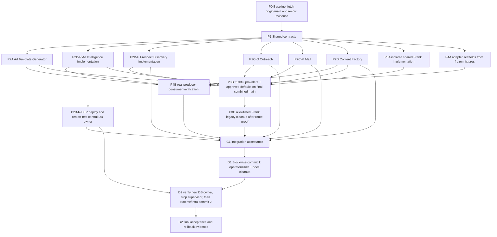

# Blockwise → Frank tool migration runbook

Status: executable migration runbook; documentation only

Audience: a low-context implementation agent working in the Frank repository,
the canonical Blockwise checkout, or the canonical VPS checkout

This document is mechanical. Execute the named checks and actions in order.
Do not invent a new product boundary, rename a capability, delete an
unlisted path, or substitute a provider. If an instruction cannot be executed
exactly, stop at the named stop condition and report the evidence.

## 0. Authority, evidence, and non-negotiable outcome

### 0.1 Authority order

Read these files before touching either repository:

1. Frank AGENTS.md, then docs/PROJECT.md.
2. Blockwise AGENTS.md, then CLAUDE.md.
3. Blockwise docs/plans/PRODUCT-REBUILD.md from origin/main, not from an
   unverified local working tree.

At the time this runbook was written, the authoritative Blockwise revision was
ae89ca5847e5389db120b686c202cf90cb42c8b5 (origin/main). The local
C:\Dev\Blockwise checkout was a detached, clean checkout after fetching, but
the reported canonical VPS checkout /projects/blockwise has current
uncommitted deletions under frank/template-factory/**. Treat those VPS
deletions as user work. Do not overwrite, restore, stage, or delete them from
an agent. Reconcile the VPS state only with the operator who owns that
checkout.

The requested path docs/plans/PRODUCT-REBUILD.md was absent from the stale
pre-fetch C:\Dev\Blockwise file inventory. It exists in the fetched
origin/main at the revision above. Any agent that sees the old absence must
fetch first and must not proceed from the stale inventory.

### 0.2a Verified live-state rollback evidence

The following live-state evidence was verified on 2026-08-14 and is mandatory
for this migration:

- `blockwise-research-db` is healthy.
- It is compose-owned by
  `/srv/blockwise/release-6d7f4f9/infra/coolify/docker-compose.research.yml`.
- Only the database container is currently running from that research stack.
- A fresh, non-destructive dump exists at
  `/srv/blockwise/backups/research/frank-migration-research-20260814T082207Z.dump`.
- Its matching checksum is at
  `/srv/blockwise/backups/research/frank-migration-research-20260814T082207Z.dump.sha256`.
- The checksum-verified counts manifest is at
  `/srv/blockwise/backups/research/frank-migration-research-20260814T082207Z.counts`.
- Its checksum file is at
  `/srv/blockwise/backups/research/frank-migration-research-20260814T082207Z.counts.sha256`.
- The dump covers 39 `research`/`research_archive` tables and 4,977,532 total
  rows.

This dump, its matching `.sha256`, its `.counts` manifest, and its matching
`.counts.sha256` are the mandatory rollback artifact. Never commit, copy,
attach, or expose the dump, checksum, manifest contents, or row data in Git, a
release, a trace, or a public Frank endpoint. Refer to the absolute paths only
in operator evidence.

Supabase research schemas were already dropped after the earlier verified VPS
cutover. Do not attempt to migrate, recreate, or re-drop those schemas. Any
remaining migration work concerns the healthy VPS research database and its
runtime ownership only.

### 0.3 Final ownership law

- Frank Window displays and configures. Frank owns tool homes, safe widgets,
  connection status/configuration views, release views, settings forms, and explicit state
  rendering. Frank does not become a second brain.
- Hermes executes models, tools, skills, schedules, provider calls, memory,
  policy, approvals, traces, and autonomous work. Hermes has the one VPS
  profile default.
- Reusable mini apps live in apps/window/tools/<tool-id>/. They are visual
  control surfaces and adapters to Hermes, not independent runtimes.
- Blockwise is the customer product. It consumes only immutable, sanitized,
  released outputs through explicit adapters. It must not scrape, generate
  templates, write blogs, or own the operator research runtime.
- Existing customer transaction and lead lifecycle mail remains in Blockwise
  until an explicitly tested replacement exists. Existing Mautic campaign and
  segment ownership, Resend delivery, Accounts, Connections, the Frank widget
  runtime, chat, and Hermes are not duplicated. Tool settings and home
  manifests use only a non-secret `connection_id` plus the required
  capability; OpenBao remains entirely behind Connections, and vault/provider/
  credential references never appear in those Tool contracts.

Authoritative storage and execution ownership is fixed:

| Concern | Authoritative owner | Frank behavior | Forbidden duplicate |
| --- | --- | --- | --- |
| Tool manifests and pipeline definitions | Domain Tool package | Validate and render the registered declaration | Second manifest, pipeline, or per-Tool registry |
| Settings revisions, schedules, commands, approvals, evidence, releases, and receipts | Hermes/data plane | Submit typed requests and render authorized projections | Frank settings/release database, queue, scheduler, or executor |
| Traces | Hermes/domain runtime through the existing OpenTelemetry path | Render the authorized redacted projection and deep-link the existing provider when available | Frank trace backend or per-Tool trace store |
| Credentials and provider authorization | Connections/OpenBao | Refer only to a non-secret `connection_id` and capability | Secret, provider credential, or vault reference in Tool data |
| Customer transaction, RLS, lead lifecycle, editing, and publishing state | Blockwise | Consume accepted immutable releases through explicit adapters | Frank/Hermes writes to Blockwise private tables without an accepted adapter |

### 0.4 Named capability destinations

Use these exact Frank tool IDs and directories. Phase P2 creates them when
absent; when they are already present on the reviewed integration branch,
validate and reuse them rather than creating parallel packages:

Each Tool directory has one canonical dashboard manifest at `home.json`.
Before the final Dashboard+Connections handoff, `default_widget_ids` remains
empty (`[]`); do not invent Tool-specific or provisional widget IDs. P3B must
replace that temporary empty state with the approved truthful blueprint for
each Tool before the six Tools ship.

| Tool ID | Frank mini-app directory | Hermes responsibility | Blockwise result, if any |
| --- | --- | --- | --- |
| ad-template-generator | apps/window/tools/ad-template-generator/ | Build, review, version, and release sanitized template packs | Customer AdStudio consumes released template packs |
| ad-intelligence | apps/window/tools/ad-intelligence/ | Collect/classify/analyse evidence and publish approved read models | Optional customer Ad Radar/read-model adapter |
| prospect-discovery | apps/window/tools/prospect-discovery/ | Discover, dedupe, enrich, verify, and release prospect outputs | No direct customer write; explicit approved adapter only |
| outreach | apps/window/tools/outreach/ | Plan and execute outreach commands under policy and trace | Customer lead lifecycle remains authoritative in Blockwise |
| mail | apps/window/tools/mail/ | Show/configure mailbox workflows and issue approved commands | Mautic/Resend remain provider owners; transaction mail is protected |
| content-factory | apps/window/tools/content-factory/ | Generate, QA, approve, and release blog/content artifacts | Blockwise may consume completed blog releases through an adapter |

outreach has no dedicated current outreach/ directory in the canonical
Blockwise path inventory. Do not infer a deletion. Treat existing lead,
provider, and customer-operations paths as KEEP until a concrete importer and
consumer contract is recorded.

## 1. Required working state and evidence capture

### 1.1 Prepare the Frank checkout

Run from the Frank checkout:

```bash
git status --short --branch
git fetch origin main
git log -1 --oneline
test -f AGENTS.md
test -f docs/PROJECT.md
test -f apps/window/server.py
test -f apps/window/home_platform.py
```

Expected evidence:

- Frank has no unrelated uncommitted changes.
- apps/window is the only application source.
- apps/window/server.py is the Flask transport/static entry point.
- apps/window/home_platform.py is the home/widget/connection metadata
  boundary.

### 1.2 Prepare the canonical Blockwise checkout

Run from the canonical Blockwise checkout. On a VPS this is
/projects/blockwise; on a local mirror it may be C:\Dev\Blockwise.

```bash
git status --short --branch
git fetch origin main
git show-ref --verify refs/remotes/origin/main
git rev-parse origin/main
git show origin/main:AGENTS.md
git show origin/main:docs/plans/PRODUCT-REBUILD.md
git ls-tree -r --name-only origin/main > /tmp/blockwise-origin-main-paths.txt
```

Expected revision: ae89ca5847e5389db120b686c202cf90cb42c8b5, or a newer
explicitly recorded origin/main revision. Expected evidence includes
docs/plans/PRODUCT-REBUILD.md and the KEEP/DELETE lists in this runbook.

For the live research database, verify metadata without dumping row data:

```bash
docker ps --format '{{.Names}}\t{{.Status}}' | grep blockwise-research-db
docker inspect blockwise-research-db --format '{{json .Config.Labels}}'
sha256sum -c /srv/blockwise/backups/research/frank-migration-research-20260814T082207Z.dump.sha256
sha256sum -c /srv/blockwise/backups/research/frank-migration-research-20260814T082207Z.counts.sha256
echo "Approved aggregate: 39 research/research_archive tables; 4,977,532 rows."
```

Expected evidence is a healthy `blockwise-research-db`, the compose owner
`/srv/blockwise/release-6d7f4f9/infra/coolify/docker-compose.research.yml`,
only that database running from the research stack, a valid checksum, and a
valid counts-manifest checksum. Record only the approved aggregate of 39
research/research_archive tables and 4,977,532 rows. Do not run `pg_dump`,
`pg_restore`, `COPY`, unrestricted `SELECT`, or schema recreation as part of
discovery; the fresh dump is already complete.

If the checkout reports uncommitted frank/template-factory/** deletions:

```bash
git status --short -- frank/template-factory
git diff --name-status -- frank/template-factory
```

Record the output. Do not run git restore, git checkout, git reset,
git clean, or any broad delete in that checkout.

Never implement or stage this migration in that dirty canonical checkout. From
the canonical repository, create a clean dedicated worktree at the recorded
`origin/main` revision. Use one branch and worktree per lane:

```bash
git worktree add -b codex/blockwise-frank-migration /tmp/blockwise-frank-migration origin/main
cd /tmp/blockwise-frank-migration
test -z "$(git status --porcelain)"
git rev-parse HEAD
```

If the branch or directory already exists, stop and ask the integration lead
for its recorded path; do not reuse, delete, or reset it. Frank agents use the
same rule with a separate Frank worktree per lane. The integration lead records
each lane's repository, absolute worktree, branch, base SHA, owned path
allowlist, and final SHA before accepting a handoff.

### 1.3 Discovery checks before any move or delete

```bash
git grep -n -i -E 'adstudio|ad radar|research-runtime|content-engine|operator/email|outreach|prospect|enrich|resend|lead-lifecycle' origin/main -- ':!public/**'
git grep -n 'createResearchServiceClient' origin/main -- 'src/**'
git grep -n 'sendOperatorEmail' origin/main -- 'src/**'
git grep -n -E 'blockwise-image-|blockwise-listing-scraper' origin/main -- 'src/**' 'tests/**' 'hermes/**'
```

Save the output in the task report. A path is not eligible for deletion until
all importers and consumers are accounted for.

## 2. Current inventory and disposition

Disposition meanings:

- KEEP: remains authoritative in Blockwise or Frank. Do not move or delete it
  as part of this migration.
- MOVE / ADAPT: replace the capability with a Frank mini-app plus Hermes
  execution and an explicit released-output adapter. Preserve behavior and
  evidence until the adapter is accepted.
- DELETE AFTER CUTOVER: remove only after the replacement is live in the
  target environment, all importers are gone, and the acceptance gate passes.
- DATABASE ARCHIVE: DBA/operator-only preservation under section 6.3. A
  low-context application agent records the approved evidence but runs no
  archive SQL and never deletes schema history.

### 2.1 Frank current paths

| Current path | Disposition | Mechanical instruction |
| --- | --- | --- |
| apps/window/server.py | KEEP | Preserve the thin Flask transport and Hermes proxy. Add only documented adapter routes in a separate implementation task. |
| apps/window/home_platform.py | KEEP | Preserve homes, widgets, connections, scope checks, revision preconditions, and explicit empty/error states. |
| apps/window/web/index.html | KEEP | Preserve the single Window shell. Tool surfaces open inside the existing content pane. |
| apps/window/web/js/app.js | KEEP / ADAPT | Add tool navigation only through the existing registry/home contracts; do not build a second application shell. |
| apps/window/web/js/registry.js | KEEP | Use the versioned widget catalog; do not create a second widget runtime. |
| apps/window/web/js/widgets.js | KEEP / ADAPT | Register tool summaries and status views only; execution goes to Hermes. |
| apps/window/web/js/homes.js | KEEP / ADAPT | Use the existing entity-home flow and exact dashboard home manifest contract in section 5.1. Do not edit before the final combined-main handoff. |
| apps/window/Dockerfile, docker-compose.yml, Caddyfile, deploy.sh | KEEP | No deployment in this task. Do not patch production files in place. |
| apps/window/tools/** | MOVE / ADAPT target | Put reusable mini-app views/adapters here, one directory per named tool. No local agent loop, scheduler, database, secret, or provider runtime. |

### 2.2 Ad Template Generator

| Current path | Disposition | Mechanical instruction |
| --- | --- | --- |
| frank/template-factory/** | MOVE / ADAPT | Treat as Frank-owned source material and service input. Preserve the reported VPS uncommitted deletions. Adapt its output to an immutable sanitized TemplatePack release consumed by Blockwise. |
| packages/ad-template-pack-contract/** | MOVE / ADAPT | Make this the contract reference for the Frank release and Blockwise import adapter. Do not allow credentials, source customer data, or mutable provider state in a public pack. |
| hermes/skills/adstudio-template-builder-v2/SKILL.md | MOVE / ADAPT | Keep the template-builder operating rules in Hermes/Frank. Do not reintroduce the deleted legacy flat-clone path. |
| src/app/(customer)/ad-studio/** | KEEP | Customer chooses released packs, edits finished ads, saves PNGs, and publishes to Meta. |
| src/app/api/adstudio/** | KEEP | Customer AdStudio API remains Blockwise-owned. It may consume only the released pack adapter. |
| src/app/api/internal/adstudio/template-packs/import/route.ts | KEEP / ADAPT | Change only the import boundary needed to validate immutable Frank releases. Keep customer persistence and workspace/RLS behavior. |
| src/lib/adstudio/{import-pack,pack-gallery,client-pack,types}.ts | KEEP / ADAPT | Consume the sanitized pack schema and provenance/checksum fields. Do not move customer editing or publishing into Frank. |
| src/lib/adstudio/** | KEEP | Preserve the customer AdStudio surface and its tested provider/publish behavior unless a specific importer is proven to belong to the generator. |
| public/adstudio-fixtures/**, public/adstudio-inputs/**, public/adstudio-templates/**, public/adstudio-thumbnails/** | KEEP / ADAPT | Keep only customer-safe released/sample assets. Do not publish private source ads or PII. Verify checksums and provenance before replacing assets. |
| supabase/migrations/*adstudio*, *template_pack* | KEEP / DATABASE ARCHIVE only where runtime rows are retired | Never delete migration files. Archive deprecated rows only after counts and an approved archive migration. |

The canonical rebuild plan records the old legacy AdStudio flat-clone paths as
already gone. Do not recreate any of these: src/lib/adstudio/template-gallery/,
reference-clone.ts, clone-generation.ts, clone-campaign.ts,
clone-creative.ts, clone-regions.ts, region-edit.ts,
rasterize-reference.ts, generate-template-campaign.ts, or the other
legacy paths listed in section (c) of docs/plans/PRODUCT-REBUILD.md.

### 2.3 Ad Intelligence / Ad Radar

| Current path | Disposition | Mechanical instruction |
| --- | --- | --- |
| src/app/(operator)/operator/research/** | DELETE AFTER CUTOVER | Remove the operator research console after the Frank/Hermes tool and release/read-model checks pass. |
| src/app/api/operator/research/** | DELETE AFTER CUTOVER | Remove all 27 listed operator research routes only after importers and health/referrer edits pass. |
| src/components/operator/{research-console,research-console-styles,research-drain-dashboard,operator-assistant}* | DELETE AFTER CUTOVER | Delete only after the operator route is gone and tests are updated. |
| src/lib/operator/{hermes-assets,assistant,postcode-refresh}.ts | DELETE AFTER CUTOVER | Delete only after B1 importers are gone; do not delete shared customer-ops libraries. |
| src/lib/research/{service,drain-status,census-sources,ingest}.ts | MOVE / ADAPT or DELETE AFTER CUTOVER | service.ts has external importers in health and paid-service watchdog; refactor those importers first. The other three are B1-only after confirming the postcode refresher dependency. |
| src/app/api/health/research/route.ts | DELETE AFTER CUTOVER | Delete or repoint only with the research service importer refactor. Preserve authenticated health semantics for remaining services. |
| src/app/api/alerts/paid-service-watchdog/route.ts | KEEP / ADAPT | Remove its research-service dependency before deleting src/lib/research/service.ts. Do not remove paid-service alerting. |
| hermes/tools/research-runtime/** | DELETE AFTER CUTOVER | Stop the supervisor process first; then remove runtime source and binaries in the second Blockwise removal commit. |
| hermes/tools/meta-library-capture/** | DELETE AFTER CUTOVER | Same supervisor and second-commit gate as research-runtime. |
| infra/hermes/Dockerfile, infra/hermes/main-wrapper.sh | MOVE / ADAPT then DELETE AFTER CUTOVER | Remove only research-runtime wiring; preserve remaining Hermes image/runtime behavior. |
| infra/coolify/docker-compose.research.yml | DELETE AFTER CUTOVER | Remove only after a committed central Hermes data-plane owner is deployed and a controlled restart proves that it returns the same database healthy. Supervisor shutdown or a contract-only Tool package is insufficient. Otherwise KEEP it and mark D2 BLOCKED. |
| hermes/skills/{blockwise-ad-collector,blockwise-ad-classifier,blockwise-agent-census,blockwise-coverage-auditor,blockwise-defect-investigator,blockwise-location-ad-search,blockwise-page-resolver,blockwise-operator-chat} | MOVE / ADAPT then DELETE AFTER CUTOVER | Re-home only the capabilities needed by the Frank/Hermes Ad Intelligence tool. Delete obsolete research-ops skills after parity evidence. |
| src/app/(customer)/ad-radar/** | KEEP | Optional customer Ad Radar remains a customer read surface. It must read the customer-safe projection, not the private research database. |
| src/app/api/research/{ad-radar,ads,advertisers,locations,swipe-file}/** | KEEP | Keep only customer-safe read APIs listed in the canonical plan. No operator scraper or private research writes. |
| src/app/api/research/{audit,local-ad-radar}/** | KEEP | Preserve the customer property/suburb and optional local read-model behavior. Verify PII and workspace scope. |
| src/lib/research/{public-ad-radar,ad-radar-*,advertiser-autocomplete,audit-suggestions,brand-pack-suburb,customer-ad-library-pages,customer-meta-card,suburb-report-insights,ad-audit,ad-library-api,normalise,hash,meta-official-api,schemas}.ts | KEEP | These are customer-safe read-model libraries in the canonical plan. Do not route them to private VPS research state. |
| supabase/migrations/20260728074225_customer_ad_radar_read_model.sql | KEEP | It defines the customer projection contract. Preserve it even if the feature is optional or disabled at launch. |
| supabase/migrations/20260730021835_launch_disable_ad_radar.sql | KEEP | Preserve feature shutdown history and flags; do not interpret disabled as permission to delete the read model. |
| tests/ad-radar-*.test.ts, tests/public-ad-radar.test.ts, tests/performance-read-models.test.ts | KEEP | Keep customer/read-model coverage. B1-only accuracy/purge tests are handled below. |
| tests/research-engine/**, tests/ad-radar-accuracy-audit.{mjs,ts}, tests/research-inactive-purge.test.ts | DELETE AFTER CUTOVER | Delete or move only with the research runtime and operator surface. |
| scripts/research/** | MOVE / ADAPT | This includes enrichment and research scripts. Re-home execution under Hermes; retain evidence/data migration scripts until counts, exports, and adapters are accepted. |

### 2.4 Prospect Discovery & Enrichment

The canonical repository has no single prospect-discovery/ product folder.
The current evidence is distributed across:

| Current path | Disposition | Mechanical instruction |
| --- | --- | --- |
| scripts/research/discover-agents-missing-email.mjs | MOVE / ADAPT | Re-home as a Hermes command behind the prospect-discovery tool. Emit sanitized, versioned prospect candidates; do not write customer lead lifecycle state directly. |
| scripts/research/enrich-agent-emails-exa.mjs | MOVE / ADAPT | Preserve source attribution, validation, revert flags, and AU attribution checks in the Hermes artifact. No raw provider token or secret in output. |
| scripts/research/verify-agent-email-enrichment.mjs | MOVE / ADAPT | Make verification a QA gate before release. Failed or suspicious enrichment is not releasable. |
| scripts/research/enrichment-stats.mjs | MOVE / ADAPT | Expose counts as a traced Hermes result or Frank status view, not as a second dashboard database. |
| scripts/research/cleanup-enrichment-v2.mjs | MOVE / ADAPT | Keep as an operator repair command until all historical enrichment is reconciled. Require dry-run/count evidence before writes. |
| scripts/research/cleanup-foreign-tld-emails.mjs | MOVE / ADAPT | Preserve the revert behavior and its audit metadata. Run only through Hermes with an explicit command and trace. |
| scripts/lib/email-validation.mjs | MOVE / ADAPT | Reuse or port the validation contract in the Hermes tool. Do not duplicate customer transaction-mail validation. |
| src/lib/leads/**, src/app/api/leads/**, customer leads pages/components | KEEP | Customer lead identity, quality, dedupe, export, and lifecycle remain Blockwise-owned. |
| src/lib/providers/{lead-delivery-queue,lead-delivery-worker,meta-leads,meta-leads-queue,meta-leads-worker}.ts | KEEP | Durable customer/provider lead delivery remains in Blockwise’s existing worker boundary. |
| worker/** | KEEP | The canonical plan explicitly keeps the provider/meta/activation worker. Do not move or delete it as part of research migration. |

### 2.5 Outreach

Outreach is a Hermes-executed tool surface, not a license to duplicate
Blockwise lead or mail systems.

| Current path | Disposition | Mechanical instruction |
| --- | --- | --- |
| apps/window/tools/outreach/ | MOVE / ADAPT target | Display audience, evidence, approval, schedule, and outcome state. Send commands to Hermes. |
| src/lib/leads/**, src/app/(customer)/leads/**, src/app/api/leads/** | KEEP | Do not replace customer lead lifecycle or its workspace/RLS rules. |
| src/lib/providers/lead-delivery-*.ts, src/lib/providers/meta-leads*.ts | KEEP | These are customer/provider delivery paths. Any future outreach adapter must call an explicit supported boundary. |
| src/app/api/integrations/meta/publish-plans/** | KEEP | Meta publish and lead sync remain customer product behavior. |
| src/app/(operator)/operator/customers/**, src/lib/operator/customers.ts | KEEP | Customer operations remain Blockwise-owned. |

If an agent finds a real current outreach importer, add it to the inventory
before editing. If no importer is found, record “no dedicated current path;
no deletion performed.”

### 2.6 Mail

| Current path | Disposition | Mechanical instruction |
| --- | --- | --- |
| src/app/(operator)/operator/email/page.tsx | DELETE AFTER CUTOVER | Delete the mailbox UI after replacement status/command views are accepted. |
| src/app/api/operator/email/route.ts, src/app/api/operator/email/[id]/route.ts | DELETE AFTER CUTOVER | Delete the mailbox API after importers and operator navigation are gone. |
| src/components/operator/email-console.tsx | DELETE AFTER CUTOVER | Delete with the console. |
| src/lib/operator/email-service.ts | KEEP | It has customer importers: src/app/suburb/[postcode]/actions.ts and src/lib/notify/demo-request-email.ts. Keep until both are refactored and tested. |
| src/app/suburb/[postcode]/actions.ts | KEEP / ADAPT | Protect sendOperatorEmail behavior while removing any dependency on the retired console. |
| src/lib/notify/demo-request-email.ts | KEEP / ADAPT | Protect demo-request notification behavior. |
| src/lib/email/resend-client.ts | KEEP | Resend remains the delivery provider; do not create a second Resend client in Frank or Hermes. |
| src/lib/email/lead-lifecycle.ts | KEEP | Transaction and lead lifecycle email remains Blockwise-owned until an explicit replacement is accepted. |
| src/app/api/operator/email/** tests and tests/operator-email-service.test.ts | ADAPT | Retain tests for the kept library/importers; remove only console-specific assertions. |
| apps/window/tools/mail/ | MOVE / ADAPT target | Show/configure mail workflows and provider status. Do not store credentials, send directly, or duplicate Mautic campaigns/segments or Resend delivery. |

### 2.7 Content Factory

| Current path | Disposition | Mechanical instruction |
| --- | --- | --- |
| src/app/(operator)/operator/content-prompts/page.tsx | DELETE AFTER CUTOVER | Move prompt controls to Hermes/Frank settings and release views before deletion. |
| src/app/(operator)/operator/content-runs/page.tsx | DELETE AFTER CUTOVER | Replace with the Frank Content Factory home and Hermes run records. |
| src/app/(operator)/operator/content-runs/[id]/page.tsx | DELETE AFTER CUTOVER | Preserve review, approval, trace, and release evidence in Hermes/Frank. |
| src/app/api/operator/content-prompts/** | DELETE AFTER CUTOVER | Remove after settings revision and Hermes command/event checks pass. |
| src/app/api/operator/content-runs/** | DELETE AFTER CUTOVER | Remove after completed-release adapter checks pass. |
| src/components/operator/content-runs/** | DELETE AFTER CUTOVER | Delete with the operator content surface. |
| src/lib/content-engine/{contracts,index,queue,repository}.ts | MOVE / ADAPT | Preserve contract, queue, and repository behavior in Hermes. Do not leave a second Blockwise content runtime. |
| tests/content-engine/** | MOVE / ADAPT | Port contract and queue tests to the Hermes tool; retain proof of idempotency and release immutability. |
| hermes/skills/{blockwise-blog-editor,blockwise-blog-formatter,blockwise-blog-writer,blockwise-content-run-orchestrator,blockwise-content-strategist,blockwise-topic-researcher,blockwise-seo-schema-builder,blockwise-social-post-generator,blockwise-image-brief-writer,blockwise-image-generator,blockwise-image-reviewer} | MOVE / ADAPT | Re-home as Content Factory skills. Verify image skills before deleting because image generation may serve customer AdStudio. |
| hermes/skills/{blockwise-instant-form-generator,blockwise-lead-ad-generator,blockwise-page-builder,blockwise-model-router,blockwise-prompt-manager,blockwise-listing-scraper} | KEEP pending importer audit | Do not delete from the B2 sweep. Check customer lead/product paths; src/lib/adstudio/listing-extract.ts imports listing-scraper output types. |
| apps/window/tools/content-factory/ | MOVE / ADAPT target | Display runs, evidence, QA, approval, schedules, and released artifacts. Hermes executes. |
| src/app/guides/**, src/app/suburb/**, customer content routes | KEEP | These are customer/public product surfaces unless a separate importer audit proves otherwise. |

### 2.8 Shared capabilities to implement once

Implement these as shared Hermes/Frank contracts, not per-tool duplicates:

- Per-tool prompt, model, style, threshold, schedule, and project-pack
  settings, each stored as a revision. Values are plain, auditable data; no
  secrets, executable code, or HTML.
- Project packs containing scope, brand, audience, approved references,
  output constraints, and required connection capability IDs. Credentials
  stay behind Connections and OpenBao/Activepieces; Tool settings never carry
  vault, provider, or credential references.
- Evidence and assets with source identifiers, provenance, content hashes,
  sanitization status, retention class, and access scope.
- QA/compliance gates that produce blocking or passing evidence before a
  release is public or a provider write is allowed.
- A Hermes/data-plane release registry for immutable public releases,
  checksums, provenance,
  schema version, source trace, approvals, and consumer compatibility.
- Schedules displayed by Frank but created, leased, executed, retried, and
  audited by Hermes. Frank must not become a scheduler.
- One shared graph contract and renderer: maxGraph (Apache-2.0) is the sole
  graph renderer; CodeMirror 6 is the prompt/instruction inspector; and
  vanilla-jsoneditor plus Ajv is used only for schema-backed payload editing.
  OTel GenAI-style spans/events are the trace interchange. Domain Tools own
  and version manifests, nodes/edges, immutable settings revisions, and
  Hermes envelopes; they project through `ToolManifestAdapter` to
  `schema://frank.graph/v1`.

Do not duplicate Accounts, Connections/OpenBao, the widget runtime, chat,
Mautic campaigns or segments, Resend delivery, or Hermes itself.

### 2.9 What else should become modular

The following are shared primitives, not new duplicate Tools: project packs,
evidence/assets, QA and approvals, immutable releases, schedules, and
observability. Tools consume their shared contracts and do not create their own
stores, queues, schedulers, graph renderers, or settings systems.

Media/asset production may become a future Asset Factory Tool only if it has
an independent operator workflow, approvals, and release lifecycle. Without
that independent workflow, keep it as Hermes capabilities/nodes reused by the
existing tools. Customer lifecycle/transaction mail, leads/workers,
property/suburb, and AdStudio editing stay Blockwise-owned.

The accepted Knowledge Library remains a separate future graph provider, not a
Tool. It may project authorized topology through `schema://frank.graph/v1`, but
it changes no Tool manifest, settings, command, event, trace, or adapter field
and gives Frank no direct vector/memory database access.

After the importer audit, the existing lead-ad, instant-form, and page-builder
capabilities may become one future Campaign Builder Tool only if they form an
independent project-agnostic operator workflow with their own approvals and
immutable release lifecycle. Otherwise keep them as Hermes capabilities used
by Content Factory or Blockwise customer publishing. Do not create three Tools
from three skills.

Before cleanup, create a reviewed cleanup manifest for both repositories. Each
row contains `path`, `current_owner`, `disposition`, `replacement`, `gate`, and
`evidence`. The only dispositions are KEEP, MOVE/ADAPT, DELETE AFTER CUTOVER,
and DATABASE ARCHIVE. The integration lead rejects any deletion not present in
that manifest. Include old Frank prototypes and docs, stale Blockwise operator
docs, and `frank/template-factory/**`. The latter remains operator-owned and is
not eligible for staging or deletion until its dirty VPS diff is reconciled,
template release parity passes, and importers are zero. Preserve historical
migrations and completed migration evidence.

The cleanup manifest must include this legacy-home replacement map:

| Legacy home/stub | Canonical owner and route decision | Removal gate |
| --- | --- | --- |
| `ad-templates` | `ad-template-generator`; route the legacy entry to the accepted Tool home through the shared home runtime | The Tool home opens, its truthful default blueprint renders, and back/refresh behavior passes before the stub is removed |
| `campaigns` | Mautic remains campaign/segment authority; resolve the legacy entry to the existing registered Campaigns/Mautic home. Do not create or route to an Outreach/Mail campaign Tool. | The Dashboard owner supplies the exact registered home ID after combined-main handoff, and the route works with real scoped state and no duplicate campaign store before the stub is removed |

Do not guess the registered Campaigns home ID before handoff and do not remove
either stub because a card or manifest merely exists.

## 3. Execution phases, lanes, gates, and dependencies

### 3.1 Phase IDs

| ID | Lane | Owner | Prerequisites | Exact actions | Expected evidence | Rollback | Stop conditions |
| --- | --- | --- | --- | --- | --- | --- | --- |
| P0 | Baseline | Integration lead | None | Fetch Blockwise origin/main; record revisions, statuses, path inventory, and VPS frank/template-factory deletion evidence. | Revision ae89ca5 or newer, saved git status, plan present, mismatch recorded. | Discard only the new report, never user work. | Do not proceed when authority files cannot be read or the canonical revision is unknown. |
| P1 | Contracts | Hermes + Frank | P0 | Freeze exact home, settings, pipeline, trace, command/event, per-domain release, and consumer fixtures. Record all cross-language hash inputs. | Versioned fixtures validate exact fields, RFC 8785 hashes, and rejection of secrets/code/HTML. | Revert contract-only commit. | Do not proceed while a producer and consumer disagree on any field, type, receipt, pipeline version, compatibility ID, or hash input. |
| P2A | Template Generator | Hermes/Frank tool agent | P1 | Adapt clean `origin/main` template source and ad-template-pack-contract into ad-template-generator; emit checksum-addressed immutable sanitized TemplatePacks. Do not reconcile the dirty VPS source in this lane. | Pack contains provenance, checksums, QA/compliance status, no PII, and passes consumer fixture tests. | Keep old source/adapter active; do not delete Blockwise consumer code. | Do not proceed when public pack contains source private data, PII, mutable URLs, failed QA, or an unverified release hash. |
| P2B-R | Ad Intelligence implementation | Hermes/Frank research agent | P1 | Adapt private ad collection/classification into ad-intelligence and publish only the customer-safe Ad Radar projection. Prepare, but do not deploy, the replacement runtime/data-plane definition. | Private evidence and public projection are separately scoped; release fixture, sanitization, and runtime tests pass. | Leave B1 runtime, database compose ownership, and customer read path unchanged. | Do not proceed when private research tables are exposed, the projection is stale, or the replacement is contract-only. |
| P2B-P | Prospect Discovery implementation | Hermes/Frank prospect agent | P1 | Adapt only discovery/enrichment/verification scripts into prospect-discovery. Use a separate store/contract and release verified prospect artifacts; never write customer leads directly. | Independent prospect fixture preserves attribution, validation, verification, revert metadata, scope, and trace. | Leave enrichment scripts and customer leads unchanged. | Do not proceed when prospect data shares mutable Ad Radar state, enrichment is unverified, or a direct lead write exists. |
| P2B-R-DEP | Research data-plane deployment gate | Hermes/VPS operators | Accepted P2B-R commit and separate deploy approval | Deploy the committed central Hermes data-plane owner using its deploy runbook; perform a controlled restart and prove it returns `blockwise-research-db` healthy. This table records a gate and does not itself authorize deployment. | Replacement compose/config path, deployed SHA, container identity, health output, and restart evidence. | Stop the replacement owner and restore the old owner only through the approved deploy rollback. | Stop while the replacement owner is uncommitted, contract-only, not deployed, or not restart-proven. Never remove the old compose here. |
| P2C-O | Outreach | Hermes/Frank communications agent | P1; live execution additionally requires accepted P2B-P releases | Build the declarative outreach Tool and typed Hermes commands for audience, approval, schedule, policy, and outcomes. | Idempotency, policy, trace, and approved prospect-release fixtures pass. | Keep existing customer lead paths; disable the new command capability. | Do not proceed when outreach reads mutable prospect state or bypasses approval/provider policy. |
| P2C-M | Mail | Hermes/Frank communications agent | P1 | Build the declarative inbound/outbound mailbox Tool and typed Hermes commands while preserving Mautic, Resend, customer lifecycle mail, and Connections. | Transaction/demo/lead email tests pass; no duplicate delivery client or campaign store. | Keep console and customer importers until replacement is proven. | Do not proceed when any lifecycle email path is unowned or delivery bypasses policy/audit. |
| P2D | Content Factory | Hermes/Frank content agent | P1 | Adapt B2 pages/API/lib/skills into content-factory; produce reviewed immutable blog releases. | Completed release has QA, provenance, checksum, no PII, and adapter fixture passes. | Keep B2 runtime active. | Do not proceed when image skills/listing-scraper consumers are unresolved. |
| P3A | Isolated shared Frank implementation | Frank graph agent | P1 and accepted graph spec | On its isolated branch, implement only the shared adapter/provider/workbench and tests. Domain packages add no JavaScript, CSS, HTML, routes, screens, widgets, or settings stores. Do not touch frozen dashboard/home integration files. | Shared schema fixtures, unit/syntax checks, one maxGraph dependency, and no production registration changes. | Revert the isolated Frank-only commit. | Stop on a second renderer/store, domain UI, execution, external provider/network/database call, or edit to a frozen shared file. |
| P4A | Blockwise adapter scaffolds | Blockwise adapter agents | P1 | In separate worktrees, implement unconnected Template Pack, Ad Radar, and Completed Blog adapters against the frozen producer fixtures. Add no production route, fetch, persistence, or cutover. A self-hash proves integrity, not producer authenticity. | Positive and negative fixture tests validate exact schemas, receipts, compatibility, scope, and RFC 8785 hashes; source audit proves the adapters are unreachable from production. | Disable the unconnected adapter; retain current customer path. | Stop when a contract field or hash input is ambiguous or when a scaffold is wired to production before P4B. |
| P4B | Producer-consumer compatibility | Producer owner + Blockwise adapter owner | P4A plus the relevant P2A, P2B-R, or P2D commit | Run each actual producer payload through its real consumer over the authenticated, authorized Hermes release boundary; bind its release identity, caller scope, and delivery receipt before enabling any route or persistence. | Cross-language fixtures and end-to-end adapter tests pass without translation or invented fields; authenticated delivery/authorization evidence is recorded. | Return the mismatched lane; no deletion or cutover. | Stop on any producer/consumer difference, missing delivery authentication/authorization, scope mismatch, or private/mutable input. |
| P3B | Final Frank registration | Frank integration agent + Tool owners | P3A, relevant Tool packages, and final combined-main dashboard handoff | Rebase once onto the recorded combined-main SHA. For each Tool, expose one truthful read-only snapshot/provider through the shared runtime, approve its distinct default blueprint, then register through the one discovery seam. Add graph only after `frank.graph.v1` merges. Run desktop/mobile verification. | Six real-state provider fixtures, six approved blueprints, startup discovery, fail-closed registration, scoped Connections/current-work/output/receipt evidence, shared graph/trace evidence when available, and final tests pass. | Revert the registration commit; keep the Tool unshipped rather than restore a fake or empty default. | Stop before the combined-main handoff; when a Tool has only fake/demo state or an empty/generic-only default; or on any second registry, bespoke Tool UI, provisional widget ID, fake live health, or unapproved shared-file change. |
| P3C | Frank legacy cleanup | Frank integration agent | P3B and approved Frank cleanup-manifest rows | In a clean allowlisted worktree, remove only obsolete Frank prototypes/docs/stubs whose canonical home and route already pass. Preserve shared history and current runtime files. | Exact cleanup diff, route/browser tests, no dangling refs, and rollback SHA. | Revert the Frank cleanup commit. | Stop when a path is absent from the cleanup manifest or replacement route/default/provider is not green. |
| G1 | Integration gate | Reviewer | P2A, P2B-R, P2B-P, P2B-R-DEP, P2C-O, P2C-M, P2D, P3C, P4B | Run all acceptance matrices and end-to-end consumer checks against the deployed preview and accepted releases. | All required rows pass; no PII/secrets; trace links and DB ownership evidence are present. | Return failing lane to its owner; no deletes. | Do not proceed when any critical row fails. |
| D1 | Blockwise commit one | Blockwise operator | G1 | From a clean allowlisted worktree, remove operator/UI/lib surfaces and references; keep customer AdStudio, optional Ad Radar/read model, property/suburb, customer ops, worker, and protected mail. Attach approved DBA archive evidence and never absorb the dirty template-factory diff. | npm run check, typecheck, tests, route/referrer grep clean, DBA evidence recorded, staged paths allowlisted. | Revert commit one; do not touch schema history or user work. | Do not proceed when importers remain, DBA evidence is missing, the template-factory diff is unresolved, or a staged path is unlisted. |
| D2 | VPS/runtime commit two | Blockwise operator + VPS operator | D1 plus verified P2B-R-DEP ownership transfer | Reverify the replacement Hermes runtime and database owner, stop the exact retired research supervisor, then remove only retired Blockwise runtime/infra/ops wiring and commit from the clean migration worktree. | Replacement database owner and runtime remain healthy; old supervisor is stopped; no orphan process; both compose/config checks pass; commit is allowlisted. | Restore the committed runtime/infra paths; restore the old compose owner only when the new owner is stopped; restart through the approved deploy runbook. | Do not proceed while `blockwise-research-db` is still owned only by the Blockwise compose file, when the replacement data plane is contract-only, when supervisor identity is uncertain, when a process remains, or when the deploy revision is uncommitted. |
| G2 | Release gate | Reviewer + operators | D2 | Verify Frank, Hermes/VPS, Blockwise, data/security, and desktop/mobile acceptance matrices. | Signed report with commands, URLs/fixtures, traces, counts, and rollback revision. | Keep customer-only Blockwise and old adapter disabled; no destructive cleanup. | Do not proceed when any critical security, lifecycle mail, or customer read-model check fails. |

### 3.2 Mermaid dependency graph



P2A, P2B-R, P2B-P, P2C-O package work, P2C-M, P2D, P3A, and P4A may run
in parallel after P1 because they use separate worktrees and path allowlists.
P4B waits for each real producer. Outreach package work may start after P1,
but live execution waits for an accepted Prospect release. P3B waits for the
final combined-main dashboard handoff. P2B-R-DEP is operator-only and waits for
an accepted committed implementation. P3C waits for P3B replacement-route
proof. G1, D1, D2, and G2 are strict gates. No delete lane runs in parallel
with cutover, deployment, or supervisor shutdown.

## 4. Mechanical lane instructions

### Lane A — Ad Template Generator

1. Read the Frank and Blockwise authority files and
   packages/ad-template-pack-contract/**.
2. Inventory every current template source, sample, input, evidence file,
   asset, prompt, and credential reference. Hash source and public artifacts.
3. Put execution in Hermes; put display/configuration in
   apps/window/tools/ad-template-generator/.
4. Emit a release containing only the exact Template Pack row in section 5.5a.
5. Run source-vs-public hash checks and the Blockwise import adapter fixture.
6. Do not delete customer AdStudio paths or schema history.

Required stop: an output is not public if it contains a private source asset,
customer media, raw prompt credential, PII, provider token, or mutable draft
reference.

### Lane B-R — Ad Intelligence / Ad Radar

1. Keep private collection, raw evidence, classification, and retention behind
   the Hermes data plane. Frank receives only authorized summaries and refs.
2. Adapt B1 operator research into the `ad-intelligence` Tool without moving
   enrichment-email scripts into its store or release contract.
3. Preserve evidence IDs, source URLs/IDs, classifier version, media QA,
   settings revision, receipt refs, and trace IDs.
4. Publish only the sanitized customer-safe Ad Radar read model through the
   exact release and Blockwise adapter contract.
5. Keep Blockwise customer Ad Radar optional but valid; disabled is an explicit
   supported state, not permission to delete the read model.
6. Prepare the replacement runtime/data-plane definition, but leave deployment
   to P2B-R-DEP and leave the old compose owner untouched.

Required stop: Blockwise or Frank queries private research tables, private
evidence reaches the public projection, the customer projection becomes stale,
or a contract-only package is presented as a deployed database owner.

### Lane B-P — Prospect Discovery and Enrichment

1. Adapt only the confirmed discovery, enrichment, verification, statistics,
   and repair scripts into the `prospect-discovery` Tool.
2. Give prospect candidates an independent contract, access scope, retention
   rule, and Hermes data-plane authoritative store. Do not use the Ad Radar
   public projection as a prospect database and do not add prospect fields to
   the Ad Radar release.
3. Preserve source attribution, validation, AU checks, verification result,
   revert flags, repair evidence, and trace IDs.
4. Release only verified sanitized prospects. Link to shared public evidence by
   opaque source/evidence ID; do not copy private ad evidence into the release.
5. Never write Blockwise customer leads directly. Outreach consumes only an
   approved immutable Prospect release through its declared boundary.

Required stop: an enrichment is unverified, the prospect Tool shares mutable
Ad Radar state, a release contains PII beyond its approved scope, or any direct
customer-lead write exists.

### Lane C — Outreach and Mail

1. Build declarative Tool contracts for outreach audience, approval, policy,
   schedule, command status, delivery outcome, inbound mailbox state, and
   approved outbound commands. Shared Frank surfaces render them.
2. Send execution commands to Hermes; do not send directly from Frank.
3. Keep Mautic as campaign/segment owner and Resend as delivery provider.
4. Keep src/lib/email/lead-lifecycle.ts, src/lib/email/resend-client.ts,
   src/lib/operator/email-service.ts, and their customer importers until
   replacement tests prove equivalence.
5. Remove only the operator mailbox console/API after its customer importers
   are not dependent on it.

Required stop: any command could send customer lifecycle mail without an
idempotency key, policy decision, trace, provider status, and retry outcome.

### Lane D — Content Factory

1. Port content contracts, queue semantics, run/review states, and skills to
   Hermes.
2. Make Frank display prompt/style/model settings, project pack, schedule,
   evidence, QA, approval, trace, and release state.
3. Verify every blockwise-image-* skill and blockwise-listing-scraper
   consumer before deleting anything.
4. Publish completed blog releases as immutable, sanitized artifacts.
5. Make Blockwise consume only through the completed-blog-release adapter.

Required stop: image generation or listing extraction has an unresolved
customer importer, or a blog output is published without QA/provenance.

### Lane E — Frank integration

1. P3A works only on its isolated branch. Implement the single shared
   `tool-manifest` adapter, provider, `graph-workbench`, and tests from the
   accepted graph spec.
2. Before the final combined-main handoff, do not edit
   `apps/window/home_defaults.py`, `home_platform.py`, registry/runtime files,
   production routes, or shared shell/home files. Do not merge P3A.
3. Domain Tool directories contain declarative `home.json`, `manifest.json`,
   schemas, pipelines, plus a pure read-only snapshot adapter and fixtures.
   The adapter receives already-authorized runtime/package state as input and
   performs no I/O. Tool packages register no JavaScript, CSS, HTML, route,
   screen, widget, renderer, settings store, network/database/provider call.
4. P3B records the final combined-main SHA, rebases once, and uses only
   `discover_tool_homes(tools_root) -> register_entity_profile(manifest)`.
   There is no second registry.
5. Before a Tool ships, its owner exposes at least one truthful read-only
   snapshot/provider through the existing shared provider runtime. It reads
   real package/runtime state already supplied through the authorized boundary;
   it makes no provider/network/database call and reports unavailable when the
   source is unavailable. Fake packs are excluded or visibly labeled demo, and
   no fixture or manifest value may be rendered as live health.
6. The Dashboard owner approves one distinct default blueprint per Tool. Using
   only known shared widget IDs, it must cover: overview; scoped Connections
   attention/coverage; current work or latest output; and receipts/evidence.
   Empty or generic-only defaults are a P3B failure. Keep defaults empty before
   handoff; bind approved defaults only after the provider fixtures are green.
   Add `entity-graph` only after `/api/capabilities` advertises
   `frank.graph.v1` and the shared graph provider/widget is green.
7. Shared settings forms use schema-backed controls and reject code, HTML,
   secrets, arbitrary provider URLs, and arbitrary calls. Shared views display
   authorized Hermes events, releases, schedules, and explicit ready, empty,
   attention, unavailable, and error states.
8. Keep Accounts, Connections/OpenBao, chat, widget runtime, and Hermes as the
   existing shared surfaces.
9. Only after P3B passes, P3C removes the exact approved Frank cleanup-manifest
   rows in a clean worktree with an explicit path allowlist. Verify the
   replacement route, defaults, provider state, dangling references, tests, and
   browser behavior before committing. Do not remove migration history.

Required stop: the combined-main SHA is missing, a Frank change touches a
frozen file before handoff, a Tool lacks a truthful provider or approved
blueprint, a fake/demo fixture is presented as live, or the change adds domain
UI, a second registry/renderer, local queue, scheduler, model loop,
memory/trace/settings/release store, provider credential store, or second chat
transcript.

For P3C, the integration lead creates `/tmp/frank-p3c-allowlist.txt` from only
the approved Frank cleanup-manifest rows. Start clean, make the listed edits,
then verify and stage only that list:

```bash
test -z "$(git status --porcelain)"
test -s /tmp/frank-p3c-allowlist.txt
# Make only the approved cleanup edits, then continue.
git diff --check
git diff --name-only | sort -u > /tmp/frank-p3c-changed.txt
test -z "$(comm -23 /tmp/frank-p3c-changed.txt <(sort -u /tmp/frank-p3c-allowlist.txt))"
(cd apps/window && python -m unittest discover -s tests)
find apps/window -type f -name '*.js' -print0 | xargs -0 -n1 node --check
git add -A --pathspec-from-file=/tmp/frank-p3c-allowlist.txt
test -z "$(git diff --cached --name-only | sort -u | comm -23 - <(sort -u /tmp/frank-p3c-allowlist.txt))"
git diff --cached --name-status
git commit -m "Retire replaced Frank tool stubs and docs"
git show --name-status --stat HEAD
```

Run the required browser route/default/provider checks before the P3C commit.
Source rollback is
`git revert <recorded-P3C-SHA>` on a clean branch.

### Lane F — Blockwise adapters and removal

1. P4A builds each adapter in a separate clean worktree against the exact P1
   fixture before any producer or customer path is removed. Validate schema,
   release ID, RFC 8785 hashes, artifact checksums, receipts, provenance,
   sanitization, scope, pipeline identity/version, and compatibility.
2. P4B runs the real producer payload through the real consumer without a
   translation shim. Pin the accepted release ID/hash and producer/consumer
   SHAs in evidence.
3. Keep all customer surfaces explicitly listed in the canonical rebuild plan.
4. Run D1 and D2 exactly as written in section 6; never combine them.

## 5. Shared contracts

The following contracts are normative for implementation and review.

### 5.1 Tool home manifest

The manifest has exactly these fields:

The canonical per-Tool dashboard filename is
`apps/window/tools/<tool-id>/home.json`.

```json
{
  "id": "ad-template-generator",
  "name": "Ad Template Generator",
  "kind": "tool",
  "blurb": "Build and release approved template packs.",
  "capabilities": [],
  "default_widget_ids": [],
  "connection_capabilities": []
}
```

Before the final Dashboard+Connections handoff, `default_widget_ids` must
remain `[]`. During P3B, the Dashboard owner supplies the approved known shared
widget IDs for that Tool's distinct blueprint after its truthful read-only
provider passes. The six Tools cannot ship with empty or generic-only defaults.
`entity-graph` remains absent until `frank.graph.v1` is available.

kind is exactly the literal 'tool'. id is stable and URL-safe. Arrays
contain capability/widget IDs. `connection_capabilities` lists required
capability IDs only; it never contains a vault reference, provider reference,
credential reference, or secret. Each Tool uses a non-secret `connection_id`
when bound to a configured Connection. Do not add fields without a versioned
contract change and fixtures.

### 5.2 Settings revisions

Every Tool setting change creates a new immutable revision. The canonical
runtime envelope contains exactly `schema`, `scope`, `revision`, and
`settings`:

```json
{
  "schema": "schema://frank.tool-app-settings/v1",
  "scope": {"kind": "project", "id": "blockwise"},
  "revision": 3,
  "settings": {
    "prompt_refs": {"draft": "prompt://content/draft/v3"},
    "tone_style": {"profile": "style://brand/blockwise/v2"},
    "model_policy": {"id": "model-policy://content/default/v1"}
  }
}
```

The example `settings` keys are Content Factory properties, not a common Frank
settings object. Each Tool may expose adjustable prompt/style/model policy,
threshold, schedule reference, project-pack reference, or connection binding
only when that exact property is declared by its canonical
`manifest.json.settings` schema. Frank validates that schema and never invents
or silently reinterprets a property. Prompt/instruction content is resolved
through Hermes; manifests and graph snapshots carry approved references and
versions, not secret bodies. A connection setting contains only a non-secret
`connection_id` and required capability ID. Reject vault/provider/credential
references, secrets, access tokens, credentials, arbitrary code, HTML, shell
commands, and provider-specific opaque secret values. Saving appends a new
scoped revision and never mutates an old one.

### 5.3 Fixed versioned pipeline

Each Tool owns canonical pipeline definitions in `manifest.json`. A pipeline
uses exactly `schema`, optional `id` and `version`, `{id, kind}` nodes, and
`{from, to}` edges:

```json
{
  "schema": "schema://frank.tool-app-pipeline/v1",
  "id": "content-factory-pipeline",
  "version": "1.0.0",
  "nodes": [{ "id": "draft", "kind": "task" }, { "id": "qa", "kind": "gate" }],
  "edges": [{ "from": "draft", "to": "qa" }]
}
```

A run pins the Tool manifest version, pipeline ID/version, and immutable
settings revision. It never silently follows latest. `graph_id` is not
domain-authored: `ToolManifestAdapter` derives `tool:<tool-id>` for global
scope or `project:<project-id>/tool:<tool-id>` for project scope. The generated
`schema://frank.graph/v1` envelope is an in-memory or disposable projection,
never a second checked-in pipeline or authoritative graph state.

There is no manifest `sha256` field. The provider computes
`manifest_sha256` out of band as SHA-256 over UTF-8 RFC 8785 JCS of the complete
canonical `manifest.json`. The runtime may expose it as derived
`source.sha256`; never write it back into the manifest or exclude a self-field.

### 5.3a Shared graph implementation decision

This decision is fixed for every tool:

- `@maxgraph/core` under its Apache-2.0 license is the sole graph renderer;
  pin its exact accepted version in the implementation lockfile.
- CodeMirror 6 is the prompt/instruction inspector.
- vanilla-jsoneditor with Ajv is used only when editing a schema-backed
  payload.
- OTel GenAI-style spans/events are the trace interchange; they are not a
  second graph state store.
- Domain Tools own and version manifests, graph nodes/edges, immutable
  settings revisions, and Hermes envelopes. They project through
  `ToolManifestAdapter` to `schema://frank.graph/v1`.
- Do not add Cytoscape, React Flow, a custom renderer, or tool-specific graph
  UI, execution, or settings stores.
- Preserve the existing trace, slot-trace, and trace-view hooks unchanged
  during P3A. Wire them to the shared workbench only after the correlation gate
  below clears.
- Use the existing normalized OpenTelemetry path and provider deep links; do
  not install or persist a second trace backend.

Before adding a dependency, inventory the current package and lock files. The
implementation handoff records the exact pinned version and license for
`@maxgraph/core`, CodeMirror 6, vanilla-jsoneditor, and Ajv; includes the
lockfile diff; runs the repository's dependency/license audit; and searches the
dependency tree and source for Cytoscape, React Flow, Rete, LiteGraph, or a
custom second renderer. Unknown, floating, duplicated, or incompatible
dependencies BLOCK P3B.

The accepted contract is
`docs/specs/shared-graph-trace-contract.md` at source revision
`390fcf7a0bcc226526d9cb88e20a01f963d3b030`. The canonical Tool files remain
`schema://frank.tool-app-manifest/v1`; the adapter creates only an in-memory or
disposable `schema://frank.graph/v1` projection. Do not create a second
checked-in manifest or pipeline.

#### Trace-correlation stop condition

An independent implementation audit found a required compatibility gate that
the accepted graph document does not yet resolve. The current canonical
`tool_apps/adapters.py` v1 event envelope is exactly
`{schema, request_id, sequence, kind, status, timestamp, data}`, and its trace
record is exactly `{schema, request_id, events}`. Neither record contains a W3C
`trace_id` or a versioned pipeline/node correlation field. Generic `data` is
not a graph contract and must not be reinterpreted by Frank.

Therefore P3A may implement and test only the shared renderer, provider
boundary, and `tool.pipeline` / `tool.settings` projections against current v1.
It must keep `run.trace` unavailable, omit active event/trace adapter claims,
and leave the existing trace runtime untouched until the Tool/Hermes contract
owner approves one versioned correlation contract. That future contract must
bind the Tool, request, W3C trace, pipeline revision, and node identity without
overloading `request_id`, adding guessed fields to v1, or copying prompt/model/
tool bodies. A contract-only Tool package, an OTLP span by itself, or fields
hidden inside generic event `data` do not clear this gate.

After the trace-correlation stop condition clears, the one shared
implementation registers `graph`, `slot-graph`, `entity-graph`,
`graph-workbench`, and `tool-manifest`. Only then do the existing `trace` and
`slot-trace` hosts use the same workbench with a `run.trace` lens, and
`trace-view` becomes a deprecated compatibility alias. Before the combined-main
handoff, a Tool keeps `default_widget_ids: []`. During P3B it receives its
approved non-graph shared blueprint after its truthful provider passes;
`entity-graph` may be added only after `/api/capabilities` advertises
`frank.graph.v1` and that shared provider/widget passes.
Integration remains BLOCKED until this shared implementation lands on the
accepted dashboard base. Domain agents must not invent adapter fields, widget
IDs, routes, or a temporary renderer.

### 5.4 OTel-style traces and events

The target state, after the trace-correlation stop condition clears, correlates
every command, provider call, QA gate, release, and adapter import to the
canonical `schema://frank.tool-app-trace/v1` record and authorized
OpenTelemetry spans. Before then, P3A may use strictly validated OTLP spans only
to overlay declared pipeline status; it must not claim a Tool trace record or
`run.trace` support. The following is an illustrative redacted OTLP-style span,
not a second Frank trace schema:

```json
{
  "traceId": "0123456789abcdef0123456789abcdef",
  "spanId": "0123456789abcdef",
  "parentSpanId": "fedcba9876543210",
  "name": "template.release",
  "start_time": "2026-08-14T00:00:00Z",
  "end_time": "2026-08-14T00:00:01Z",
  "status": "ok",
  "attributes": {
    "frank.tool.id": "ad-template-generator",
    "frank.project.id": "blockwise",
    "frank.pipeline.id": "reference-clone-release",
    "frank.pipeline.revision": "1.0.0",
    "frank.receipt.ref": "receipt://template/example/qa"
  },
  "events": [{ "name": "qa.passed", "attributes": { "gate": "public-sanitize" } }]
}
```

Do not put secrets, raw customer PII, full email addresses, prompts,
completions, tool definitions, tool arguments/results, request/response bodies,
or provider tokens in span attributes/events. Use opaque IDs, hashes, refs,
counts, and token usage. `traceId` is a non-zero lowercase 32-hex W3C ID and
`spanId` is a non-zero lowercase 16-hex W3C ID; aliases and duplicate
correlation attributes are rejected. Use only the stable `frank.*` correlation
attributes and each Tool manifest's trace/event allowlists. Frank renders the
supplied authorized projection and does not fabricate a trace from chat,
events, or source code.

### 5.5 Immutable public release

A public release is append-only and addressable by release ID and checksum. It
must include:

- `schema`, `release_id`, `tool_id`, version, and final status;
- artifact URLs or storage references that contain no credentials;
- SHA-256 checksums for every artifact;
- source/provenance references, pipeline version, settings revision, QA gates,
  approvals, and trace ID;
- sanitization result and consumer compatibility declaration;
- no PII, customer media, private source ads, secrets, tokens, or mutable
  working-draft pointers.

Consumers pin a release ID/checksum. A new output is a new release; never
mutate a public release in place.

All structured JSON checksums and release hashes use SHA-256 over RFC 8785
JSON Canonicalization Scheme bytes. A whole-release hash excludes only its
own `release_hash` field. Producers use Python `rfc8785`; JavaScript consumers
use the RFC 8785 `canonicalize` package. Do not replace either side with a
handwritten key sorter or locale-aware comparison.

The identity field is always named `schema`; do not introduce aliases such as
`producer_schema`. Domain payloads may differ, but every publishing Tool must
declare its release schema in `manifest.json`, include matching `schema` and
`tool_id` fields in each release, and validate both before a consumer reads the
payload.

### 5.5a Frozen producer-consumer release matrix

P1 freezes these identities and public shapes before producer and adapter work
starts. Producer code, its fixture, and the Blockwise consumer fixture must be
byte-compatible; no adapter may rename a field or translate a receipt.

| Release | Exact producer identity | Exact compatibility and gates | Hash/checksum input | Canonical producer contract |
| --- | --- | --- | --- | --- |
| Template Pack | `schema://frank.ad-template-generator-release/v1`; tool `ad-template-generator`; pipeline `reference-clone-release` version `1.0.0`; status `released`; `immutable: true`; `source_free: true` | Compatibility is exactly `["blockwise-template-pack-v1"]`. `template_pack` is exactly `{schema:"blockwise.template-pack/v1",pack_id,artifact_ref,sha256,signature_algorithm:"ed25519",signature}`. Provenance binds the same artifact URL to an artifact receipt. QA, native-pixel approval, sanitization, and release timestamps are exact timezone-bearing receipt shapes. | `template_pack.sha256` addresses the fetched pack bytes. `release_hash` is SHA-256 over RFC 8785 JCS of the complete public release excluding only `release_hash`. | `apps/window/tools/ad-template-generator/release.schema.json` and `apps/window/tests/fixtures/releases/ad-template-generator-v1.json` |
| Ad Radar | `schema://frank.ad-intelligence-release/v1`; tool `ad-intelligence`; pipeline `ad-radar-pipeline` version `1.0.0`; public export `schema://frank.ad-intelligence-public/v1`; status `released`; `immutable: true` | Compatibility is exactly `["ad-intelligence-public-v1"]`. Project scope equals the export project. The release carries non-empty unique provenance/trace refs, integer settings revision plus one settings ref, exact timestamped passing QA receipt, and exact timestamped passing PII/secret scan receipts. | `checksum` is SHA-256 over RFC 8785 JCS of `public_export`. `release_hash` is SHA-256 over RFC 8785 JCS of the complete release envelope excluding only `release_hash`. | `apps/window/tools/ad-intelligence/schemas/*.json` and `apps/window/tools/ad-intelligence/fixtures/ad-radar-release-v1.json` |
| Verified Prospect | P1 adds `release_schema: schema://frank.prospect-discovery-release/v1` to the canonical manifest; tool `prospect-discovery`; pipeline `discover-enrich-qualify` version `1.0.0`; status `released`; `immutable: true` | `consumer_compatibility` contains exact ID `prospect-release-v1`. Each candidate is exactly `prospect_ref`, opaque `contact_ref`, `evidence_refs`, `qualification`, and `verification_receipt_ref`; qualification is exactly `decision`, `score`, and `policy_ref`. The envelope has non-empty settings, trace, sanitization, and verification receipt refs. It contains no email address, phone, raw provider payload, consent claim, or direct Blockwise lead ID. Outreach resolves authorized opaque refs through Hermes. | `release_hash` is SHA-256 over RFC 8785 JCS of the complete public release excluding only `release_hash`. Referenced private/contact records remain behind the Hermes data plane and are not hash-expanded into the public release. | P1 must add `apps/window/tools/prospect-discovery/` producer, schema, and Outreach consumer fixtures before P2B-P can pass |
| Completed Blog | `schema://frank.content-factory-release/v1`; tool `content-factory`; pipeline `content-factory-pipeline` version `1.0.0`; status `published`; `immutable: true` | `consumer_compatibility` contains exact ID `article-release-v1`. QA is exactly `{"decision":"pass","receipt_ref":"...","checked_at":"..."}`; approval exactly `{"decision":"approve","receipt_ref":"...","decided_at":"..."}`; sanitization exactly `{"pii_scan":{"status":"passed","receipt_id":"...","scanned_at":"..."},"secret_scan":{"status":"passed","receipt_id":"...","scanned_at":"..."}}`. | `provenance.artifact_checksums.body` and `.seo` hash their RFC 8785 JCS objects; each `media:<id>` equals that media checksum. `release_hash` hashes the complete public release excluding only `release_hash`. | `apps/window/tools/content-factory/release.schema.json` and `apps/window/tools/content-factory/fixtures/content-release-v1.json` |

All JSON hashes above use SHA-256 over UTF-8 RFC 8785 JSON Canonicalization
Scheme bytes. Python uses pinned `rfc8785`; JavaScript uses pinned
`canonicalize`. Do not use a handwritten sorter, `localeCompare`, whitespace-
sensitive JSON, or implementation-specific number formatting. Each producer's
`manifest.json.release_schema` must equal the release `schema`. Unsupported
pipeline versions or compatibility IDs fail closed.

Outreach and Mail are command/event/receipt Tools in v1; they do not publish a
Blockwise-consumable public release. Do not invent release schemas for them.

### 5.6 Hermes command/event boundary

Frank constructs only `schema://frank.tool-app-command/v1` envelopes accepted
by the canonical Tool validator. Hermes executes and emits ordered
`schema://frank.tool-app-event/v1` envelopes:

```text
Frank -> Hermes: validated command envelope with Tool ID, runtime scope,
                 selected settings revision, declared action, validated input,
                 idempotency key, and trace context
Hermes -> Frank: command.accepted / command.progress / command.blocked /
                 command.failed / command.completed
Hermes -> Frank: release.published(release_id, checksum, provenance, trace_id)
```

The labels above describe lifecycle meaning, not permission to invent event
kinds or fields. Emit only the event kinds and exact envelope fields accepted
by that Tool's canonical manifest and validator.

Do not add `graph_version`, `project_pack`, or any other convenience field
unless that exact field exists in the canonical command validator. The adapter
does not reinterpret pipeline/settings data into new command fields.

Commands are authenticated, scoped, idempotent, policy-checked, and
trace-linked. Events are append-only, safe to replay, and contain summaries or
opaque references rather than secrets. Frank may cancel/request attention but
does not execute provider calls.

### 5.7 Blockwise consumer adapters

Required adapters:

1. Template Pack adapter: validates a public TemplatePack release,
   RFC 8785 release hash, pack schema, asset allowlist, provenance, and
   workspace-safe import before customer AdStudio can choose it.
2. Ad Radar adapter: reads the optional customer-safe Ad Radar projection;
   it verifies both the RFC 8785 public-export checksum and whole-release hash,
   and never reads private research tables or raw VPS evidence. Disabled
   feature state remains a valid explicit response.
3. Completed Blog Release adapter: imports only a completed, QA-passed,
   immutable blog release with exact artifact checksums, an RFC 8785 release
   hash, provenance, and sanitized media/content. It does
   not import an in-progress Content Factory run.

Every consumer must also pass these fail-closed checks before P4A is accepted:

- Validate the whole release envelope for private, provider, prospect,
  outreach, PII, credential, and secret leakage; scanning only the nested
  public payload is insufficient.
- Reuse one server-side public URL guard. Reject credentials, fragments,
  token-like query keys, localhost/private/link-local/reserved addresses, and
  IPv4-mapped IPv6 private or loopback addresses.
- Treat a Template Pack artifact checksum as a checksum of the bounded raw
  response bytes. Verify it before JSON parsing; do not replace it with a JCS
  hash of the parsed object. After schema/signature validation, require the
  signed pack ID to equal the release/import pack ID before persistence.
- Accept the producer's versioned safe opaque scope-ID syntax and bind it to
  the caller target. A consumer must not narrow a canonical opaque ID to UUID
  unless the producer contract itself requires UUID.

Release hashes and artifact checksums detect mutation; they do not authenticate
the producer. P4A adapters remain unreachable scaffolds. P4B may connect them
only through the authenticated, authorized Hermes release boundary and must
bind the delivery receipt, release identity/checksum, and caller scope before
any Blockwise route, fetch, persistence, or customer cutover is enabled.

## 6. Exact Blockwise removal sequence

This is the only deletion sequence. It is intentionally two commits. Do not
combine them, and do not delete schema history.

Both commits are prepared in the clean dedicated Blockwise migration worktree,
never in `/projects/blockwise` while it contains the operator-owned
`frank/template-factory/**` diff. Before each commit, the integration lead
creates `/tmp/bw-d1-allowlist.txt` or `/tmp/bw-d2-allowlist.txt` from the
approved cleanup manifest, with one exact repository-relative path per line.
No wildcard, repository root, `.` entry, or unrelated path is allowed.

### 6.1 Commit one: operator/UI/lib plus docs cleanup

Prerequisites: G1 passed, customer adapters are available, customer email
tests pass, required DBA archive evidence is recorded, and the clean dedicated
Blockwise worktree is on the recorded target branch with no unrelated changes.

Run a dry inventory first:

```bash
git status --short --branch
test -z "$(git status --porcelain)"
test -s /tmp/bw-d1-allowlist.txt
git grep -n -E 'operator/research|operator/content|operator/email|createResearchServiceClient|sendOperatorEmail' -- src tests next.config.ts docs
```

Make the following changes in one commit:

1. Delete B1 operator pages, 27 operator research API routes, four listed
   operator components, B1-only operator libs, src/app/api/health/research,
   B1-only tests, and the B1-only accuracy/purge tests.
2. Refactor src/app/api/alerts/paid-service-watchdog/route.ts off
   src/lib/research/service.ts, then delete service.ts only when its
   importers are zero. Delete B1-only drain-status, census-sources, and
   ingest only when their importers are zero.
3. Delete B2 operator content pages, API routes, components, and
   src/lib/content-engine/** after their Hermes replacement and adapter
   tests pass.
4. Delete B3 operator email page, two API routes, and
   src/components/operator/email-console.tsx. Keep
   src/lib/operator/email-service.ts and its customer importers.
5. Edit, do not delete, these referrers: src/components/sidebar-nav.tsx,
   src/components/app/mobile-bottom-nav.tsx, next.config.ts,
   src/lib/features/route-availability.ts,
   tests/feature-surface-isolation.test.ts, and
   tests/operator-service-role-pages.test.ts.
6. Remove stale docs/runbook references to the deleted Blockwise-owned
   operator surfaces. Do not remove migration history or customer product
   documentation.
7. Attach the approved DBA archive decision/evidence for every deprecated
   table before dropping application references. A low-context migration agent
   does not create, copy, alter, or drop database tables.
8. For `frank/template-factory/**`, accept only an operator-reconciled base
   revision. If that base already contains the approved removal and Template
   Pack parity/importer-zero evidence exists, record it; do not restage it. If
   the dirty VPS diff is still unresolved, leave the path untouched and mark
   the Blockwise legacy cleanup BLOCKED. Never absorb the raw dirty diff into
   BW-1.

Then run:

```bash
npm run check
npm run typecheck
git grep -n -E 'operator/research|operator/content|operator/email' -- src tests next.config.ts docs || true
git diff --check
git diff --name-status
git diff --name-only | sort -u > /tmp/bw-d1-changed.txt
comm -23 /tmp/bw-d1-changed.txt <(sort -u /tmp/bw-d1-allowlist.txt)
test -z "$(comm -23 /tmp/bw-d1-changed.txt <(sort -u /tmp/bw-d1-allowlist.txt))"
```

Commit exactly the operator/UI/lib/docs change:

```bash
git add -A --pathspec-from-file=/tmp/bw-d1-allowlist.txt
git diff --cached --quiet -- frank/template-factory
test -z "$(git diff --cached --name-only | sort -u | comm -23 - <(sort -u /tmp/bw-d1-allowlist.txt))"
git diff --cached --name-status
git commit -m "BW-1 remove retired operator surfaces and references"
git show --name-status --stat HEAD
```

Do not stage supabase/migrations/** for deletion. An archive migration is a
separately approved, tested DBA change referenced by evidence; never let this
low-context deletion commit invent, rewrite, or remove schema history. Source
rollback is `git revert <recorded-BW-1-SHA>` on a clean branch; do not reset or
restore the dirty canonical checkout.

### 6.2 Commit two: VPS runtime/infra after supervisor stop

Prerequisites: commit one is pushed and green; the target commit SHA is
recorded; the VPS operator has identified the exact research supervisor
process from the runbook; no customer worker depends on it; the approved
Hermes data-plane deployment owns the research database through a committed
compose/configuration definition; and a controlled restart has proved that
the replacement owner brings the database back healthy. A contract-only Frank
Tool package does not satisfy this prerequisite.

Stop immediately if `blockwise-research-db` is still owned only by
`/srv/blockwise/release-6d7f4f9/infra/coolify/docker-compose.research.yml`.
Do not delete or edit away the only restart definition for a healthy database.

On the VPS, before changing files:

```bash
cd /projects/blockwise
git status --short --branch
supervisorctl status
ps auxww | grep -E 'research-runtime|meta-library-capture|supabase-supervisor' | grep -v grep
```

The VPS commands identify and stop the retired process only. Return to the
recorded clean migration worktree before editing or staging repository files.
Verify `test -s /tmp/bw-d2-allowlist.txt` and record its checksum.

Stop only the exact research supervisor/service identified in the output. Do
not guess a service name and do not stop the customer worker, Hermes base
service, or provider delivery worker. Record the command and stopped state:

```bash
supervisorctl stop <exact-research-supervisor-name>
supervisorctl status <exact-research-supervisor-name>
ps auxww | grep -E 'research-runtime|meta-library-capture|supabase-supervisor' | grep -v grep || true
```

Record the exact committed replacement compose/configuration path, deployed
revision, database container identity, health output, and restart evidence.
Then make the second commit containing only retired VPS runtime/infra removal:

1. Delete hermes/tools/research-runtime/**.
2. Delete hermes/tools/meta-library-capture/**.
3. Remove their wiring from infra/hermes/Dockerfile and
   infra/hermes/main-wrapper.sh without removing unrelated Hermes tools.
4. Delete infra/coolify/docker-compose.research.yml only after the replacement
   committed owner is deployed and restart-tested. If it remains the only
   owner of `blockwise-research-db`, KEEP it and mark D2 BLOCKED.
5. Delete the research-ops skills listed in B1 after the replacement skill
   inventory is confirmed. Keep cleanup/reviewer/artifact-packager skills.
6. Keep customer AdStudio, optional Ad Radar/read model, property/suburb,
   customer operations, transaction/lead mail, and worker/**.

Run the runtime checks before committing:

```bash
git diff --check
git grep -n -E 'research-runtime|meta-library-capture|docker-compose.research' -- hermes infra worker src tests || true
npm run check
npm run typecheck
git diff --name-only | sort -u > /tmp/bw-d2-changed.txt
test -z "$(comm -23 /tmp/bw-d2-changed.txt <(sort -u /tmp/bw-d2-allowlist.txt))"
```

Commit exactly the runtime/infra change:

```bash
git add -A --pathspec-from-file=/tmp/bw-d2-allowlist.txt
git diff --cached --quiet -- frank/template-factory
test -z "$(git diff --cached --name-only | sort -u | comm -23 - <(sort -u /tmp/bw-d2-allowlist.txt))"
git diff --cached --name-status
git commit -m "BW-2 remove retired research runtime and infra"
git show --name-status --stat HEAD
```

Do not deploy from an uncommitted checkout. This runbook does not authorize a
deployment; the separate VPS deploy runbook must deploy the exact committed
revision and verify the supervisor remains stopped.

### 6.3 Database archive procedure — DBA/operator only

A low-context application agent stops after identifying a candidate table from
the importer inventory and migration history. It must not run ad hoc SQL,
`SELECT`, `COPY`, `CREATE TABLE`, `ALTER`, `DROP`, `pg_dump`, or `pg_restore`.

The DBA/operator supplies an approved archive sub-runbook containing:

1. exact database owner, table, primary key, retention owner, and reason;
2. the already verified backup/checksum used for rollback;
3. a reviewed versioned migration and transaction/locking plan;
4. approved pre-count, primary-key count, min/max timestamps, and checksum;
5. exact `legacy_archive` destination and RLS/private-data rules;
6. post-count/checksum equality and a tested restore command; and
7. operator approval before any application reference or runtime table is
   removed.

The migration agent records only approved aggregates and artifact paths. It
never copies row contents into a report, release, trace, or Git. Stop when the
sub-runbook, counts, checksums, ownership, retention, or restore evidence is
unknown.

## 7. Acceptance matrices

PASS requires command/output evidence or a named browser/preview evidence
artifact. BLOCK means do not cut over or delete.

### 7.1 Frank Window

| Check | Evidence | Result |
| --- | --- | --- |
| Tool homes use exact manifest fields and kind: "tool" | JSON fixture and /api/homes/tool/<id> response |  |
| Each of six Tools has a truthful read-only provider and distinct approved nonempty default blueprint at ship | Real-state provider fixtures plus registered blueprint IDs |  |
| Tool defaults cover overview, scoped Connections attention/coverage, current work/output, and receipts | Dashboard fixture and browser evidence for all six Tools |  |
| Demo/fake packs are excluded or labeled and no fake manifest value renders as live health | Negative provider fixtures and browser/source check |  |
| Tool cards show ready, empty, attention, unavailable, and error states | Browser capture or test fixture |  |
| Settings revisions use exactly schema/scope/revision/settings and validate only Tool-declared properties | Canonical fixture plus rejection tests |  |
| Commands go to Hermes and canonical events render in the existing Frank surface; graph trace remains BLOCK until the trace-correlation stop condition clears | Command/event fixture now; approved versioned Tool/request/W3C/pipeline/node correlation plus browser evidence before graph trace |  |
| Releases show provenance and checksum | Release registry fixture |  |
| Schedules are display/config only | No local scheduler process; Hermes event evidence |  |
| Graph uses maxGraph only and projects through ToolManifestAdapter | `schema://frank.graph/v1` fixture plus renderer dependency check |  |
| Prompt inspector is CodeMirror 6 and payload editor is vanilla-jsoneditor + Ajv only | Browser/source check; no Cytoscape/React Flow/custom renderer |  |
| Existing trace, slot-trace, and trace-view hooks remain untouched during P3A; they use the shared workbench only after the trace-correlation stop condition clears | Pre-integration route smoke evidence; post-contract shared-workbench evidence |  |
| Legacy ad-templates resolves to ad-template-generator and Campaigns follows the recorded Mautic/canonical route decision | Route tests before stub removal |  |
| Accounts, Connections/OpenBao, widget runtime, and chat are not duplicated | Route/source grep and UI smoke |  |
| python -m unittest discover -s tests from apps/window passes | Test output |  |
| node --check passes for every Frank JavaScript file | Command output |  |

### 7.2 Hermes / VPS

| Check | Evidence | Result |
| --- | --- | --- |
| Hermes is the only execution/model/tool owner | Runtime/process inventory |  |
| One profile default is used | Hermes configuration and command trace |  |
| Commands are authenticated, scoped, idempotent, and trace-linked | Event fixture and trace |  |
| Graph/settings revisions are pinned | Run record |  |
| Ad Intelligence and Prospect Discovery use separate contracts/stores and correlate only by approved opaque evidence IDs | Ownership/config audit and negative cross-store tests |  |
| Prospect releases contain only opaque contact/evidence refs and Outreach rejects mutable, unverified, or consent-implying candidates | Producer/consumer fixtures and negative boundary tests |  |
| Domain Tools own/version graph manifests, nodes/edges, settings revisions, and Hermes envelopes | Contract fixture and source ownership check |  |
| maxGraph is the sole renderer; no tool-specific graph/execution/settings store exists | Dependency/source inventory |  |
| QA/compliance gates block failed releases | Negative gate test |  |
| Public releases are immutable and checksummed | Registry/storage verification |  |
| Python producers and JavaScript consumers produce identical RFC 8785 hashes | Cross-language fixtures for all three release types |  |
| Research supervisor is stopped before D2 | supervisorctl and ps evidence |  |
| No orphan research runtime remains | Process/container inventory |  |
| Research database has one committed owner and survives a controlled restart before old compose removal | Replacement compose path/revision plus health and restart evidence |  |
| Credentials remain behind the Connections/OpenBao boundary | Secret/config audit |  |

### 7.3 Blockwise

| Check | Evidence | Result |
| --- | --- | --- |
| Customer AdStudio still chooses/edits/saves/publishes released packs | Preview/e2e run |  |
| Template Pack adapter rejects mutable/untrusted/PII output | Negative adapter tests |  |
| Optional customer Ad Radar reads only the sanitized read model | API/read-model test |  |
| Property/suburb/customer operations remain available | Route and e2e checks |  |
| Leads and Meta/provider worker remain available | Worker/test evidence |  |
| Transaction and lead lifecycle mail still works | lead-lifecycle/Resend tests and test delivery evidence |  |
| Mautic campaigns/segments are not duplicated | Source/runtime inventory |  |
| Completed blog release adapter accepts only immutable QA-passed output | Adapter fixture |  |
| Ad Radar release contains no prospect/enrichment fields and Prospect release cannot write customer leads | Negative boundary tests |  |
| No operator research/content/mail route remains after D1 | Route grep and test output |  |
| Customer adapters do not invent or consume graph fields before final spec/adapter fields land | Integration review evidence |  |

### 7.4 Data and security

| Check | Evidence | Result |
| --- | --- | --- |
| No secrets, credentials, raw tokens, or private keys in releases/traces | Secret scanner and fixture review |  |
| No PII in public releases | Sanitization test and sample inspection |  |
| Workspace/RLS scope is preserved | Existing Blockwise tests plus adapter negative tests |  |
| Read-only VPS mounts remain read-only in Frank | Compose/mount inspection |  |
| Dotfiles, credentials, databases, and Hermes state are not exposed by Frank | File API traversal tests |  |
| Any non-empty deprecated table has an operator-approved DBA archive sub-runbook and verified legacy_archive evidence | Approved migration, pre/post aggregates, checksum, and restore evidence |  |
| Schema migration history is intact | git ls-files supabase/migrations comparison |  |
| Customer lifecycle email has an owner and idempotency | Mail trace/test evidence |  |

### 7.5 Desktop and mobile

| Check | Evidence | Result |
| --- | --- | --- |
| Desktop tool home opens inside the existing Frank content pane | Browser check at desktop viewport |  |
| Mobile navigation still reaches tool homes | Browser check at mobile viewport |  |
| No horizontal/page scroll is introduced | Visual/browser check |  |
| Keyboard focus and escape/back behavior work | Manual interaction evidence |  |
| Long-running work shows progress and can recover from unavailable/error | Browser/event fixture |  |
| Release/download links do not expose private paths | Link inspection |  |
| Touch targets and text remain usable at narrow width | Mobile capture |  |

## 8. Copy/paste agent prompts

Use one prompt per lane. Each agent must report commands, evidence, changed
paths, blockers, rollback revision, absolute worktree, branch, base SHA, and
final SHA. Agents use separate clean worktrees and must not broaden scope.

### Prompt A — Ad Template Generator

```text
Read docs/blockwise-to-frank-tool-migration.md, Frank AGENTS.md, Blockwise
AGENTS.md, and origin/main:docs/plans/PRODUCT-REBUILD.md. Work only on the
Ad Template Generator lane. Inspect frank/template-factory/**,
packages/ad-template-pack-contract/**, and the existing customer AdStudio
importer. Put execution behind Hermes and the reusable visual mini-app under
apps/window/tools/ad-template-generator/. Emit immutable sanitized TemplatePack
fixtures with the exact section 5.5a identity, RFC 8785 release hash,
provenance, output checksums, QA/approval/sanitization receipts, and no PII or
secrets. Work from a clean origin/main worktree. Record but never touch or
reconcile the known dirty VPS frank/template-factory diff. Do not edit shared
Frank home/server/runtime files, delete customer AdStudio, touch schema
history, or deploy. Stop if a public artifact is not sanitized or the real
producer and consumer fixture differ. Report exact evidence and rollback.
```

### Prompt B-R — Ad Intelligence / Ad Radar

```text
Read docs/blockwise-to-frank-tool-migration.md and both repositories' authority
files. Work only on P2B-R Ad Intelligence/Ad Radar. Inventory B1 operator
research, the research runtime, and customer-safe Ad Radar/read-model paths
from origin/main. Keep collection/raw evidence private behind Hermes and emit
only the exact section 5.5a sanitized Ad Radar release. Do not move prospect or
email-enrichment data into this Tool. Prepare but do not deploy the replacement
runtime/data-plane definition. Keep optional customer Ad Radar, customer leads,
worker/**, customer operations, and lifecycle mail. Do not delete or edit
shared Frank home/server/runtime files. Stop on private exposure, stale read
model, unresolved importer, or any claim that contract code owns the live DB.
```

### Prompt B-P — Prospect Discovery and Enrichment

```text
Read docs/blockwise-to-frank-tool-migration.md and both repositories' authority
files. Work only on P2B-P Prospect Discovery. Inventory the confirmed discovery,
enrichment, verification, statistics, and repair scripts. Build
apps/window/tools/prospect-discovery/ with an independent store/contract,
retention scope, verification gate, revert metadata, and trace. Do not add
prospect fields to Ad Radar, share mutable Ad Radar state, write customer leads,
or expose unapproved PII. Outreach may consume only an approved immutable
Prospect release. Do not delete, deploy, or edit shared Frank files. Stop on an
unverified enrichment, direct lead write, or unresolved attribution/revert path.
```

### Prompt C-O — Outreach

```text
Read the runbook and authority files. Work only on P2C-O under
apps/window/tools/outreach/. Build declarative audience, approval, policy,
schedule, typed Hermes command, and outcome contracts. Use only approved
immutable Prospect release IDs; never query mutable prospect research or write
Blockwise leads. Do not duplicate Connections, Mautic, Resend, chat, Hermes, or
provider stores. Do not edit shared Frank files or deploy. Stop on missing
idempotency, approval, policy, trace, or provider receipt evidence.
```

### Prompt C-M — Mail

```text
Read the runbook and authority files. Work only on P2C-M under
apps/window/tools/mail/. Build declarative inbound mailbox state and approved
outbound Hermes command contracts. Keep and test Blockwise lead lifecycle,
Resend client, operator email-service customer importers, suburb actions, and
demo-request email. Mautic remains campaign/segment owner and Connections owns
authorization. Do not send from Frank, duplicate a delivery/campaign store,
edit shared Frank files, delete the console, or deploy. Stop on any unowned
lifecycle path or missing idempotency/policy/trace/provider receipt.
```

### Prompt D — Content Factory

```text
Read docs/blockwise-to-frank-tool-migration.md, both repositories' authority
files, and origin/main:docs/plans/PRODUCT-REBUILD.md. Work only on Content
Factory. Adapt the B2 operator content pages/routes/components,
src/lib/content-engine/**, tests/content-engine/**, and the confirmed blog
skills to Hermes plus apps/window/tools/content-factory/. Preserve pinned
manifest/pipeline/settings revisions, adjustable schema-declared prompt/style/
model policies, QA/compliance, evidence, provenance, RFC 8785 hashes, traces,
and the exact section 5.5a completed blog release. Verify
blockwise-image-* and blockwise-listing-scraper consumers before deletion. Do
not delete customer routes, lead tools, schema history, or deploy. Stop on an
unresolved image/listing importer or failed release gate. Report evidence and
rollback.
```

### Prompt E-A — Isolated shared Frank implementation

```text
Read the runbook, Frank AGENTS.md, docs/PROJECT.md, and the accepted graph spec.
Work only on P3A in an isolated branch. Implement the one shared adapter,
read-only provider boundary, graph-workbench, and tests. Use pinned maxGraph,
CodeMirror 6, vanilla-jsoneditor, Ajv, and the existing OTel path exactly as
specified. Do not edit home_defaults.py, home_platform.py, registry/runtime,
production routes, shell/home files, or domain Tool UI; do not register, merge,
or deploy. Validate the current exact event/trace v1 envelopes, but keep
`run.trace` unavailable and do not advertise event/trace adapter support until
the trace-correlation stop condition in section 5.3a is cleared by an approved
versioned contract. Stop on a second renderer/store/backend, invented v1
fields, execution, or external provider/network/database call. Report
dependency/license audit and tests.
```

### Prompt E-B — Final dashboard registration

```text
Start only after the Dashboard+Connections owner sends the final combined-main
SHA and approved registration instructions. Record that SHA and rebase P3A once.
For each of the six Tools, require a truthful read-only snapshot/provider from
real authorized package/runtime state; exclude or label demo packs and never
render fake live health. Obtain a distinct approved default blueprint covering
overview, scoped Connections attention/coverage, current work/output, and
receipts using only known shared widgets. Register homes only through
discover_tool_homes(tools_root) -> register_entity_profile(manifest). Defaults
were empty before this handoff but may not be empty/generic-only at ship. Add
entity-graph only after frank.graph.v1 is green. Verify legacy ad-templates
routes to ad-template-generator and legacy campaigns resolves to the exact
registered Campaigns/Mautic home supplied by the Dashboard owner before
removing either stub. Do not add bespoke UI or a second registry.
```

### Prompt E-C — Frank legacy cleanup

```text
Start only after P3B passes. Work from the approved Frank cleanup manifest in a
clean worktree with an exact file allowlist. Remove only obsolete prototypes,
docs, and stubs whose replacement provider, blueprint, and route have passed.
The ad-templates legacy entry must resolve to ad-template-generator. Campaigns
must resolve to the exact registered Campaigns/Mautic home supplied after
handoff, never an Outreach/Mail campaign Tool; do not guess the home ID.
Search for dangling references, run all Frank tests and browser checks, and
report the exact diff and rollback SHA. Do not remove shared runtime files,
migration history, or any unlisted path.
```

### Prompt F-A — Blockwise adapter scaffolds

```text
Read docs/blockwise-to-frank-tool-migration.md and the fetched canonical
origin/main plan. Work only on P4A in separate clean worktrees. Keep customer
AdStudio, optional Ad Radar/read-model APIs/libs, property/suburb, customer
operations, worker/**, Resend, and lead-lifecycle mail. Implement and test
adapters for immutable sanitized TemplatePacks, customer-safe Ad Radar
read-model releases, and completed blog releases against the exact frozen P1
fixtures. Validate every section 5.5a field, RFC 8785 hash, artifact checksum,
receipt, scope, pipeline identity/version, and compatibility ID. Do not read
private Hermes/research state, add translation fields, delete, modify schema
history, or deploy. Stop on any ambiguity.
```

### Prompt F-B — Producer-consumer compatibility

```text
For one release only, run the real accepted producer payload through the real
P4A Blockwise consumer. Compare the complete public envelope with the frozen
fixture and verify cross-language RFC 8785 hashes. Record producer SHA,
consumer SHA, release ID/hash, command, and result. Do not repair a mismatch in
an integration shim. Return it to the owning producer or consumer lane. Do not
delete, cut over, or deploy.
```

### Prompt G — Integration/reviewer

```text
Read docs/blockwise-to-frank-tool-migration.md and all authority files. Review
the completed lanes mechanically against every acceptance matrix. Verify the
canonical revision, path dispositions, exact home/settings/graph/trace/release
contracts, adapter fixtures, customer AdStudio and optional Ad Radar behavior,
lead lifecycle mail, workspace/RLS scope, archive counts, and desktop/mobile
behavior. Verify six truthful Tool providers and approved nonempty defaults,
the two legacy route decisions, and that fake packs/health are not live state.
Confirm D1 and D2 use clean worktrees and staging allowlists, remain separate,
and that D2 stops the exact research supervisor only after the replacement DB
owner survives restart. Do not edit, delete, restore user work, or deploy.
Return PASS or BLOCK for every row with evidence and rollback revision.
```

## 9. Final handoff checklist

Before declaring the migration complete:

```bash
git status --short --branch
git log --oneline -5
git diff --check
git grep -n -E 'operator/research|operator/content|operator/email' -- src tests next.config.ts docs || true
git grep -n -E 'research-runtime|meta-library-capture|docker-compose.research' -- hermes infra worker src tests || true
npm run check
npm run typecheck
```

The handoff must name:

- canonical Blockwise revision and Frank revision;
- each lane owner, absolute worktree, branch, base/final SHA, path allowlist,
  and final status;
- every moved/adapted/deleted path and every protected KEEP path;
- the reviewed two-repository cleanup manifest and proof no staged path fell
  outside the D1/D2 allowlists or into `frank/template-factory/**`;
- archive table names, pre/post counts, and checksums;
- the verified rollback artifact paths
  `/srv/blockwise/backups/research/frank-migration-research-20260814T082207Z.dump`,
  its `.sha256`, its `.counts` manifest, and its `.counts.sha256`, without
  copying or exposing their contents;
- supervisor stop command and process evidence;
- release IDs/checksums consumed by Blockwise;
- producer/consumer SHAs and cross-language RFC 8785 fixture results for the
  Template Pack, Ad Radar, and Completed Blog releases, plus the verified
  Prospect producer/Outreach consumer fixture and hash result;
- the six truthful Tool provider fixtures, six approved default blueprints,
  fake/demo labeling evidence, and the recorded `ad-templates` and `campaigns`
  legacy route decisions;
- the accepted graph specification path, source revision, exact shared
  registration IDs, and `ToolManifestAdapter` verification evidence;
- traces for representative template, research/prospect, mail/outreach, and
  content runs;
- acceptance matrix results and browser viewport evidence;
- the two Blockwise commit SHAs and the exact rollback commands;
- anything blocked and the one command or owner action needed to unblock it.

No deployment is part of this documentation task. A later deployment must use
only the committed revision and its repository-specific deploy runbook.
