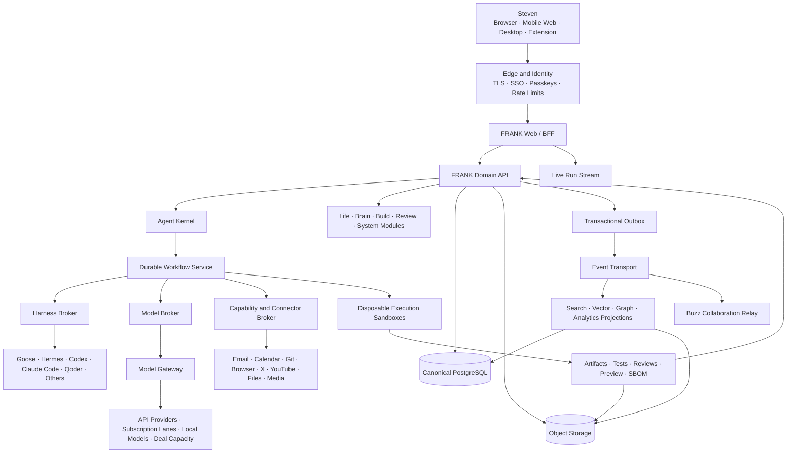
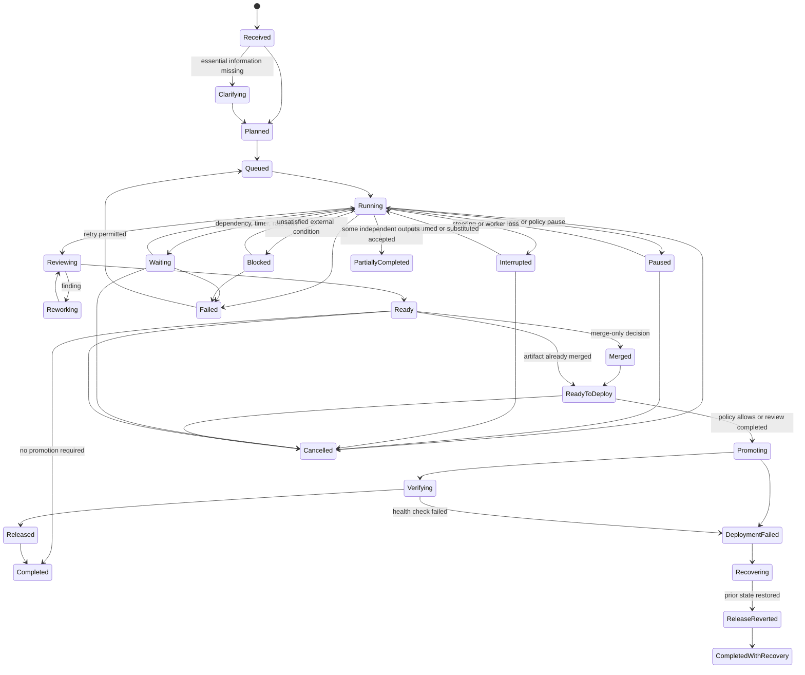
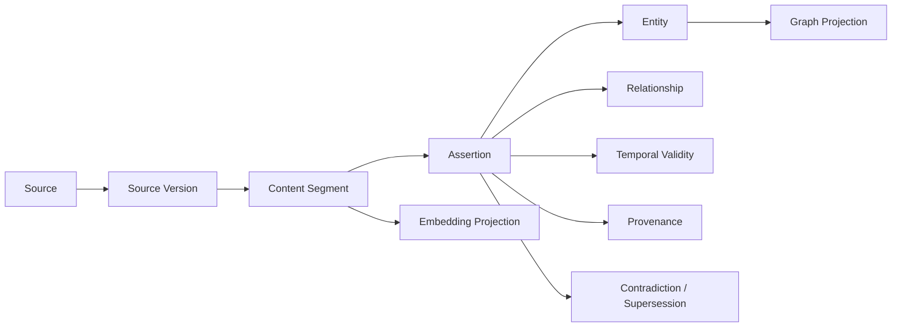
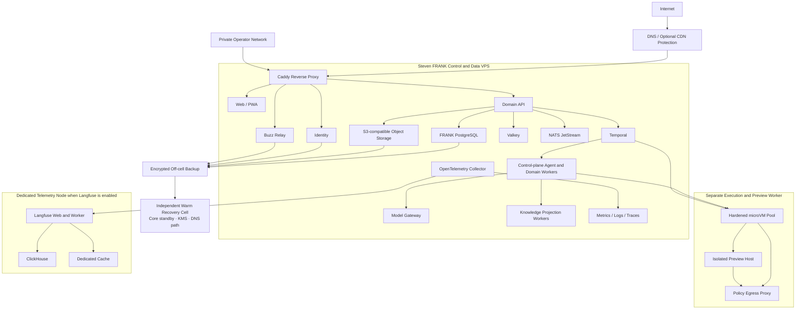
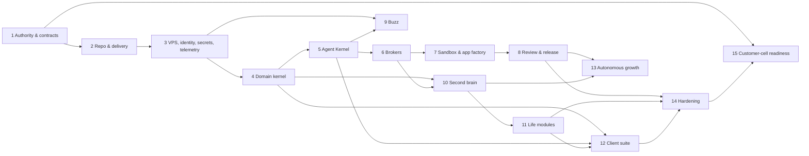

# FRANK — Complete Build Plan and System Specification

**One place to run your life and build software through AI agents.**

| Field | Value |
|---|---|
| Document status | Implementation authority |
| Version | 1.1 |
| Date | 29 July 2026 |
| Product owner | Steven |
| Primary domain | `frank.fail` |
| Primary deployment | Steven's private VPS cell |
| Source of truth | This document plus accepted Architecture Decision Records |

---

## 0. How to use this specification

This is the controlling product, architecture, security, delivery, and operations specification for FRANK. It supersedes the original Agent OS brief and the earlier V2, V3, and white-label notes wherever they conflict.

Every implementation change must trace to:

1. a requirement ID in this document;
2. a numbered normative section locator such as `FRANK-§15.4` when the requirement is a cross-cutting rule rather than a functional row;
3. an accepted Architecture Decision Record (ADR);
4. an issue derived from one of those sources; or
5. an incident, dependency update, or research finding whose impact record links back to the affected requirement.

The repository generates a requirement registry from both requirement IDs and normative section locators. Each registry record has an owner, implementation links, SLI or test, dataset version where relevant, threshold, evidence artifact, and current status. A cross-cutting rule is not optional merely because it is written as prose.

The specification is intentionally modular. Stable contracts are versioned. Replaceable implementations sit behind those contracts. The goal is to let models, providers, agent harnesses, memory systems, user interfaces, and infrastructure change without rewriting FRANK's identity, data, or workflows.

### 0.3 Revision 1.1 reconciliation

This revision incorporates the final MCP 2026-07-28 specification, Claude's announced support path, and the current fast-moving Block Buzz `main` branch. It makes Buzz the strategic human-agent collaboration workspace and adopts its maintained relay, clients, ACP integration, agent tooling, Git-event direction, deployment assets, and workflow primitives where they pass FRANK conformance. It does not transfer FRANK's durable workflow authority, canonical personal/build data, policy decisions, secrets, or external audit anchor to Buzz.

The executable handoff for updating the existing prototype and future service repository is `FRANK_BUZZ_MCP_EXISTING_BUILD_UPDATE_PLAN.md`. Where an older blueprint or mockup disagrees with this revision, this specification and that handoff control.

### 0.1 Precedence

When instructions conflict, use this order:

1. safety, privacy, and legal obligations;
2. Steven's current explicit instruction;
3. this specification;
4. accepted ADRs and module contracts;
5. repository runbooks;
6. implementation details and third-party defaults.

### 0.2 Change control

- Breaking contract changes require an ADR, a migration, compatibility tests, and a rollback path.
- A third-party package may not become a core dependency merely because an agent can install it.
- Research findings create proposals and tested branches; they do not silently alter production.
- Generated code is held to the same tests, review rules, provenance, and operational controls as human-written code.
- All current product behaviour must be discoverable from the module registry and requirement catalogue.

---

## 1. Product charter

FRANK is Steven's private, always-on personal operating system for life administration, knowledge, communication, software creation, research, automation, and continuous improvement.

FRANK must:

- accept a goal in plain language;
- turn it into durable, observable work;
- select appropriate agents, harnesses, models, skills, and tools;
- keep working without repeated prompts;
- preserve evidence and provenance;
- prepare changes before Steven is available;
- stop at configured boundaries for production promotion or other high-consequence actions;
- remember useful facts without confusing generated memory with source truth;
- improve through measured, reversible changes;
- remain replaceable at every fast-moving AI boundary.

FRANK is a product and a durable kernel. It is **not** a skin over Hermes, Goose, Codex, Claude Code, Qoder, Buzz, Cognee, LiteLLM, or any single model provider.

### 1.1 Primary outcomes

| Outcome | What success looks like |
|---|---|
| One trusted control surface | Steven can see today, ask for work, capture anything, review evidence, and control the system from one simple interface. |
| A genuine second brain | Knowledge is searchable, connected, dated, cited, correctable, and linked back to its source. |
| An autonomous app factory | FRANK can research, specify, implement, test, review, preview, document, and prepare releases while Steven is away. |
| A capable life manager | Tasks, calendar, email, goals, routines, finance administration, contacts, home, travel, and personal projects share one work model. |
| Model and harness freedom | Providers and coding agents can be changed manually or automatically without losing the job, evidence, or memory. |
| Continuous adaptation | New AI releases and research are evaluated against FRANK's needs, with useful changes prepared on isolated branches. |
| Commercial readiness without distraction | Clean module and isolation seams allow later customer cells, while Steven's FRANK remains the product priority. |

### 1.2 Non-negotiable principles

1. **Canonical truth is boring and durable.** PostgreSQL and object storage own business truth; AI-oriented indexes are rebuildable projections.
2. **Autonomy is the default.** Research, coding, testing, documentation, review, backups, previews, and reversible internal work proceed under standing policy.
3. **Evidence precedes promotion.** Steven reviews a completed, tested change and its evidence, not an unbuilt proposal.
4. **Models and harnesses are replaceable workers.** No provider owns the run, memory, policy, or artifact format.
5. **One cell, one ownership and data boundary.** Steven's deployment has isolated databases, object storage, secrets, identities, collaboration relay, and provider accounts; inside the cell, public edge, control services, sandboxes, secrets, and data stores remain separate trust zones.
6. **No hidden work.** Every durable run exposes status, decisions, actions, outputs, spend, and traceable evidence.
7. **Simple interface, deep system.** Use plain system fonts, restrained colour, clear hierarchy, and progressive disclosure.
8. **Sources outrank summaries.** FRANK shows provenance, timestamps, confidence, and the original material.
9. **Secure by containment.** High autonomy is delivered through disposable workspaces, scoped credentials, egress controls, and fast kill switches.
10. **Measure before adopting.** A new model, memory engine, or agent earns promotion through evals and real task outcomes.
11. **Local ownership, open interfaces.** Prefer self-hostable and open components where they are strong, while keeping adapters for superior hosted services.
12. **Deletion and correction are first-class.** Steven can correct a fact, remove a source, rebuild projections, export data, and verify erasure.

### 1.3 Explicit product boundaries

FRANK may assist with health, finance, legal administration, and security, but it must distinguish information and organisation from regulated professional advice. It must not invent authority, send irreversible instructions, move money, accept legal terms, publish externally, or deploy production changes outside the standing policy that applies to that action.

FRANK stores operational summaries and evidence. It does not require hidden reasoning traces and must not make those traces part of the product contract.

---

## 2. Users, trust zones, and deployment intent

### 2.1 Current user

Steven is the owner, administrator, operator, and primary user. He is non-technical at the product surface and should not need to understand containers, queues, model identifiers, or source-control commands to use FRANK.

### 2.2 Later roles

The authorization model must support these roles even though Steven's cell initially assigns them to one person:

| Role | Scope |
|---|---|
| Owner | Identity recovery, policies, billing, export, deletion, production promotion, and global containment. |
| Operator | Infrastructure, connectors, model pools, backups, incident response, and upgrades. |
| Builder | Project work, repositories, sandboxes, tests, and previews. |
| Member | Personal work and allowed shared spaces. |
| Reviewer | Evidence review and narrowly delegated promotion decisions. |
| Service identity | A non-human principal with explicit capability and time limits. |

### 2.3 Data classification and content trust

FRANK uses one versioned data-classification vocabulary everywhere:

| Class | Examples | Processing rule |
|---|---|---|
| `open` | Public websites, open-source code, published research | Eligible for any verified route, including promotional capacity |
| `internal` | Generic plans, non-secret test artifacts, operational metadata | Dedicated authenticated provider or local route |
| `private` | Email, calendar, contacts, private code, personal notes | Provider explicitly approved for private data or local route |
| `sensitive` | Health, finance, location history, identity documents, children and intimate relationship records | Compartment-scoped agent and contractually approved private or local route |
| `secret` | Passwords, recovery codes, private keys, raw access tokens | Never placed in model context; opaque handle or brokered operation only |

Classification and trust are different. Each source also carries a trust label:

| Trust | Meaning |
|---|---|
| `policy-trusted` | Signed, versioned FRANK policy or schema installed through the policy-change workflow; ordinary documents and messages can never receive this label |
| `owner-authenticated` | Steven's authenticated command or correction; it establishes user intent but does not prove factual correctness or bypass safety, legal, data, or action policy |
| `verified-source` | Source identity or provenance has been verified; its content remains evidence to assess and can never issue system instructions |
| `external-untrusted` | Email, web, document, post, transcript, repository content, or third-party tool description |
| `generated-untrusted` | Model, agent, extraction, summary, or inferred relationship awaiting deterministic checks or confirmation |

Combining data inherits the strictest class. A derived summary, embedding, trace, artifact, or Buzz projection retains the strictest contributing class unless an explicit deterministic redaction produces a separately verified lower-class artifact. Provider fallback may maintain or strengthen privacy, never weaken it.

Every model, tool, projection, storage, telemetry, and connector route produces a `DataRouteDecision` containing the class, contributing sources, processor, location, retention/training terms, redactions, policy version, and reason. Unknown terms or unknown classification fail closed.

### 2.4 Isolation rule

FRANK is a single private cell. Later white-label deployments are separate cells, not tenants sharing Steven's data plane. Each customer receives a dedicated VPS, domain, database set, object store, secret root, identity realm, Buzz relay, telemetry store, backups, and provider-native model credentials or subaccount.

The later fleet service may know that a cell exists, its version, health, licensed modules, backup status, and provider-reported aggregate billing. It must never receive cell logs, events, prompts, retrieved memories, email, files, source code, embeddings, model outputs, or secrets.

### 2.5 Steven's personal defaults

| Setting | Default |
|---|---|
| Locale | English (Australia), `en-AU` |
| Home timezone | `Australia/Perth` |
| Week start | Monday |
| Date format | `DD/MM/YYYY`; ISO 8601 in APIs |
| Time format | 12-hour in the personal UI, 24-hour in logs and APIs |
| Currency | AUD |
| Units | Metric |
| Quiet hours | 21:00–07:00 local time, with critical security and travel exceptions |
| Calendar handling | Preserve event timezone; display home and event time when travelling |
| Daylight-saving handling | Use IANA timezone rules at the event location; never use fixed UTC offsets for recurrence |

Steven can change these values; every scheduled or financial record retains the rules used when it was created.

---

## 3. Experience specification

### 3.1 Design direction

The interface must feel calm, fast, and obvious:

- system UI font stack only;
- no decorative or novelty typography;
- neutral surfaces with one restrained accent colour;
- borders and spacing before shadows;
- motion only for continuity, progress, focus, and state change;
- dense information on desktop, focused cards on mobile;
- no “AI magic” theatre, animated prose, or ornamental dashboards;
- human descriptions first, technical detail one level deeper;
- keyboard, mouse, touch, screen reader, and reduced-motion support.

### 3.2 Primary navigation

| Area | Purpose |
|---|---|
| **Today** | Daily brief, current commitments, important changes, waiting items, and suggested next actions. |
| **Ask / Capture** | Persistent conversation plus universal capture, scoped to a person, project, room, source, or task. |
| **Life** | Tasks, calendar, email, goals, habits, finance admin, contacts, home, family, travel, and personal projects. |
| **Build** | Apps, repositories, specifications, issues, active runs, previews, evidence, releases, and incidents. |
| **Brain** | Search, sources, wiki pages, people, topics, timelines, saved items, and memory corrections. |

These are the five equal top-level destinations. **Review** appears as a persistent outcome queue and contextual badge; **Inbox**, **Automations**, **Rooms**, and **System** live under **More** or open within the object they affect. Technical routing and operations never compete with daily life in the normal navigation.

Contextual areas:

| Area | Purpose |
|---|---|
| **Review** | Completed change packs, production promotions, sensitive actions, unresolved contradictions, and failed checks. |
| **Inbox** | Captures and items that require classification, reply, scheduling, or delegation. |
| **Automations** | Rules, schedules, triggers, run history, standing policies, and exceptions. |
| **Rooms** | Buzz conversations attached to a person, project, incident, branch, or topic. |
| **System** | Owner controls for agents, models, harnesses, skills, tools, connectors, costs, health, audit, backups, and settings. |

### 3.3 Global interactions

- **Universal capture:** one action accepts text, voice, image, file, URL, forwarded email, or selected browser content.
- **Command palette:** navigation and safe actions are searchable without remembering where they live.
- **Global search:** one query spans canonical records and derived knowledge, with filters and citations.
- **Context drawer:** every object can reveal sources, related items, history, agents, automation, and audit.
- **Status strip:** concise system health, current spend, active runs, and incidents; no constant technical noise.
- **Activity explanation:** each agent update says what changed, why it changed, what evidence exists, and what happens next.
- **Undo or contain:** reversible actions offer undo; running work offers stop; connectors and agents offer immediate containment.

The Review surface never reduces different intentions to one vague approval button. Depending on the evidence pack and policy, it offers distinct actions:

- accept the knowledge or specification change only;
- merge code but do not deploy;
- deploy an already merged immutable artifact;
- promote the exact reviewed artifact;
- request a bounded edit while retaining completed evidence;
- retain the branch and preview for later;
- reroute the remaining work to another harness or model;
- archive the candidate with a reason;
- discard disposable artifacts after showing what will be removed.

The interface must state exactly which repository, environment, audience, data, cost, and recovery option each action affects.

### 3.4 Desktop and browser

The browser application is the complete product surface and runs from `frank.fail`. The desktop application is a signed Tauri shell around the same product modules, adding:

- system tray and global capture shortcut;
- native notifications;
- secure local credential bridge;
- file and folder handoff;
- optional local execution node;
- deep links and protocol handlers;
- offline capture queue;
- controlled access to clipboard and selected desktop context.

Desktop-only capabilities must never be required for core life or review workflows.

### 3.5 Mobile

The mobile experience is an installable responsive web application with:

- bottom navigation for Today, Ask, Capture, Review, and More;
- voice-first capture;
- camera and share-sheet ingestion;
- push notifications;
- quick accept, reject, defer, stop, and reroute actions;
- readable evidence summaries with drill-down;
- offline capture and recent-item access.

An app-store shell is built only when recorded PWA evidence fails a required capability or reliability target for push delivery, Share Sheet integration, biometrics, offline operation, background transfer, or system automation. The decision requires an ADR containing the failed target, native capability gained, maintenance cost, and browser fallback. iOS builds require macOS and Xcode; this does not block the browser product.

### 3.6 Browser extension

The extension is an authenticated, integrity-verified transport client. Captured page content remains `external-untrusted`, and the extension cannot create policy, assert factual trust, or authorize a consequential action. It must:

- save the current page, selection, screenshot, and user note;
- capture X bookmarks after explicit account connection;
- record opted-in YouTube viewing events and visible video identifiers;
- show exactly what will be sent to FRANK;
- never background-capture private pages, form values, passwords, or browsing history outside declared rules;
- allow an explicit user-selected capture from an authenticated page only after preview, classification, optional redaction, and destination confirmation;
- queue safely when offline;
- support per-site allow, deny, and pause controls.

### 3.7 Client state and release requirements

Every user-facing route defines and tests:

- loading, empty, partial, stale, offline, permission-denied, degraded-provider, error, recovery, and success states;
- supported roles and data compartments;
- primary keyboard path, touch path, focus order, screen-reader name, and 200% zoom;
- source, history, export, correction, and deletion actions where the object supports them;
- safe behaviour when push, service worker, share target, camera, microphone, filesystem, or native bridge capability is unavailable.

Mobile capture uses the Web Share Target API only where the installed platform passes the capability test. Copy-link, upload, camera, browser extension, bookmarklet, and email-forwarding fallbacks remain available.

The PWA has a versioned manifest, atomic service-worker update, offline schema migration, encrypted local cache for private data, remote session revocation, and a visible “update ready” recovery path. The Tauri shell requires signed and notarized packages where applicable, a signed updater, rollback, capability allowlists, and remote revocation. The browser extension uses the minimum declared permissions, signed store packages, version pinning, compromise kill switch, and token revocation.

### 3.8 Route and screen contracts

The browser, desktop shell, and mobile web client use one route model and generated API client. The desktop layout has a compact navigation rail, one primary workspace, an optional context drawer, and a collapsible activity strip. Mobile presents the same objects as focused screens with bottom navigation; it does not ship a reduced data model.

Every user-facing screen is registered through a machine-readable contract:

```yaml
schema: frank.screen/v1
id: core.today
path: /today
navigation: primary
roles: [owner, operator, member]
compartments: []
objects: [WorkItem, CalendarEvent, Notification, Run]
query_schema: schema://screens/today/query/v1
commands: [work.create, run.interrupt, review.open]
event_parts: [run.status, notification.created, work.changed]
states: [loading, empty, partial, stale, offline, denied, degraded, error, recovery, success]
offline: read-cached
capabilities: []
deep_links: [web, pwa, tauri]
acceptance_journeys: [journey.today-open, journey.capture-to-today]
```

A route absent from the screen registry cannot ship. Duplicate paths, undeclared commands, missing authorization, missing state coverage, inaccessible primary actions, and pack route collisions fail continuous integration. Server authorization never trusts the client route or manifest. URLs contain only opaque identifiers, never secrets or sensitive labels. Deprecated routes retain tested redirects until every supported client version has migrated.

| Route family | Required screens and objects | Default primary action | Mobile treatment |
|---|---|---|---|
| `/today` | Daily brief, commitments, waiting items, agent work, exceptions, recent change digest | Start or continue the highest-value safe action | Stacked priority cards with brief, capture, and review shortcuts |
| `/ask` | Scoped conversation, structured message parts, source picker, run progress, tool receipts, artifacts | Ask or capture in the current scope | Full-screen thread with persistent voice/capture control |
| `/life` | Work, calendar, messages, people, goals, routines, finance, home, travel, personal projects | Add, plan, delegate, or reconcile a life item | Hub plus object-specific lists, timeline, and focused detail |
| `/build` | Apps, specifications, repositories, work graph, runs, changes, previews, releases, incidents | Create an app or continue a blocked build | Project cards, run timeline, evidence and promotion sheets |
| `/brain` | Search, source library, wiki, people, topics, timelines, saved items, contradictions | Search or add a source | Search-first view with citation and source sheets |
| `/review` | Ready change packs, consequential actions, knowledge corrections, exceptions, failed checks | Apply one exact artifact-bound decision | Queue with explicit merge, deploy, retain, reroute, or reject actions |
| `/inbox` | Captures, triage, drafts, sync exceptions, unclassified sources | Classify, reply, schedule, delegate, or archive | Swipe is never the only control; accessible action sheet mirrors every action |
| `/automations` | Catalogue, rule editor, schedules, policies, run history, exceptions | Enable, simulate, edit, pause, or inspect | Plain-language cards; advanced policy opens separately |
| `/rooms` | Buzz rooms, members, messages, linked work, proposals, delivery state | Message, attach work, or translate a proposal into a FRANK command | Conversation view with linked-object drawer |
| `/system` | Health, agents, harnesses, models, skills, tools, connectors, spend, audit, backups, settings | Diagnose, contain, configure, test, or restore | Owner-only sections with high-consequence step-up authentication |

Canonical detail routes include `/life/work/:id`, `/life/calendar/:id`, `/life/messages/:id`, `/life/people/:id`, `/build/projects/:id`, `/build/runs/:id`, `/build/changes/:id`, `/build/incidents/:id`, `/brain/sources/:id`, `/brain/entities/:id`, `/brain/wiki/:slug`, `/review/:id`, `/automations/:id`, and `/rooms/:id`. Every detail screen shows:

- identity, current state, owner, scope, classification, freshness, and last meaningful change;
- one clear primary action and a restrained overflow menu;
- timeline and current work, with live progress delivered through typed event parts;
- sources, citations, related objects, artifacts, spend, policy, and audit in the context drawer;
- correction, export, retention, and deletion controls when applicable;
- an explicit recovery action for stale, partial, failed, quarantined, or outcome-unknown states.

Required critical click paths are versioned browser tests:

1. capture text, voice, file, URL, X item, or YouTube item and find the durable source;
2. ask a cross-source question, inspect citations, correct an assertion, and verify the corrected answer;
3. create an app goal, inspect its specification, follow live work, open the isolated preview, and review the complete evidence pack;
4. merge without deploying, later promote the exact reviewed artifact, observe health, and recover the previous release;
5. inspect a model route, temporarily pin a different eligible route, exhaust it, and see safe automatic fallback;
6. contain one run, harness, connector, model route, or all execution from both desktop and mobile;
7. receive an offline or push notification, open the exact object, act once, and see the action reflected across clients;
8. lose a connector or provider mid-flow, see the stale or outcome-unknown state, reconcile it, and avoid duplicate side effects.

---

## 4. Functional requirements

“Must” means required. Every normative requirement has a unique ID or inherited normative section locator and an automated test. When physical observation or human evaluation is necessary, the requirement registry names the owner, deterministic procedure, fixtures, cadence, threshold, and evidence artifact; inability to automate is not a waiver.

### 4.1 Today, capture, and personal command

| ID | Requirement | Acceptance evidence |
|---|---|---|
| UX-001 | Today must combine calendar, tasks, goals, routines, waiting items, messages, agent work, and system exceptions into one prioritised view. | Fixture account produces a deterministic brief with links to every source record. |
| UX-002 | FRANK must generate morning and evening briefs and regenerate them on demand. | Scheduled and manual runs produce equivalent cited outputs and record inputs. |
| UX-003 | Universal capture must accept text, voice, images, documents, URLs, and forwarded content. | Each input type creates an immutable source envelope and a triage item. |
| UX-004 | Capture must acknowledge durability in under 500 ms at the API boundary, even when downstream enrichment is delayed. | Load test and queue interruption test. |
| UX-005 | Steven must be able to say “remember,” “do,” “build,” “research,” “schedule,” or “send” without selecting a technical agent. | Intent routing eval passes representative natural-language commands. |
| UX-006 | Every recommendation must be dismissible, explainable, and trainable through simple feedback. | Feedback changes ranking without erasing the original event. |
| UX-007 | The interface must show stale data and sync failures rather than silently presenting an old state as current. | Connector outage test displays age and recovery action. |
| UX-008 | Important work must remain findable by outcome, person, project, topic, source, or date. | Search acceptance set meets retrieval targets in section 20. |

### 4.2 Unified work model

| ID | Requirement | Acceptance evidence |
|---|---|---|
| WORK-001 | Tasks, goals, calendar commitments, messages requiring action, app issues, and automation exceptions must share a common `WorkItem` contract. | Cross-domain query returns a consistent state and ownership model. |
| WORK-002 | A work item must support owner, collaborators, status, priority, dates, dependencies, context, source, policy, artifacts, and history. | Contract and migration tests cover every field and transition. |
| WORK-003 | Work can be delegated to a person, agent profile, team of agents, or external system without changing its identity. | Reassignment retains history, evidence, and dependency links. |
| WORK-004 | Waiting, blocked, scheduled, active, reviewing, completed, cancelled, and failed states must be explicit. | Invalid transitions are rejected and valid transitions are audited. |
| WORK-005 | Repeating work must use recurrence rules and idempotency keys, not copied ad hoc tasks. | Retry and daylight-saving tests produce one intended occurrence. |
| WORK-006 | All work must expose “why now,” “definition of done,” and “next safe action.” | UI and API contract tests. |

### 4.3 Calendar, email, contacts, and communication

| ID | Requirement | Acceptance evidence |
|---|---|---|
| COMMS-001 | FRANK must synchronise selected calendars bidirectionally and preserve provider identifiers, recurrence, timezone, attendees, and change tokens. | Round-trip, conflict, recurrence, and timezone suites pass. |
| COMMS-002 | Calendar planning must detect collisions, travel buffers, focus time, deadlines, and over-commitment. | Scenario suite returns expected warnings and alternatives. |
| COMMS-003 | Email must support unified inbox, threads, labels/folders, attachments, semantic search, drafting, scheduled send, and follow-up tracking. | Provider contract tests and evidence of source message lineage. |
| COMMS-004 | Untrusted message content must never directly authorize tools or disclose secrets. | Prompt-injection test corpus cannot cross the execution boundary. |
| COMMS-005 | Contact records must join identities across email, phone, calendar, X, organisations, and user-confirmed aliases. | Merge/split tests preserve provenance and undo. |
| COMMS-006 | Meeting preparation must assemble relevant people, history, open work, documents, and suggested questions with citations. | Representative meeting pack matches known evidence. |
| COMMS-007 | Meeting follow-up must produce notes, decisions, tasks, and draft messages, each linked to transcript or user notes. | Source-linked outputs and correction flow demonstrated. |
| COMMS-008 | Outbound communication must obey per-channel standing policy and show the exact sent content in audit. | Policy matrix tests draft, schedule, send, cancel, and retry paths. |

### 4.4 Goals, habits, health, home, travel, and personal administration

| ID | Requirement | Acceptance evidence |
|---|---|---|
| LIFE-001 | Goals must support outcomes, measures, target dates, projects, habits, reviews, and evidence of progress. | Goal roll-up derives progress from linked records and allows correction. |
| LIFE-002 | Habits and routines must support schedules, streaks, skips, notes, reminders, and trend summaries without punitive design. | Recurrence and timezone tests; accessible mobile interaction. |
| LIFE-003 | Health data must be separately classified, consented, encrypted, and excluded from opportunistic model routes. | Data-flow test proves only allowed processors receive health context. |
| LIFE-004 | FRANK may organise symptoms, appointments, medications, measurements, questions, and documents, but it must never diagnose or alter treatment. Informational output is labelled, and urgent-risk guidance follows a versioned clinician-reviewed red-flag policy and Steven's current location. | No missed red-flag case in the hidden safety suite; every health response passes advice-boundary and source tests. |
| LIFE-005 | Home administration must track assets, warranties, maintenance, bills, providers, documents, and recurring obligations. | Warranty-to-reminder and maintenance-history scenarios pass. |
| LIFE-006 | Travel planning must combine itinerary, bookings, documents, calendar, tasks, weather, local time, and disruption monitoring. | Simulated trip generates a cited, timezone-correct travel pack. |
| LIFE-007 | Personal projects must use the same work, file, conversation, and automation contracts as software projects. | Project switch retains consistent navigation and permissions. |
| LIFE-008 | Family or child-related data must support separate privacy and retention policies. | Retrieval and export tests respect subject-level boundaries. |

### 4.5 Finance administration

| ID | Requirement | Acceptance evidence |
|---|---|---|
| FIN-001 | FRANK must ingest statements, receipts, invoices, subscriptions, bills, and user-entered transactions with source provenance. | Sample corpus reconciles every extracted value to a source region. |
| FIN-002 | Monetary values must use currency plus integer minor units or fixed-precision decimal; floating point is forbidden. | Schema lint and arithmetic test suite. |
| FIN-003 | Categories, merchants, accounts, tax labels, and reconciliation corrections must be versioned and reversible. | Reclassification does not mutate the source and can be undone. |
| FIN-004 | FRANK must detect renewals, unusual changes, duplicate charges, missing documents, and upcoming cash obligations. | Known-anomaly fixture suite meets precision target. |
| FIN-005 | Reports must distinguish recorded facts, estimates, and model-generated suggestions. | UI/API snapshot tests show labels and confidence. |
| FIN-006 | Moving money, opening accounts, accepting financial terms, or placing trades requires a separately enabled high-consequence connector policy. | Default-deny integration tests. |

### 4.6 Second brain and knowledge

| ID | Requirement | Acceptance evidence |
|---|---|---|
| BRAIN-001 | Every ingested item must begin as a source envelope containing origin, author, capture method, timestamps, content hash, rights metadata, trust class, and raw artifact pointer. | Ingestion contract rejects incomplete envelopes. |
| BRAIN-002 | Raw sources must be immutable; corrections create new assertions, annotations, or tombstones. | Correction test retains original and updates retrieval. |
| BRAIN-003 | FRANK must support exact text, metadata, semantic, temporal, entity, and relationship search. | Golden retrieval set measures each mode and hybrid ranking. |
| BRAIN-004 | Answers from the brain must cite sources at passage or timestamp level and expose the retrieval path. | Citation verifier confirms each cited span exists. |
| BRAIN-005 | Facts must support valid-from, valid-to, observed-at, confidence, source, and supersession. | Changing-address and changing-role scenarios return the right fact for a date. |
| BRAIN-006 | Personal preference memories must be reviewable, editable, expirable, and deletable. | Memory control screen and end-to-end deletion test. |
| BRAIN-007 | Derived embeddings, summaries, entities, and graphs must be rebuildable from canonical sources. | Projection deletion and full rebuild preserve source coverage, citation integrity, accepted assertions, authorization, and retrieval metrics within the registered tolerance for the projection revision. |
| BRAIN-008 | Contradictory sources must remain visible; FRANK must not silently collapse them into one false certainty. | Contradiction fixture returns both claims and an uncertainty record. |
| BRAIN-009 | Knowledge scopes must include private, project, room, person, topic, and later customer cell. | Cross-scope leakage tests return zero unauthorized results. |
| BRAIN-010 | Export must produce human-readable files plus machine-readable source, assertion, link, and provenance records. | Restore into an empty test cell recreates the selected knowledge set. |

### 4.7 X bookmarks

| ID | Requirement | Acceptance evidence |
|---|---|---|
| X-001 | Connected X bookmarks must be captured through an official API where available, with an explicit browser-assisted fallback. | Both adapters produce the same normalized source contract. |
| X-002 | A bookmark must preserve post text, author, thread context, URLs, media pointers, timestamps, and capture time. | Fixture thread generates complete envelope and media manifest. |
| X-003 | FRANK must classify the item, extract claims and useful actions, find related knowledge, and propose a destination. | Evaluation set meets classification and duplicate-detection targets. |
| X-004 | Public posts are untrusted content and cannot issue system instructions. | Adversarial-post corpus cannot trigger tools or retrieve secrets. |
| X-005 | Bookmark removal or source deletion must support a user-selected keep, archive, or erase policy. | Sync test applies each policy predictably. |

The browser fallback is an explicit user action on the X Bookmarks view or an individual post: the extension reads only visible bookmarked-post identifiers and content after preview, then fetches public context through approved routes. It does not scrape passwords, private messages, form fields, or unrelated browsing. Selector/version health checks detect layout breakage; legal/terms metadata can disable the adapter without losing already captured provenance. Target ingestion delay is under 15 minutes for API sync and immediate durable capture for the explicit browser action.

### 4.8 YouTube history and transcript wiki

| ID | Requirement | Acceptance evidence |
|---|---|---|
| YT-001 | Historical viewing may be imported from a user-provided export; continuous capture uses an opted-in browser extension because the public API does not provide complete watch history. | Import and browser-capture fixtures deduplicate the same video. |
| YT-002 | Capture must record video ID, channel, title, URL, watch time, watched portion where observable, and the capture mechanism. | Event schema and privacy UI tests. |
| YT-003 | Kid-oriented or family-background viewing must be excluded by default using account/profile, channel rules, title/topic signals, watch context, and user feedback. | Labelled evaluation set reports precision, recall, and override behaviour. |
| YT-004 | Transcript acquisition must prefer creator captions, preserve language and timestamps, and clearly label generated transcription. | Multiple transcript sources normalize without losing timestamps. |
| YT-005 | Each accepted video must create a wiki record with synopsis, chapter map, claims, examples, tools, people, action ideas, related knowledge, and timestamp citations. | Golden-video set passes structural and citation checks. |
| YT-006 | A video without a transcript must remain a source record and may be queued for local or approved speech-to-text processing. | No-transcript scenario remains searchable and resumable. |
| YT-007 | Copyrighted content must be stored and displayed according to user rights and source terms; summaries must not become unauthorised republication. | Rights metadata and export policy tests. |

### 4.9 Notes, bookmarks, media, voice, and notifications

| ID | Requirement | Acceptance evidence |
|---|---|---|
| NOTE-001 | Notes must support plain text and Markdown, folders, tags, wiki links, backlinks, attachments, daily notes, templates, source citations, and version history. | Edit, conflict, backlink, attachment, export, and restore scenarios pass. |
| NOTE-002 | A generated note must remain distinguishable from a source, an accepted fact, and Steven's own writing. | UI and API expose authorship, source, and confirmation state. |
| NOTE-003 | Notes may propose tasks, people, decisions, events, and memories, but extraction may not silently mutate those domains. | Proposal and acceptance audit is complete. |
| MARK-001 | General bookmarks must preserve URL, resolved URL, title, author, snapshot, selected text, note, tags, collection, source time, capture time, and availability state. | Redirect, duplicate, deleted-page, and archived-snapshot tests pass. |
| MARK-002 | FRANK must detect duplicates and syndicated copies without losing each capture's provenance or note. | Duplicate corpus groups related items while preserving originals. |
| MEDIA-001 | Studio must manage images, audio, video, documents, source files, generated variants, previews, rights, prompts, models, edits, and publication history. | Asset lineage can reproduce or explain every generated output. |
| MEDIA-002 | Image, speech, music, video, document, HyperFrames, and CAD capabilities must be separate provider or worker modules. | Each module can be disabled or replaced without breaking the asset library. |
| MEDIA-003 | Media generation must retain content credentials, rights and consent metadata where applicable and prevent private inputs from entering ineligible providers. | Provider-route and publication checks pass. |
| VOICE-001 | Voice capture must provide transcript preview, language, confidence, correction, and a retained audio policy before creating work. | Mobile and desktop voice journeys pass with offline retry. |
| VOICE-002 | Spoken responses must be optional, interruptible, privacy-aware, and paired with equivalent text. | Accessibility and private-setting tests pass. |
| NOTIFY-001 | Notifications must support in-app, web push, email, and optional ntfy-compatible channels with priority, quiet hours, deduplication, escalation, deep links, and delivery receipts. | Retry and provider-outage tests produce no notification storms. |
| NOTIFY-002 | A notification must explain the outcome or action needed; routine technical activity belongs in the timeline, not as an interruption. | Notification quality fixture set passes plain-language and urgency rules. |

### 4.10 Research watcher and continuous improvement

| ID | Requirement | Acceptance evidence |
|---|---|---|
| GROW-001 | FRANK must monitor a curated registry of official research, product, security, release, standards, and pricing sources. | Daily run records fetch state, source health, and new items. |
| GROW-002 | Sources must use RSS, release feeds, APIs, sitemaps, or polite page checks with conditional requests and rate limits. | Network test verifies caching, backoff, and terms metadata. |
| GROW-003 | Every finding must be deduplicated, trust-labelled, summarised, and mapped to affected requirements, modules, ADRs, or evals. | Known release note creates the expected impact record. |
| GROW-004 | FRANK must distinguish information, a candidate, a tested improvement, and an accepted product change. | State transition tests prevent direct source-to-production promotion. |
| GROW-005 | When a finding warrants code, FRANK must prepare an isolated change with tests, cross-model review, preview, and evidence while Steven is away. | Simulated overnight run ends at review-ready state with no production change. |
| GROW-006 | Low-value churn must be suppressed using impact score, confidence, expected value, compatibility, operational cost, and change budget. | Replay set shows stable rejection of cosmetic or duplicative updates. |
| GROW-007 | Rejected candidates must retain a reason and reconsideration trigger. | Candidate register supports future re-evaluation without duplicate work. |

### 4.11 Inference deal scout and capacity

| ID | Requirement | Acceptance evidence |
|---|---|---|
| DEAL-001 | FRANK must check provider pricing, free-credit offers, rate limits, model access, expiry, geography, privacy terms, and reliability each day. | Provider fixtures produce normalized offers and expiry alerts. |
| DEAL-002 | Offers must be verified from provider-controlled sources before routing real work. | Unverified social post remains quarantined and cannot become a route. |
| DEAL-003 | Free or promotional capacity must be treated as opportunistic, expiring, and lower-trust until verified otherwise. | Route policy refuses sensitive data and has an automatic fallback. |
| DEAL-004 | New capacity must pass authentication, health, capability, quality, privacy, and cost probes before activation. | Failing probe cannot enter an active pool. |
| DEAL-005 | A public or shared key must never be stored in source control or used for private customer or sensitive personal data. | Secret scanner and data-class route tests. |
| DEAL-006 | Deal value must be measured as cost per successful task at the required quality, not advertised token price alone. | Dashboard reports eval-adjusted value and failure cost. |

### 4.12 App builder and development environment

| ID | Requirement | Acceptance evidence |
|---|---|---|
| BUILD-001 | Every app must have a durable project record, product brief, architecture, requirements, repository, environments, owners, risks, and release history. | Project completeness gate rejects missing authority records. |
| BUILD-002 | FRANK must turn an idea into research, specification, acceptance tests, dependency graph, issues, and a build-ready context pack. | Reference idea produces all required artifacts with links. |
| BUILD-003 | Untrusted repositories and agent-written executable code must run in a disposable hardened microVM with declared tools, credentials, network policy, and resource limits. A Git worktree may organize a branch only inside that execution boundary; it is never the security boundary. Rootless containers are reserved for trusted, pinned first-party jobs. | Malicious-repository escape, cleanup, and reproducibility tests. |
| BUILD-004 | Multiple harnesses and agents must be able to work on separate bounded tasks and exchange structured progress through FRANK and Buzz. | Multi-agent integration test merges non-conflicting changes and detects conflicts. |
| BUILD-005 | FRANK must support repositories on the VPS, GitHub, and later additional forges through a forge adapter. | Contract suite passes against local Git and GitHub test repositories. |
| BUILD-006 | All code changes must run formatting, lint, type, unit, integration, security, dependency, and relevant end-to-end checks. | Required-check policy blocks incomplete evidence. |
| BUILD-007 | User-facing changes must produce a preview environment and visual comparison on desktop and mobile viewports. | Evidence pack contains working URL, screenshots, and browser checks. |
| BUILD-008 | Database changes require forward migration, compatibility window, backup point, rollback or fix-forward procedure, and restore test. | Migration rehearsal passes on production-shaped data. |
| BUILD-009 | FRANK must perform a fresh-context review and a cross-model-family review with severity and evidence requirements. | Seeded critical defects are found; low-value comments remain below noise target. |
| BUILD-010 | Review agents must not share the implementing agent's hidden context or be told the desired verdict. | Review harness test confirms isolated prompts and independent model route. |
| BUILD-011 | Binary tests and deterministic tools outrank model opinion. | A favourable review cannot override a failing required check. |
| BUILD-012 | A completed change pack must be ready before Steven is asked to promote it. | Review item contains code, checks, preview, risks, rollback, spend, and change summary. |
| BUILD-013 | Every production promotion must declare and implement one transaction mode: pre-commit cancellable, atomic artifact/traffic-pointer change, or post-commit compensating recovery. The selected mode, point of no return, health gates, and recovery action must be visible before promotion and assessed automatically afterward. | Tests interrupt promotion before and after the declared commit point and verify the exact cancellation or recovery result. |
| BUILD-014 | Incidents must create a timeline, affected services, containment actions, evidence, recovery, and follow-up work. | Failure exercise produces a complete incident record. |
| BUILD-015 | FRANK must support creating web apps, APIs, workers, automations, browser extensions, desktop shells, mobile web apps, documents, data pipelines, and optional media/CAD outputs through project templates. | Template conformance suite and sample builds. |
| BUILD-016 | Agent-generated branches must not trigger privileged forge workflows or access production environments, deployment credentials, organization secrets, or unsafe ownership changes. | A generated CI-change branch attempts seeded secret exfiltration and receives no privileged job or secret. |

### 4.13 Collaboration with Buzz

| ID | Requirement | Acceptance evidence |
|---|---|---|
| BUZZ-001 | Buzz must provide private rooms where Steven and agents collaborate as first-class members. | Steven and every enabled harness pass the common identity, membership, signed-event, job, replay, and revocation contract. |
| BUZZ-002 | Each project, incident, substantial research topic, or long-running change may have a linked room. | Creating a project provisions or links a room idempotently. |
| BUZZ-003 | Buzz events must be signed and retained according to room policy. | Signature and membership tests pass. |
| BUZZ-004 | Buzz is not the canonical life database, build database, workflow engine, secret store, or compliance audit. | Service boundaries and failure test prove FRANK remains authoritative. |
| BUZZ-005 | Relevant room events must project into FRANK using explicit event mappings and provenance. | Rebuild test recreates projections from retained signed events. |
| BUZZ-006 | A Buzz outage must not lose canonical jobs or prevent FRANK from showing their state. | Outage and replay test. |
| BUZZ-007 | A Buzz message, reaction, or signed event is an untrusted collaboration proposal until a FRANK command resolves actor, membership-at-event-time, schema, artifact digest, replay state, and current policy. A Buzz event alone can never approve production or another consequential action. | Revoked-key, replayed-event, altered-artifact, forged-reaction, and wrong-room tests all fail closed. |
| BUZZ-008 | FRANK must reuse maintained Buzz components before building equivalent rooms, relay, ACP, CLI, agent, Git-event, Compose, or Helm functionality. | Dependency inventory proves every custom overlap is removed, justified by an ADR, or upstreamed. |
| BUZZ-009 | Production Buzz must run a tested pinned commit or immutable image while a separate canary tracks upstream `main` and runs compatibility, migration, security, and recovery checks daily. | Canary report records upstream commit, changed contracts, test results, promotion decision, and rollback image. |
| BUZZ-010 | `buzz-acp`, `buzz-agent`, `buzz-dev-mcp`, `buzz-cli`, custom ACP harness definitions, and native workflow actions may execute bounded work only through FRANK-issued assignments, capability grants, and receipts. | A direct capability escalation, duplicate scheduler, missing receipt, or bypassed FRANK policy fails closed. |
| BUZZ-011 | Buzz workflow actions are allowed for room-local, reversible collaboration tasks; Temporal remains the durable scheduler and completion authority for life administration, app builds, overnight work, retries, approvals, and consequential effects. | Restart, duplicate-delivery, pending-input, and long-running tests preserve one canonical FRANK run and one effect receipt. |
| BUZZ-012 | Buzz Git/NIP-34 features may provide branch rooms, event mirroring, and canary hosting, but the selected production forge remains authoritative until Buzz passes required forge, recovery, CI, protection, review, and migration tests. | Bidirectional reference and disaster-recovery tests preserve commit identity without granting Buzz privileged deployment credentials. |

Buzz is a strategic upstream dependency, not a decorative adapter. FRANK uses the official Compose or Helm deployment path and the maintained upstream clients and integration packages wherever practical. A small `frank-buzz` boundary layer maps cell identity, room links, assignments, event projections, capability grants, action receipts, and policy results; it must not become a forked replacement for Buzz. FRANK contributes generally useful fixes upstream and keeps local patches small, documented, rebased, and removable.

Production is pinned because Buzz remains pre-1.0 and only the current `main` line is actively supported. A daily canary follows upstream `main`; promotion occurs only after database migration, API/event compatibility, identity, rate-limit, workflow, ACP, Git, backup/restore, and security tests pass. FRANK's edge supplies enforced per-identity, per-room, and per-event-kind rate limits, payload limits, connection limits, and abuse controls while upstream rate limiting remains incomplete.

Buzz may receive `private` content and selected `sensitive` collaboration excerpts only in explicitly marked high-trust rooms inside Steven's dedicated cell when the room retention, membership, backup, redaction, and incident policy permits it. Buzz never receives `secret` material, raw credentials, recovery keys, broad connector tokens, unredacted high-risk records, or data whose policy requires end-to-end encryption. Until a reviewed Buzz release proves a compatible end-to-end encryption mode, FRANK labels room content accurately as **private on Steven's VPS and readable by the server**, not end-to-end encrypted. Canonical records stay in FRANK; rooms carry the minimum useful text and stable object references.

Authentik authenticates the FRANK user session; a separate identity bridge maps each human, device, and agent service identity to a unique cell-scoped Buzz/Nostr public key with validity dates and revocation status. Keys are never derived from passwords, passkeys, or identities in another cell. Steven's device keys use the platform keystore where available; agent signing operations use an OpenBao-held key through a narrow signer service so raw private keys never enter a harness. Membership is evaluated at event time and command time. Rotation, device loss, account recovery, agent removal, and cell restore all produce new mappings and invalidate old keys.

```ts
interface BuzzIdentityBinding {
  bindingId: string;
  cellId: string;
  frankPrincipalId: string;
  agentProfileId?: string;
  deviceId?: string;
  nostrPublicKey: string;
  keyCustodian: "platform-keystore" | "secret-broker-signer";
  signingPurposes: ("room-message" | "proposal" | "delivery-receipt")[];
  membershipValidFrom: string;
  membershipValidUntil?: string;
  revokedAt?: string;
  replacesBindingId?: string;
  recoveryEventId?: string;
}
```

### 4.14 Cost, operations, and control

| ID | Requirement | Acceptance evidence |
|---|---|---|
| OPS-001 | Every model, media, hosting, storage, and paid connector cost must attach to a run, project, automation, and provider account where possible. | Cost reconciliation reaches the target in section 20. |
| OPS-002 | Budgets must exist per day, month, project, automation, agent, provider, and customer cell. | Budget test reroutes, slows, or stops according to policy. |
| OPS-003 | Steven must be able to pause a run, agent, connector, automation class, model provider, or the whole execution plane. | Containment exercise meets time target. |
| OPS-004 | Health must distinguish healthy, degraded, unavailable, stale, and intentionally paused. | Fault injection maps each state correctly. |
| OPS-005 | Backups must be encrypted, off-cell, monitored, and regularly restored into an isolated environment. | Restore drill evidence and checksum comparison. |
| OPS-006 | Upgrades must use pinned artifacts, compatibility checks, migration rehearsal, signed provenance, and rollback or fix-forward instructions. | Supply-chain and upgrade rehearsal pass. |

---

## 5. System architecture

### 5.1 Architectural shape

FRANK is a modular control plane around isolated execution and durable data:



### 5.2 Plane responsibilities

| Plane | Owns | Must not own |
|---|---|---|
| Client | Interaction, local capture, display, offline queue | Business truth, provider secrets, policy enforcement |
| Edge and identity | TLS, authentication, sessions, coarse rate limits | Domain decisions |
| Domain control | Canonical records, authorization, module rules, API, audit intents | Long-running execution inside web requests |
| Agent control | Plans, runs, delegation, budgets, context packs, policies, interrupts | Provider-specific session as sole truth |
| Workflow | Durable state, retries, timers, signals, compensation, resumability | Source documents or UI state |
| Execution | Harness processes, tools, browsers, code, media, sandboxes | Durable identity or cross-run memory |
| Model | Capability routing, provider health, spend, privacy routes | Agent workflow semantics |
| Data | Canonical SQL, immutable artifacts, outbox, backups | Unverified generated claims |
| Knowledge projection | Search, embeddings, entities, graph, summaries | Canonical facts that cannot be rebuilt |
| Collaboration | Human-agent rooms, signed messages, shared context | Canonical life/build records or secret material |
| Operations | Telemetry, health, deployment, recovery, supply chain | Product-level user decisions |

### 5.3 Failure-domain rules

- The web application may restart without losing work.
- An agent harness may crash and be replaced without losing the run.
- A model call may fail and reroute without duplicating a tool side effect.
- Buzz may be unavailable while canonical work continues.
- A knowledge projection may be deleted and rebuilt.
- A connector may be stale without blocking unrelated modules.
- A workflow retry must not send a duplicate email, create a duplicate event, or apply the same migration twice.
- Provider promotions and upgrades must be reversible by configuration.
- No single AI vendor outage may make existing records unavailable.

---

## 6. Core modular contracts

All contracts are versioned, schema-validated, documented, and exercised by a conformance suite. Implementations declare capabilities instead of relying on brand names.

### 6.1 Module manifest

```yaml
schema: frank.module/v1
id: brain.youtube
name: YouTube Knowledge Ingestion
version: 1.0.0
kind: feature
depends_on:
  - core.sources@^1
  - core.knowledge@^1
provides:
  - connector.youtube.capture
  - pipeline.youtube.wiki
data_scopes:
  - open
  - private
ui:
  routes: ["/brain/videos"]
  widgets: ["today.recent-learning"]
events:
  consumes: ["source.youtube.captured.v1"]
  emits: ["knowledge.video.ready.v1"]
permissions:
  required: ["source:write", "knowledge:write"]
health_checks:
  - transcript_provider
  - capture_lag
```

### 6.2 Harness adapter

```ts
interface AgentHarnessAdapter {
  descriptor(): Promise<HarnessDescriptor>;
  health(): Promise<HealthReport>;
  capacity(): Promise<HarnessCapacity>;
  usage(window: UsageWindow): Promise<HarnessUsage>;
  start(input: StartHarnessRun): Promise<HarnessSession>;
  resume(input: ResumeHarnessRun): Promise<HarnessSession>;
  inspect(sessionId: string): Promise<HarnessSessionState>;
  prompt(input: HarnessPrompt, afterCursor?: string): AsyncIterable<HarnessEvent>;
  checkpoint(input: CheckpointHarnessRun): Promise<HarnessCheckpoint>;
  steer(input: SteerHarnessRun): Promise<void>;
  interrupt(input: InterruptHarnessRun): Promise<void>;
  cancel(input: CancelHarnessRun): Promise<void>;
  kill(input: KillHarnessRun): Promise<void>;
  collect(input: CollectHarnessArtifacts): Promise<ArtifactManifest[]>;
  close(input: CloseHarnessRun, cleanupDeadline: string): Promise<void>;
}
```

The descriptor declares ACP support, tool protocols, supported models, subscription authentication and refresh behaviour, context limits, budget reporting, rate limits, reset time, workspace modes, cleanup guarantees, operating-system requirements, and these explicit capability enums:

```ts
type ResumeGuarantee = "none" | "native-session" | "same-harness-restart";
type CheckpointPortability = "native-only" | "frank-rehydratable";
type EventReplay = "none" | "cursor-within-live-session" | "durable-cursor";
type CancellationStrength = "cooperative" | "process" | "sandbox";
```

A FRANK-rehydratable checkpoint contains the canonical run revision, plan and dependency state, source references, accepted artifact digests, repository commit and workspace manifest, completed tool receipts, pending or outcome-unknown side-effect ledger, cumulative spend, normalized event cursor, remaining budgets, and policy revision. Cross-harness substitution always starts a new native session from this checkpoint. FRANK maps Codex, Claude Code, Qoder, Goose, Hermes, and future agents to this contract and tests process loss at each event boundary.

### 6.3 Model provider and route

```ts
interface ModelProviderAdapter {
  catalog(): Promise<ModelDescriptor[]>;
  health(model: string): Promise<ModelHealth>;
  quote(request: ModelRequestShape): Promise<CostEstimate>;
  invoke(request: NormalizedModelRequest): AsyncIterable<ModelEvent>;
  usage(receipt: ProviderReceipt): Promise<NormalizedUsage>;
}

interface ModelRoutePolicy {
  select(task: TaskProfile, candidates: ModelCandidate[]): Promise<RouteDecision>;
  fallback(failure: RouteFailure, remaining: ModelCandidate[]): Promise<RouteDecision>;
}

interface RoutePlan {
  planId: string;
  decisionId: string;
  taskHash: string;
  dataClass: DataClass;
  allowedRegions: string[];
  termsSnapshotIds: string[];
  attemptCeiling: number;
  retryBudgetMinor: number;
  requiredModelFamilyStatus: "verified" | "provider-opaque";
  deployments: RouteDeployment[];
  fallbackConditions: RouteFallbackCondition[];
  expiresAt: string;
  signerId: string;
  signature: string;
}

interface RouteLease {
  leaseId: string;
  planId: string;
  decisionId: string;
  cellId: string;
  accountId: string;
  endpointId: string;
  modelId: string;
  modelRevision?: string;
  modelFamilyStatus: "verified" | "provider-opaque";
  region: string;
  dataClass: DataClass;
  requestHash: string;
  maxAttempts: number;
  maxCostMinor: number;
  expiresAt: string;
  signerId: string;
  signature: string;
}
```

The task profile contains capability, quality floor, privacy class, latency target, context size, tool needs, modality, budget, preferred provider, prohibited providers, and review-diversity requirements.

The FRANK Model Broker issues an immutable ordered plan and one deployment lease at a time. A gateway can retry only within that lease; changing any bound field requires the broker to select the next permitted deployment and issue a new lease. Harness-managed inference is a distinct route type: its receipt must report the actual provider, model, purpose, usage, and auxiliary call where exposed. Unknown identity is recorded as `provider-opaque`, never guessed.

### 6.4 Skill package

```yaml
schema: frank.skill/v1
id: build.adversarial-review
version: 1.2.0
entry: SKILL.md
inputs:
  - change_manifest
  - acceptance_requirements
outputs:
  - review_report
  - findings
tools:
  allow: ["repo.read", "tests.run", "browser.read"]
  deny: ["repo.write", "deploy.*", "secrets.read_raw"]
network:
  mode: declared-only
provenance:
  source: "internal"
  commit: "..."
tests:
  - "evals/review-seeded-defects.yaml"
```

Skills are instruction and workflow packages, not ambient authority. Every skill is pinned, scanned, reviewed, tested, and attached to a declared agent profile.

### 6.5 Capability and connector adapter

```ts
interface ConnectorAdapter<TConfig, TCursor> {
  manifest(): ConnectorManifest;
  authorize(config: TConfig): Promise<AuthorizationResult>;
  health(): Promise<HealthReport>;
  pull(cursor?: TCursor): AsyncIterable<ConnectorRecord>;
  push(command: ConnectorCommand): Promise<ConnectorReceipt>;
  revoke(): Promise<void>;
}
```

Connectors must implement idempotency, cursor persistence, retry classification, rate-limit reporting, source identifiers, data-class declarations, redaction, and revocation.

### 6.6 Memory projection

```ts
interface MemoryProjection {
  project(source: SourceEnvelope): Promise<ProjectionReceipt>;
  retract(sourceId: string): Promise<ProjectionReceipt>;
  query(query: KnowledgeQuery): Promise<KnowledgeHit[]>;
  explain(hitId: string): Promise<RetrievalExplanation>;
  rebuild(scope: ProjectionScope): AsyncIterable<RebuildProgress>;
  evaluate(dataset: string): Promise<EvalReport>;
}
```

Cognee, a native PostgreSQL hybrid stack, Graphiti, Mem0, and later systems are candidates behind this boundary. None may become the only copy of a source or accepted fact.

### 6.7 Event envelope

```json
{
  "specversion": "1.0",
  "type": "frank.build.change.ready.v1",
  "source": "frank://build/app-123",
  "id": "01J...",
  "time": "2026-07-28T12:00:00Z",
  "subject": "change/chg-456",
  "dataschema": "schema://frank.build.change.ready/v1",
  "datacontenttype": "application/json",
  "cellid": "cell-steven",
  "actorid": "agent/reviewer-security",
  "correlationid": "run-789",
  "causationid": "evt-previous",
  "classification": "internal",
  "data": {}
}
```

Business events use a CloudEvents-compatible envelope, explicit schema version, cell scope, correlation, causation, classification, and idempotency. A transaction writes domain state and the outbox event together.

### 6.8 Artifact and evidence manifest

```yaml
schema: frank.evidence/v1
change_id: chg-456
created_at: "2026-07-28T12:00:00Z"
retention_policy: release-history
requirements: [BUILD-006, BUILD-007, BUILD-009]
source:
  repository: "..."
  base_commit: "..."
  head_commit: "..."
execution:
  workflow: "build.change@1.4.0"
  policy: "autonomous-internal-work@3.2.0"
  environment: "sandbox-image@sha256:..."
  agents:
    - id: "agent/builder"
      revision: "1.8.0"
      harness: "codex@..."
      model: "provider/model@..."
      skills: ["build.implement@..."]
      tools: ["repo.write@...", "tests.run@..."]
artifacts:
  - kind: test-report
    uri: "s3://.../tests.json"
    sha256: "..."
  - kind: release
    uri: "oci://.../frank@sha256:..."
    sha256: "..."
checks:
  - id: unit
    result: pass
  - id: cross-model-review
    result: pass
reviews:
  - reviewer: "agent/reviewer-independent"
    model_family: "different-from-builder"
    isolated_context_hash: "sha256:..."
    report_hash: "sha256:..."
preview:
  url: "https://chg-456.preview.SANDBOX_BASE_DOMAIN"
  artifact_digest: "sha256:..."
risks: []
rollback:
  kind: release-pointer
  target: "release-previous"
integrity:
  manifest_sha256: "..."
  signer_id: "service/evidence"
  signature: "..."
```

### 6.9 Policy decision

```ts
type ActionClass =
  | "observe"
  | "internal_reversible"
  | "external_reversible"
  | "financial_or_public"
  | "destructive_or_privileged";

interface PolicyDecision {
  result: "allow" | "allow_with_limits" | "hold_for_review" | "deny";
  policyVersion: string;
  reasons: string[];
  evaluatedEnvelopeHash: string;
  matchedAuthorizationId?: string;
  limits: ActionLimits;
  expiresAt?: string;
  obligations: string[];
}

interface ActionEnvelope {
  schema: "frank.action/v1";
  actionId: string;
  idempotencyKey: string;
  nonce: string;
  cellId: string;
  principalId: string;
  delegatedActorId?: string;
  operation: string;
  target: ResourceRef;
  recipient?: ResourceRef;
  requestHash: string;
  artifactDigest?: string;
  dataClasses: DataClass[];
  credentialHandles: string[];
  networkScope: NetworkScope;
  budget: ActionBudget;
  validFrom: string;
  expiresAt: string;
  compensation?: CompensationPlan;
  signerId: string;
  signature: string;
}

interface StandingAuthorization {
  schema: "frank.authorization/v1";
  authorizationId: string;
  ownerId: string;
  allowedActors: string[];
  operations: string[];
  targetPattern: ResourcePattern;
  recipientPattern?: ResourcePattern;
  maximumDataClass: DataClass;
  credentialScopes: string[];
  networkScope: NetworkScope;
  perActionBudget: ActionBudget;
  aggregateBudget: ActionBudget;
  evidenceObligations: string[];
  retryLimit: number;
  validFrom: string;
  expiresAt: string;
  revocationCounter: number;
  signerId: string;
  signature: string;
}
```

Policy is evaluated at the action boundary, not inferred from the model's confidence. Models may propose envelopes but cannot sign, widen, or approve them. The Policy Service evaluates an immutable envelope; only then may the separate Execution Service exchange approved credential handles for short-lived credentials. Envelopes are single-use unless their declared idempotency semantics say otherwise.

Mutation, replay, wrong-target, expired-envelope, confused-deputy, altered-artifact, revocation, and privilege-inheritance attacks are mandatory conformance tests.

### 6.10 Customer and industry pack seam

```yaml
schema: frank.pack/v1
id: industry.real-estate
version: 1.0.0
requires_core: ">=1.0 <2.0"
namespace: "real_estate"
license: "commercial-internal"
signature: "..."
permissions: []
configuration_schema: "schema://packs/real-estate/config/v1"
modules: []
roles: []
workflows: []
terminology: {}
navigation: {}
ui_slots: []
policies: []
connectors: []
reports: []
events:
  owns: []
  consumes: []
migrations: []
data_ownership:
  tables: []
  retained_on_disable: true
disable_behavior: "stop-triggers-and-hide-write-actions"
export_handler: "real-estate.export@1"
uninstall_options: ["retain-read-only", "export-and-delete", "migrate"]
recovery: "restore-prior-compatible-pack"
fixtures: []
acceptance_suites: []
```

A pack may extend schemas through declared extension tables and JSON Schema fields. It may not fork core tables, bypass policy, read another cell, or replace canonical identity and audit.

### 6.11 Deployment provider

```ts
interface DeploymentProvider {
  capabilities(): Promise<DeploymentCapabilities>;
  createPreview(input: PreviewSpec): Promise<EnvironmentReceipt>;
  applyMigration(input: MigrationSpec): AsyncIterable<DeploymentEvent>;
  promoteArtifact(input: PromotionSpec): AsyncIterable<DeploymentEvent>;
  shiftTraffic(input: TrafficShiftSpec): Promise<DeploymentReceipt>;
  health(input: EnvironmentRef): Promise<EnvironmentHealth>;
  rollback(input: RollbackSpec): AsyncIterable<DeploymentEvent>;
  collectEvidence(input: EnvironmentRef): Promise<ArtifactManifest[]>;
  destroy(input: EnvironmentRef): Promise<DestructionReceipt>;
}
```

The provider may target Steven's VPS, another VPS, a container platform, or a hosted service. Artifact identity, migrations, health gates, traffic, DNS, recovery, cost, and destruction evidence remain provider-neutral.

### 6.12 Sandbox provider

```ts
interface SandboxProvider {
  capabilities(): Promise<SandboxCapabilities>;
  provision(input: SandboxSpec): Promise<SandboxLease>;
  execute(input: SandboxCommand): AsyncIterable<SandboxEvent>;
  checkpoint(leaseId: string): Promise<ArtifactRef>;
  inspect(leaseId: string): Promise<SandboxState>;
  contain(leaseId: string): Promise<void>;
  collect(leaseId: string): Promise<ArtifactManifest[]>;
  destroy(leaseId: string): Promise<DestructionReceipt>;
}
```

`SandboxCapabilities` declares kernel boundary, image digest, mounts, network policy, credential mechanism, resource ceilings, attestation, region, persistence, and destruction guarantee. Untrusted-code assignments require the hardened-microVM capability.

### 6.13 Object store

```ts
interface ObjectStore {
  put(input: PutObject): Promise<ObjectReceipt>;
  get(ref: ObjectRef, range?: ByteRange): Promise<ObjectStream>;
  head(ref: ObjectRef): Promise<ObjectMetadata>;
  version(ref: ObjectRef): Promise<ObjectVersion[]>;
  replicate(input: ReplicationRequest): Promise<ReplicationReceipt>;
  lock(input: RetentionLock): Promise<void>;
  delete(input: DeleteObjectRequest): Promise<DeletionReceipt>;
  verify(ref: ObjectRef): Promise<IntegrityReport>;
}
```

All objects are content-addressed or carry a verified content hash. The contract includes encryption, versioning, retention lock, multipart upload, replication, malware status, region, lifecycle, audit, and proof of deletion.

The pinned local store must pass destructive S3 Object Lock tests for compliance and governance retention, legal hold, delete markers, version-specific deletion, administrative deletion, clock skew, replication, and restore. Until SeaweedFS passes that suite for the exact deployed version, local storage is a replaceable working cache and immutable evidence is committed directly to an independently controlled provider bucket with proven Object Lock enforcement.

### 6.14 Cross-language adapter wire contract

JSON Schema 2020-12, OpenAPI, CloudEvents schemas, and Protobuf where binary efficiency is proven are canonical. TypeScript, Python, Rust, Swift, and other language types are generated bindings, not the source contract.

Every out-of-process adapter starts with a `frank.adapter/v1` negotiation that reports:

- adapter kind, implementation version, source commit, build and OCI digest;
- supported contract versions and exact schema hashes;
- transport and streaming capabilities;
- cancellation, deadline, replay, idempotency, and health semantics;
- required data/effect classes, network destinations, mounts, and credential audiences;
- compatibility evidence and expiry.

Request-response services use mTLS HTTP with OpenAPI; streaming uses SSE unless a contract explicitly requires WebSocket; asynchronous domain delivery uses CloudEvents; local sidecars use framed JSON-RPC over stdio or a permission-restricted Unix socket. All transports share canonical errors, trace context, deadlines, cancellation, idempotency, pagination, backpressure, and health semantics. An unsupported version or schema-hash mismatch fails closed.

Each adapter ships as a pinned signed OCI artifact or signed client package and passes the same black-box conformance suite before activation. Product code imports generated contracts or a port, never a vendor SDK across a domain boundary.

---

## 7. Agent kernel

### 7.1 Responsibilities

The Agent Kernel owns:

- goal intake and intent classification;
- plan and dependency representation;
- agent and harness selection;
- context-pack assembly;
- durable run state and signals;
- tool and connector authorization;
- budgets, deadlines, retries, and fallbacks;
- event and artifact normalization;
- delegation and collaboration;
- evidence completeness;
- containment and cancellation;
- learning records and eval attribution.

It does not embed one vendor's agent loop. A harness may plan and act inside a bounded assignment, but FRANK owns the assignment and observed results.

### 7.2 Agent profiles

| Agent profile | Purpose | Typical authority |
|---|---|---|
| Chief of Staff | Prioritise, coordinate life and work, prepare briefs | Read broad context; create and delegate internal work |
| Planner | Turn outcomes into requirements, dependencies, and checks | Read project context; write plans and issues |
| Research Scout | Monitor sources and investigate questions | Public web and approved private sources; no execution authority |
| Librarian | Ingest, cite, connect, correct, and maintain knowledge | Knowledge writes; no external action |
| Life Administrator | Calendar, inbox, contacts, home, travel, routines | Bounded connector actions under standing policy |
| Builder | Implement code and configuration in a sandbox | Workspace and declared dev credentials |
| Test Engineer | Run deterministic checks and create regressions | Read code; write tests in isolated branch |
| Independent Reviewer | Fresh-context correctness and architecture review | Read change and run checks; no change authority |
| Security Reviewer | Threat, dependency, secret, and abuse-case review | Read artifacts; run security tools |
| Release Operator | Preview, promote, rollback, and monitor releases | Environment-specific deployment credentials |
| Reliability Operator | Health, backups, incidents, recovery | Operational tools under signed work envelope |
| Cost Optimiser | Offers, routing economics, budgets, anomalies | Provider metadata and usage, no private prompts by default |
| Media Producer | Images, audio, video, documents, and optional CAD | Project media workspace and approved providers |

Profiles specify allowed harnesses, models, skills, tools, data classes, budgets, network policy, maximum run duration, concurrency, and review requirements.

### 7.3 Durable run state



Every transition records actor, time, reason, policy decision, correlation, and evidence. `CompletedWithRecovery` is visibly different from a successful release; it preserves the failed intended outcome and incident link. Workflow-version rules define which running revisions may continue, migrate, or finish under their original contract.

### 7.4 Context packs

A context pack is a signed manifest of what an agent was allowed to know for one assignment:

- goal and definition of done;
- requirement IDs and relevant ADR excerpts;
- source files or symbols;
- related work and known constraints;
- allowed tools and credentials by handle;
- data classification and egress rule;
- budget, deadline, and retry policy;
- expected outputs and evidence schema;
- uncertainty and escalation instructions.

Context packs are minimized, hash-addressed, and reproducible. Agents do not inherit all of FRANK's memory merely because they can access a tool.

### 7.5 Delegation

- Parent and child runs have separate budgets, contexts, outputs, and failure states.
- A child receives a bounded task that can be independently verified.
- Parallel work uses isolated workspaces or read-only investigations.
- Shared decisions are posted as structured events and optionally mirrored into the linked Buzz room.
- Agents may challenge assumptions and open a contradiction record.
- A coordinator merges outcomes only after dependency and conflict checks.

### 7.6 Autonomy and action classes

Steven's default operating policy:

| Action | Default |
|---|---|
| Read, research, classify, summarise, plan | Run automatically |
| Create internal records, branches, tests, docs, backups, and previews | Run automatically |
| Install dependencies inside disposable build environments | Run automatically with provenance and scans |
| Commit and push to non-production branches | Run automatically |
| Open and update review requests | Run automatically |
| Apply non-production maintenance | Run automatically only when the signed Action Envelope names the exact target, excludes production data and credentials, supplies a tested recovery path, passes pre/post health checks, and stays inside resource and spend limits; otherwise hold for Review |
| Promote FRANK's own autonomous self-update | Hold the completed evidence pack for Steven's review by default |
| Promote another managed app to production | Apply that project's standing release policy; it may auto-promote after gates if Steven configured it |
| Send routine external actions covered by a standing policy | Run automatically and record the exact action |
| Publish broadly, move money, sign terms, delete irreplaceable data, or change trust roots | Hold unless a narrow standing policy explicitly covers it |

This delivers maximum useful access without giving every model an uncontained, unaudited root shell.

---

## 8. Harness and protocol architecture

### 8.1 Decision

- **FRANK Kernel:** permanent owner of goals, work, policies, data, evidence, and UI.
- **Goose:** integrated as the preferred open general-purpose harness candidate and ACP/MCP portability path; it becomes an automatic default only after the private harness eval.
- **Hermes:** integrated as an optional bounded harness and messaging adapter, not the core.
- **Codex, Claude Code, and Qoder:** specialised coding harnesses behind ACP or maintained adapters.
- **Buzz workspace and ACP mesh:** the preferred collaboration entry point for people and agents. It uses maintained Buzz ACP, CLI, agent, Git-event, and workflow components to display, steer, and perform bounded assignments while FRANK owns the durable run, capability grant, effect receipt, and schedule.
- **Future harnesses:** added through the conformance suite, not direct core imports.

FRANK has exactly one durable execution authority: the Agent Kernel plus its Workflow Service. Goose, Hermes, Codex, Claude Code, Qoder, `buzz-agent`, and later harnesses may plan and execute inside a bounded assignment, but their native schedulers, cron loops, durable job databases, global memory, approval systems, direct tool routers, and autonomous child-agent creation are disabled or isolated from product authority. Buzz may own reversible room-local workflow state but must submit any durable, long-running, scheduled, or consequential operation through a FRANK contract. No worker or collaboration service can create a parallel control plane.

The `FRANK-managed Hermes` profile uses an isolated disposable `HERMES_HOME` and ACP or bounded batch ingress. Native cron, gateway delivery, persistent memory writes, provider fallback, direct connectors, dynamic plugin installation, and direct MCP configuration are disabled. Hermes session data and context compression are disposable caches. Every primary or auxiliary model call, tool request, message proposal, artifact, and usage record must return through FRANK receipts. The same no-parallel-authority conformance suite applies to every other harness.

### 8.2 Protocol boundaries

| Protocol | Use in FRANK |
|---|---|
| MCP 2026-07-28 | Stateless tools, resources, prompts, connector capabilities, interactive Apps, long-running Tasks, and multi-round input requests exposed through the Capability Broker. |
| ACP | Client-to-agent sessions, model/mode selection, prompts, streaming, resume, and cancellation. |
| A2A | Optional service-to-service agent discovery and cross-system task exchange. |
| CloudEvents-compatible domain envelope | FRANK's internal business event standard. |
| OpenAPI | Stable external and client API contract. |
| OpenTelemetry | Traces, metrics, logs, and baggage correlation. |
| Nostr/Buzz kinds | Signed collaboration events inside Buzz. |

Protocols are adapters, not substitutes for FRANK's domain model. Every harness connects to tools through FRANK's Capability Broker. Direct unmanaged MCP servers, locally remembered credentials, or harness-owned connector sessions are denied. A job-specific MCP server may run inside the assignment microVM only when it is declared, pinned, scanned, policy-filtered, and exposed through the broker.

The Capability Broker is the sole MCP host/client for managed sessions. Each registered server record binds executable or image digest, origin, protocol revision, tool/resource/prompt schema hashes, data classes, effect classes, filesystem and network limits, credential audience, owner, expiry, and conformance evidence. The permitted catalogue is snapshotted into the signed run envelope. A changed server, tool, annotation, or schema pauses the affected capability until policy and compatibility checks pass. Tool annotations and returned content remain untrusted data. Raw bearer-token passthrough is forbidden; the broker issues a separate short-lived audience-bound credential or performs the operation itself. Every effectful invocation uses the Action Envelope and canonical invocation ledger.

### 8.2.1 MCP 2026-07-28 implementation contract

MCP 2026-07-28 is the preferred protocol revision. The broker retains a temporary compatibility adapter for pinned legacy servers, measures its use, and removes it after every registered server has migrated. Claude announced that support is rolling out; FRANK capability-probes each Claude surface and never infers support from the announcement alone.

| ID | Requirement | Acceptance evidence |
|---|---|---|
| MCP-001 | The MCP edge must be stateless across requests: no `initialize` dependency, no `Mcp-Session-Id`, no sticky routing, and no hidden transport-owned workflow state. | The same logical operation retries across different gateway replicas and produces one correct result or one reconciled outcome. |
| MCP-002 | Every request must carry and validate `MCP-Protocol-Version: 2026-07-28`, `Mcp-Method`, and `Mcp-Name`; protocol version, client identity, and capabilities in `_meta` must agree with the authenticated principal and message body. | Missing, unsupported, malformed, header/body-mismatched, and identity-confused requests fail closed. |
| MCP-003 | Optional `server/discover` and all advertised capabilities must pass policy filtering before reaching a harness. | A server cannot reveal or invoke a capability outside the assignment catalogue. |
| MCP-004 | Multi Round-Trip Requests use `input_required` and `inputResponses`; each request is mapped to a durable FRANK Input Request with schema, expiry, actor, run, artifact revision, and replay protection. | Restart, duplicate, stale-response, wrong-actor, and altered-artifact tests preserve one valid continuation. |
| MCP-005 | MCP Tasks may represent long-running protocol work but never replace FRANK Run, Action, Workflow, or Review records. A task is linked to a canonical run before its handle is exposed. | `tasks/get`, `tasks/update`, `tasks/cancel`, and optional `subscriptions/listen` survive process loss and reconcile to one FRANK state. |
| MCP-006 | `tools/list`, `prompts/list`, `resources/list`, and `resources/read` caching must honour `ttlMs`, `cacheScope`, deterministic ordering, principal scope, server revision, and policy revision. | Cache-poisoning, stale-tool, cross-principal, changed-policy, and changed-schema tests cannot expose or invoke the wrong capability. |
| MCP-007 | MCP Apps run as untrusted interactive HTML in a sandboxed, isolated origin using the `ui/` dialect. Host capability requests require explicit broker policy and user consent where applicable; Apps never receive raw secrets. | CSP, origin, navigation, storage, clipboard, network, tool-call, prompt-injection, and sandbox-breakout tests pass. |
| MCP-008 | OAuth/OIDC handling must validate the authorization-server `iss`, bind credentials to that issuer and audience, prevent credential reuse across servers, set the correct `application_type` for localhost clients, and prefer Client ID Metadata Documents over deprecated dynamic registration. | Issuer mix-up, redirect, confused-deputy, token audience, credential replay, and registration downgrade tests fail closed. |
| MCP-009 | Deprecated Roots, Sampling, Logging, and legacy HTTP+SSE are available only through an instrumented compatibility boundary with an owner and removal date. New FRANK code may not depend on them. | Dependency scan and protocol tests show no new direct use; legacy traffic has complete inventory and migration telemetry. |
| MCP-010 | All Tier-1 SDK use is pinned and adapter-contained; TypeScript, Python, Go, C#, or Rust SDK changes cannot alter FRANK domain state or authorization semantics. | SDK-upgrade conformance suite passes stateless retry, input, task, cache, auth, and Apps scenarios before promotion. |

MCP Task handles, input requests, cache metadata, Apps grants, and protocol receipts are transport records. FRANK remains the owner of goals, deadlines, recurrence, approvals, effect idempotency, evidence, and recovery. An MCP server returning `input_required` is asking for data; it is not obtaining approval. If the requested input would authorize a consequential effect, FRANK creates a separate artifact-bound Review decision and resumes the task only after current policy accepts that decision.

### 8.3 Shared memory and skills

Harnesses do not naturally share one memory or skill format. FRANK makes sharing explicit:

- canonical sources and accepted facts live in FRANK;
- the Context Service creates harness-specific packs;
- skills are stored once in the FRANK registry, then compiled or mounted into each supported harness format;
- run events and artifacts normalize back into FRANK;
- conversation continuation uses FRANK session lineage plus a verified adapter capability where available;
- a provider-native session may accelerate continuation but cannot be the only copy of the job.

ACP and vendor session features are capability-specific; FRANK never assumes that a checkpoint, cancel, or resume token is portable between harnesses. If a native session can be resumed, its adapter proves cursor replay and cleanup in the conformance suite. Otherwise FRANK closes or quarantines the old session, rebuilds a minimal context pack from canonical run state, accepted artifacts, invocation receipts, and the last verified checkpoint, then starts a replacement assignment. This is rehydration, not a claim that another harness continues the same hidden state.

### 8.4 Harness selection

The Harness Broker scores:

- task type and repository language;
- required tools and protocols;
- measured success on the relevant eval;
- resume and cancellation support;
- subscription or API capacity;
- speed and cost;
- operating-system and sandbox compatibility;
- privacy and data class;
- current health;
- need for independent review diversity.

Steven can choose **Auto**, a named harness, or a saved route profile. The interface explains the actual selection in plain language.

---

## 9. Model Broker and inference capacity

### 9.1 Two-layer design

The Model Broker is the sole owner of FRANK-specific task routing, account selection, model selection, fallback order, privacy eligibility, and evaluation. LiteLLM, or a compatible OpenAI-style gateway, normalizes provider APIs, virtual keys, usage, health, and transport behaviour.

The gateway may retry a transport operation only against the exact account, endpoint, model revision, request hash, and bounds named in a signed `RouteLease`. It must not switch provider, account, model family, region, retention terms, or price tier. A failed lease returns to the Model Broker for a new policy decision. Gateway-native fallback configuration is disabled.

### 9.2 Capability aliases

FRANK calls stable aliases rather than vendor model names:

- `fast-general`
- `deep-reasoning`
- `code-builder`
- `code-review-independent`
- `vision-understanding`
- `document-extraction`
- `speech-to-text`
- `text-to-speech`
- `image-generation`
- `video-generation`
- `embedding`
- `reranking`
- `local-private`

Each alias maps to a ranked pool with quality floors and fallbacks.

### 9.3 Route score

```text
eligible_candidates =
  models satisfying capability
  AND data-route policy
  AND tool/structure requirements
  AND quality floor
  AND context fit
  AND current health

route_value =
  normalized(expected_success_probability, confidence_interval, eval_freshness)
  × normalized(requirement_value)
  - normalized(expected_usage_and_retry_cost)
  - normalized(latency)
  - normalized(outage_risk)
  - normalized(eval_drift_and_uncertainty)
```

Privacy, capability, and quality gates are hard constraints, not penalties that can be traded away for a cheap token price. Scores include evaluation age, sample size, confidence interval, model-version drift, and task-distribution match.

### 9.4 Provider pools

| Pool | Examples | Rule |
|---|---|---|
| Subscription harness | Codex, Claude Code, Qoder, Goose-connected subscriptions | Use through their permitted agent interfaces; do not assume API or resale rights. |
| Paid API | OpenAI, Anthropic, Google, Fireworks, NVIDIA and others | Stable private workloads only for individually approved account, endpoint, model, region, and terms combinations. |
| Local/private | Approved open-weight models on owned compute | Sensitive extraction, fallback, embeddings, and cost control where quality permits. |
| Promotional | Verified trials, free credits, expiring offers | Burst and evaluation workloads; never a required dependency. |
| Public/shared | A key publicly posted or shared by an offer sponsor | Treat as compromised-capable and non-private; disposable evaluation only. |

Eligibility is enforced before quality or price scoring:

| Data class | Public/shared | Promotional dedicated | Paid API | Subscription harness | Local/private |
|---|---:|---:|---:|---:|---:|
| `open` | Allowed after verification | Allowed after verification | Allowed | Allowed | Allowed |
| `internal` | Denied | Allowed only with acceptable terms | Allowed if approved | Allowed if approved | Allowed |
| `private` | Denied | Denied unless the account and terms equal an approved private route | Approved providers only | Approved supported automation only | Allowed |
| `sensitive` | Denied | Denied | Explicit sensitive-data allowlist only | Explicit allowlist only | Preferred |
| `secret` | Denied | Denied | Denied | Denied | Denied from model context |

For a Venice-style public promotion, an official provider or verified founder announcement is a discovery signal, not activation proof. FRANK then calls the provider's live model, balance/rate-limit, authentication, and terms endpoints; records expiry and reset behaviour; and benchmarks the returned model inventory dynamically.

The promotional credential is entered into a non-versioned, encrypted ephemeral secret record with source attribution, class `open-only`, hard expiry, automatic revocation/removal, and log redaction. It may perform public-repository analysis, generic scaffolding, deterministic test generation, documentation, synthetic evals, and shadow review. Work is checkpointed into small batches and always has a private fallback. Private code, personal data, secrets, customer content, and unreleased ideas are denied regardless of the selected model.

Eligibility is evaluated per provider account, endpoint, model revision, deployment region, current terms, and workload—not by provider brand. Subscription harness calls that do not expose the actual model family, retention route, or usage receipt are labelled `provider-opaque`. They may run only data classes allowed by the subscription terms, cannot be the sole reviewer where cross-family independence is required, and never inherit a model identity inferred from marketing or UI labels.

### 9.5 Manual control

The System > Models screen must show:

- route alias and current selected provider;
- quality, latency, success, and cost trend;
- remaining quota or estimated limit;
- privacy eligibility;
- active fallback chain;
- offer expiry;
- “use once,” “pin for this run,” and “make preferred after eval” controls.

### 9.6 Promotion and rollback

A model enters a production route only after:

1. catalogue and terms verification;
2. health and quota probe;
3. safety and data-class review;
4. task-specific eval;
5. shadow or canary traffic;
6. cost and latency comparison;
7. recorded route decision.

Route rollback is configuration-only and must take effect without redeploying FRANK.

---

## 10. Memory and second-brain architecture

### 10.1 Memory layers

| Layer | Purpose | Durable authority |
|---|---|---|
| Turn context | Immediate conversation and tool result | Run event store, short retention |
| Working state | Current plan, variables, intermediate artifacts | Durable workflow and run records |
| Episodic memory | What happened in a task, meeting, day, or incident | Canonical events and summaries with source links |
| Semantic memory | Facts, preferences, concepts, and relationships | Accepted assertions in PostgreSQL |
| Source library | Documents, messages, videos, pages, code, media | Immutable object storage plus metadata |
| Retrieval projection | Full text, embeddings, entities, graph, rerank features | Rebuildable index |

### 10.2 Canonical source and assertion model



Accepted assertions are explicit records, not text blobs hidden in a vector store.

Assertion lifecycle:

```text
proposed
→ accepted by owner or deterministic trusted rule
→ superseded when a newer valid fact replaces it

proposed → rejected
accepted → disputed → accepted, corrected, or superseded
accepted → retracted when its only supporting source is removed
```

Each transition records authority, evidence, time, reason, affected retrieval scopes, and projection receipt. Owner-confirmed assertions outrank generated candidates. A generated or disputed assertion cannot authorize an external high-consequence action.

### 10.3 Cognee decision

Cognee is the leading external knowledge-projection candidate because its relational, vector, and graph design matches FRANK's heterogeneous source and connected-recall needs. It is installed only in the evaluation environment until the private comparison selects a default. It remains a projection behind `MemoryProjection`.

It must be benchmarked against:

- native PostgreSQL full-text plus pgvector and FRANK's assertion graph;
- Graphiti for changing temporal relationships;
- Mem0 for conversational preference and user-memory workflows.

The PostgreSQL full-text and pgvector baseline ships regardless. Cognee becomes the default only if it produces a statistically meaningful gain on the relevant FRANK corpus without failing deletion, provenance, privacy, latency, or operating-cost gates. If another engine wins a defined retrieval class, FRANK may use more than one projection. The canonical model prevents a forced migration.

### 10.4 Retrieval pipeline

1. classify the question, user, scope, time, and data sensitivity;
2. apply authorization before retrieval;
3. search exact text and metadata;
4. run semantic and entity/relationship retrieval where useful;
5. fuse and deduplicate candidates;
6. rerank against the actual question;
7. fetch source spans and temporal validity;
8. identify contradictions and stale claims;
9. answer with citations and confidence;
10. record anonymisable quality signals without retaining unnecessary query content.

### 10.5 Ingestion pipeline

1. capture immutable source envelope;
2. malware and file-type check;
3. classify trust, rights, privacy, and retention;
4. extract text, structure, media metadata, and checksums;
5. segment without losing source coordinates;
6. deduplicate exact and near-duplicate content;
7. run untrusted-content isolation;
8. derive summaries, topics, entities, claims, and candidate links;
9. create embeddings and graph projections;
10. evaluate completeness and citation integrity;
11. publish searchable state;
12. support reprocessing when models or extractors improve.

### 10.6 Memory acceptance rules

- A model suggestion is not an accepted personal fact until it has a source or Steven confirms it.
- High-impact preferences and sensitive facts require explicit provenance.
- Stale facts remain historically queryable.
- Deleting a source retracts its unsupported projections.
- A summary always points to the exact source version used.
- Cross-person and cross-project retrieval is denied unless the query context permits it.

---

## 11. Canonical data model

### 11.1 Data standards

- UUIDv7 or ULID identifiers, generated once at the domain boundary.
- UTC timestamps plus an explicit IANA timezone where human scheduling is involved.
- Currency plus integer minor units or fixed-precision decimals.
- Enumerations enforced by schema or lookup tables, not arbitrary strings.
- Optimistic version field on user-editable aggregates.
- `created_at`, `updated_at`, `created_by`, `updated_by`, `cell_id`, and provenance on durable records.
- Soft deletion only where recovery is valuable; immutable sources use tombstones; sensitive erasure follows a verified deletion workflow.
- Large blobs live in object storage and are referenced by hash-addressed manifests.
- Secrets never appear in domain tables, events, logs, prompts, or artifacts.
- Every external record retains provider ID, account ID, sync cursor, observed version, and conflict state.

### 11.2 Bounded contexts and core entities

| Context | Core entities |
|---|---|
| Identity | User, Role, Membership, ServiceIdentity, Session, Passkey, RecoveryMethod, Device |
| Policy | PolicySet, Rule, Grant, ActionDecision, StandingAuthorization, Exception |
| Work | WorkItem, Dependency, Assignment, Checklist, Recurrence, Comment, StateTransition |
| Conversation | Conversation, Participant, Message, Attachment, Citation, SessionLineage |
| Agent | AgentProfile, AgentVersion, Run, RunStep, Delegation, ContextPack, Budget, Interrupt |
| Harness | Harness, HarnessVersion, HarnessSession, CapabilityReport, HealthSample |
| Model | Provider, Account, Model, Capability, Route, RouteDecision, UsageReceipt, Offer |
| Skills | Skill, SkillVersion, Installation, Eval, Provenance, ToolRequirement |
| Capability | Tool, ToolVersion, Connector, ConnectorAccount, CredentialHandle, Invocation |
| Workflow | WorkflowDefinition, WorkflowVersion, Execution, Timer, Signal, Compensation |
| Source | Source, SourceVersion, Segment, CaptureEvent, RightsPolicy, RetentionPolicy |
| Knowledge | Assertion, Entity, Alias, Relationship, Contradiction, Annotation, MemoryFeedback |
| Search | Projection, ProjectionVersion, EmbeddingRef, IndexJob, RetrievalTrace, EvalQuery |
| Calendar | Calendar, Event, Recurrence, Attendee, Availability, Conflict, TravelBuffer |
| Email | MailAccount, Thread, MessageRef, Folder, Draft, SendReceipt, FollowUp |
| Contacts | Person, Organisation, IdentityPoint, RelationshipNote, Interaction |
| Goals | Goal, Measure, Milestone, Review, ProgressEvidence |
| Habits | Habit, Schedule, Occurrence, CheckIn, Trend |
| Health | HealthRecord, Measurement, Medication, Appointment, DocumentRef, Consent |
| Finance | Account, Transaction, Merchant, Category, Receipt, Invoice, Subscription, Reconciliation |
| Home | Asset, Warranty, MaintenancePlan, ServiceRecord, Provider |
| Travel | Trip, Booking, Segment, Place, DocumentRequirement, Disruption |
| Build | AppProject, Repository, Requirement, ADR, Issue, Change, Build, Check, Preview, Release |
| Review | EvidencePack, Review, Finding, Decision, Waiver, ApprovalRecord |
| Incident | Incident, Event, Impact, Containment, Recovery, FollowUp |
| Media | Asset, Rendition, Generation, Edit, Rights, Publication |
| Automation | Automation, Trigger, Condition, Action, Schedule, Run, Exception |
| Notification | Notification, Channel, Delivery, Preference, Escalation |
| Cost | CostEvent, Budget, Allocation, Forecast, Anomaly |
| Audit | AuditEntry, ChainHead, Export, Verification |
| Cell | Cell, Domain, ModuleInstall, PackInstall, ReleaseChannel, HealthSummary |

### 11.3 Aggregate contract

Every entity named in §11.2 receives a generated module schema containing:

- identifier, cell, owner, actor, version, created/updated timestamps, lifecycle state, and provenance;
- required and optional fields with type, unit, validation, sensitivity, retention, and index rules;
- aggregate root and child ownership;
- uniqueness and cross-record invariants;
- commands, authorization, valid state transitions, and idempotency;
- queries, filters, sort, pagination, and stale-data semantics;
- domain events and compatibility version;
- import, export, correction, tombstone, and deletion behaviour;
- audit and evidence obligations.

The following shared aggregates are normative:

```ts
interface WorkItem {
  id: Id;
  cellId: Id;
  kind: "task" | "decision" | "bug" | "milestone" | "follow_up" | "routine" | "agent_job";
  title: string;
  description?: string;
  state: "inbox" | "planned" | "ready" | "active" | "waiting" | "blocked" | "reviewing" | "done" | "cancelled";
  priority: "none" | "low" | "normal" | "high" | "critical";
  owner: ActorRef;
  assignees: ActorRef[];
  projectId?: Id;
  goalIds: Id[];
  sourceRefs: SourceRef[];
  parentId?: Id;
  dependencyIds: Id[];
  recurrence?: RecurrenceRule;
  scheduledFor?: ZonedDateTime;
  dueAt?: ZonedDateTime;
  definitionOfDone: AcceptanceRule[];
  policyRef: VersionedRef;
  evidenceRefs: ArtifactRef[];
  version: number;
}

interface SourceEnvelope {
  id: Id;
  cellId: Id;
  kind: SourceKind;
  originUri?: string;
  externalId?: string;
  authorRefs: ActorRef[];
  capturedBy: ActorRef;
  capturedAt: Instant;
  sourceCreatedAt?: Instant;
  observedAt: Instant;
  dataClass: DataClass;
  trust: ContentTrust;
  rightsPolicyRef: VersionedRef;
  retentionPolicyRef: VersionedRef;
  contentHash: Sha256;
  rawArtifactRef: ArtifactRef;
  currentVersionId: Id;
  lifecycle: "active" | "unavailable" | "tombstoned" | "deletion_pending" | "deleted";
  version: number;
}
```

`WorkItem` dependencies must form an acyclic graph unless a record explicitly models a recurring loop. `SourceEnvelope` content is logically immutable while retained; privacy deletion may physically erase content and leave a non-content tombstone stating what policy was applied.

### 11.4 Database separation

Use separate logical databases or strongly separated schemas and roles for:

- FRANK canonical domain data;
- durable workflow service;
- Buzz relay;
- identity provider;
- projection engines that require their own stores;
- observability and analytics.

No service receives a database superuser credential at runtime. Migration identities are separate, short-lived, and only available to the release workflow.

### 11.5 Audit model

The canonical audit log is append-only and hash-linked. It records:

- authenticated actor and delegated actor;
- action, target, time, cell, correlation, and causation;
- policy version and decision;
- before/after hashes or bounded redacted change;
- tool or connector receipt;
- evidence pointer;
- integrity chain values.

Sensitive payloads are referenced, redacted, or encrypted; the audit log is not a second uncontrolled copy of personal content.

The domain mutation, invocation intent, canonical audit entry, and outbox event commit in one PostgreSQL transaction or none of them do. Concurrent audit records are serialized per cell or committed into a deterministic Merkle batch. Chain roots are periodically signed and exported to immutable off-cell storage with a signing key unavailable to the database runtime. Crash tests kill the process at every boundary; tamper tests must fail external-root verification.

---

## 12. API, events, and real-time updates

### 12.1 API style

- Versioned REST/JSON API with OpenAPI as the public and client contract.
- Generated TypeScript clients for web, desktop, extension, and automation workers.
- Server-Sent Events for run and notification streams; WebSocket only where bidirectional low-latency interaction requires it.
- Signed webhooks for external callbacks.
- Cursor pagination and conditional requests for large collections.
- Idempotency keys on all action endpoints.
- RFC 9457-compatible problem details for errors.
- Explicit cell, actor, policy, trace, and request identifiers.

### 12.2 Endpoint groups

```text
/v1/auth
/v1/today
/v1/capture
/v1/inbox
/v1/search
/v1/work
/v1/conversations
/v1/agents
/v1/runs
/v1/harnesses
/v1/models
/v1/skills
/v1/tools
/v1/connectors
/v1/workflows
/v1/sources
/v1/knowledge
/v1/calendar
/v1/email
/v1/contacts
/v1/goals
/v1/habits
/v1/health
/v1/finance
/v1/home
/v1/travel
/v1/build
/v1/reviews
/v1/releases
/v1/incidents
/v1/media
/v1/rooms
/v1/automations
/v1/notifications
/v1/costs
/v1/audit
/v1/system
```

Each resource group implements the methods that apply:

| Method pattern | Semantics |
|---|---|
| `GET /{resources}` | Authorized cursor list with filter, sort, freshness, projection lag, and ETag |
| `POST /{resources}` | Idempotent create command returning resource, policy decision, audit id, and emitted event ids |
| `GET /{resources}/{id}` | Authorized canonical view with version, provenance, links, and available commands |
| `PATCH /{resources}/{id}` | Version-checked command; JSON Merge Patch is not allowed to bypass domain invariants |
| `POST /{resources}/{id}/commands/{command}` | Explicit state transition or external side effect |
| `GET /{resources}/{id}/history` | Redacted domain and audit timeline |
| `POST /{resources}/{id}/export` | Policy-bound asynchronous export |
| `POST /{resources}/{id}/delete` | Previewed retention/deletion workflow, never an immediate generic delete |

Every OpenAPI operation declares actor roles, data classes, standing-policy eligibility, request and response schemas, idempotency semantics, consistency, error catalogue, rate limits, and audit obligations. The generated contract suite rejects undocumented operations.

Live client events use versioned parts:

```ts
type ClientEventPart =
  | TextPart
  | ProgressPart
  | SourceCitationPart
  | ToolInvocationPart
  | ArtifactPart
  | CostPart
  | PolicyDecisionPart
  | ReviewCardPart
  | ErrorPart
  | RecoveryPart
  | BuzzEventReferencePart;
```

Each part has `part_id`, schema version, sequence, timestamp, run, actor, data class, replacement/append semantics, and optional evidence reference. Clients resume after a cursor and deduplicate by event and part ID.

### 12.3 Command pattern

Action endpoints accept:

```json
{
  "command_id": "01J...",
  "expected_version": 12,
  "reason": "User requested reschedule",
  "parameters": {},
  "dry_run": false
}
```

They return the resulting resource, policy decision, receipts, and emitted event IDs. External side effects use an invocation ledger so retries return the original receipt.

### 12.4 Event transport

- Domain state and outbox are committed atomically in PostgreSQL.
- A publisher sends events to a replaceable transport; NATS JetStream is the preferred self-hosted implementation.
- Consumers use inbox tables and idempotency keys.
- Failed events enter a visible quarantine with replay controls.
- Schema compatibility is checked in continuous integration.
- Personal payloads are minimized; large or sensitive data is referenced by protected URI.

### 12.5 Core event catalogue

| Event family | Required events |
|---|---|
| Capture | `capture.accepted`, `capture.classified`, `capture.quarantined`, `capture.failed` |
| Work | `work.created`, `work.state_changed`, `work.assigned`, `work.blocked`, `work.completed` |
| Run | `run.started`, `run.progressed`, `run.paused`, `run.interrupted`, `run.resumed`, `run.failed`, `run.completed` |
| Tool | `tool.prepared`, `tool.attempted`, `tool.outcome_unknown`, `tool.observed`, `tool.compensated` |
| Source | `source.captured`, `source.versioned`, `source.unavailable`, `source.tombstoned`, `source.deleted` |
| Knowledge | `assertion.proposed`, `assertion.accepted`, `assertion.disputed`, `assertion.superseded`, `projection.rebuilt` |
| Build | `change.created`, `build.completed`, `check.completed`, `review.finding_created`, `change.ready` |
| Release | `artifact.signed`, `release.promoting`, `release.verified`, `release.failed`, `release.reverted` |
| Connector | `connector.authorized`, `connector.sync_completed`, `connector.degraded`, `connector.revoked` |
| Policy | `policy.decision_recorded`, `authorization.created`, `authorization.revoked`, `action.denied` |
| Cost | `usage.recorded`, `budget.threshold_reached`, `budget.exhausted`, `offer.expiring` |
| Security | `containment.started`, `credential.revoked`, `integrity.failed`, `incident.declared` |
| Cell | `module.installed`, `pack.activated`, `backup.verified`, `restore.verified`, `cell.degraded` |

Each family has a schema repository, owner, compatibility policy, payload classification, retention, ordering assumption, replay procedure, and consumer conformance suite. Event names shown above are logical names; wire types include namespace and version, for example `frank.run.started.v1`.

---

## 13. Durable workflows and automation

### 13.1 Workflow engine decision

Use Temporal as the durable workflow implementation behind a FRANK workflow interface. It provides persisted state, timers, signals, retries, cancellation, and long-running execution across process restarts. FRANK's domain API remains the authority for business records.

Temporal receives references or encrypted payloads, not an uncontrolled duplicate of sensitive source content.

Ownership is single-writer by concern:

- PostgreSQL owns run identity, user intent, policy records, budgets, artifact/evidence links, side-effect ledger, and final business outcome.
- Temporal history owns live orchestration progress, timers, signals, retry decisions, and workflow-code version.
- Only the orchestration service may change execution-state fields on the PostgreSQL Run aggregate, through idempotent activities keyed to a Temporal event or command.
- PostgreSQL run timelines are projections of orchestration events plus canonical business outcomes; the web/API never invents a workflow transition.
- A reconciliation worker compares workflow ID, history cursor, projected run version, pending invocation ledger, and outbox state. Mismatch quarantines side effects and repairs the projection or declares an incident.
- Closing or deleting a Temporal history is forbidden until the canonical run is terminal, evidence is complete, and retention policy permits archival.

In a conflict, Temporal history wins only for execution progress; PostgreSQL wins for accepted business records and policy. Neither store silently overwrites the other.

Temporal is also the sole durable scheduler for FRANK automations. Harness-native schedules, Hermes cron jobs, operating-system timers, provider schedulers, and any Buzz workflow that crosses beyond reversible room-local collaboration may only submit a signed ingress command to FRANK; they do not own FRANK recurrence, retries, or completion state.

Production operation requires:

- a namespace per cell and environment, authenticated with mTLS and workload identity;
- stable workflow IDs derived from cell, automation or run, and generation; explicit reject-duplicate, terminate-if-running, and reuse-after-terminal policies per workflow family;
- encrypted payload codecs or object references for private material, with no secret content in workflow history;
- deterministic workflow code, Worker Build IDs, compatible worker versioning, task-queue ownership, safe drain, and tested replay before upgrade;
- history-size and event-count limits with deterministic continue-as-new behaviour;
- signal, update, and command ordering keys with inbox deduplication; activity start-to-close, heartbeat, schedule-to-close, retry, and non-retryable-error ceilings;
- PII-free search and visibility attributes; private values remain encrypted in payloads or canonical stores;
- explicit retention, archival, visibility-index allowlists, schedule inventory, stuck-workflow detection, and operator queries;
- high availability for the Temporal frontend, history, matching, and persistence services in the warm recovery topology;
- sequential server and schema upgrades with compatibility checks, rollback windows, and no skipped supported upgrade; database backup, restore, namespace recovery, restored-history replay, cancellation, and worker-rollback drills;
- side-effect activities that use the canonical invocation ledger and never rely on Temporal retry alone for external idempotency.

Cross-language workflow, activity, signal, query, and update payloads use versioned JSON Schema or Protobuf contracts from `packages/contracts`; SDK-native objects never cross a service boundary. Every activity carries cell, run, action-envelope, idempotency, trace, schema-version, and deadline fields, and returns a normalized receipt or typed outcome-unknown result.

### 13.2 Automation definition

```yaml
schema: frank.automation/v1
id: growth.overnight-builder
trigger:
  event: research.candidate.accepted.v1
conditions:
  - impact_score: ">= 0.75"
  - change_budget_available: true
workflow: build.research-to-ready-change@1
policy: autonomous-internal-work@3
budgets:
  currency_minor: 5000
  max_runtime: "8h"
on_failure:
  - create_review_exception
  - notify_if_severity_at_least: high
```

### 13.3 Core automation catalogue

1. Morning brief and priority reconciliation.
2. Evening close-out, carry-forward, and tomorrow preparation.
3. Universal inbox classification and delegation.
4. Email triage, draft replies, follow-up detection, and stale-thread reminders.
5. Meeting preparation and source-linked follow-up pack.
6. Calendar conflict, travel-buffer, and focus-time protection.
7. Goal progress and weekly review preparation.
8. Routine, habit, and recurring home-maintenance reminders.
9. Receipt, invoice, bill, subscription, and renewal processing.
10. Contact relationship and promised-follow-up reminders.
11. X bookmark ingestion, analysis, linking, and action proposals.
12. YouTube viewing capture, kid-content exclusion, transcript, and wiki generation.
13. Official AI research, release, security, standards, and pricing watcher.
14. Inference offer verification, quota probing, eval, and routing recommendation.
15. Dependency, runtime, image, and toolchain update preparation.
16. Accepted issue implementation while Steven is away.
17. Independent and cross-model review with regression creation.
18. Preview deployment, browser testing, screenshots, and evidence packaging.
19. Backup verification and scheduled isolated restore rehearsal.
20. Morning system-change digest with completed work, rejected work, spend, risks, and ready decisions.

Additional automations are modules using the same trigger, policy, budget, evidence, and containment contracts.

Every core automation ships with this minimum contract:

| # | Trigger and input | Durable output | Standing authority | Failure and evidence |
|---:|---|---|---|---|
| 1 | 06:30 local; calendar, work, goals, waiting items, weather/travel | Cited morning brief | Read and internal write | Stale-source labels; input manifest and citations |
| 2 | 20:30 local; today's commitments and completed work | Close-out, carry-forward, tomorrow draft | Internal reversible | Never silently moves a hard deadline; change diff |
| 3 | Capture accepted | Classified inbox item and proposed destination | Internal reversible | Low confidence quarantines; classification receipt |
| 4 | Mail webhook/poll | Thread classification, draft, follow-up | Read/draft; send only by channel rule | Unknown send outcome reconciles; exact source/draft |
| 5 | Event approaching or transcript ready | Preparation or follow-up pack | Internal reversible | Consent/source failure holds transcript work |
| 6 | Calendar or travel change | Conflict and focus-time proposal | Propose; bounded reschedule by rule | Recurrence/timezone conflict held; before/after |
| 7 | Weekly schedule or goal evidence | Goal review and next-work proposals | Internal reversible | Missing evidence reported, never guessed |
| 8 | Routine or asset schedule | Reminder/check-in/maintenance work | Internal reversible | Quiet-hours and travel rules; occurrence history |
| 9 | Document/mail/source capture | Receipt, invoice, bill, renewal record | Private finance compartment | Ambiguous amounts held; source-region evidence |
| 10 | Contact promise or inactivity rule | Follow-up task or draft | Internal; send by rule | Identity ambiguity quarantined; relationship source |
| 11 | X bookmark event | Source, analysis, links, proposed actions | Open-source ingestion | Deleted/private/broken selector visible; snapshot receipt |
| 12 | YouTube watch event | Filter decision, transcript, wiki | Private activity to open-source processing rules | Uncertain child content quarantined; timestamps |
| 13 | Source schedule/feed event | Finding and impact record | Open-source research | Rate limit/backoff; snapshot and semantic diff |
| 14 | Offer discovery or daily schedule | Verified offer, probes, route proposal | Open-only until approved route | Expiry/removal/fallback; terms and eval receipts |
| 15 | Dependency/release/security feed | Tested update change pack | Build sandbox only | Failed compatibility archives candidate; SBOM/diff |
| 16 | Accepted issue and capacity | Implemented isolated change | Build sandbox and branch | Budget/loop caps; complete build evidence |
| 17 | Change checks passed | Independent reviews and regressions | Read/test branch | Reviewer conflict or noise recorded; isolated context hash |
| 18 | Review-ready UI change | Preview, browser results, screenshots | Separate preview worker | Preview compromise contains worker; artifact digest |
| 19 | Backup/restore schedule | Integrity and restore-drill record | Recovery identities only | Failure contains promotions; signed recovery manifest |
| 20 | 06:15 local or user request | System-change digest and ready decisions | Read-only aggregation | Missing telemetry marked; source run/evidence links |

Each manifest also declares schedule timezone, input schemas, data classes, connector scopes, budgets, retries, idempotency class, user controls, notification policy, containment action, retention, and eval suite.

### 13.4 Overnight builder

```mermaid
flowchart LR
    F["Verified finding or accepted issue"] --> I["Impact and requirement mapping"]
    I --> S["Isolated specification update"]
    S --> W["Disposable workspace"]
    W --> B["Implementation"]
    B --> T["Deterministic checks"]
    T --> R1["Fresh-context review"]
    R1 --> R2["Cross-family review"]
    R2 --> V["Preview and browser verification"]
    V --> E["Evidence pack"]
    E --> H["Hold ready for Steven"]
```



If work is not worth keeping, FRANK records why and removes the disposable environment. Production remains unchanged.

### 13.5 Connector sync and side-effect contract

Every connector follows the same durable rules:

1. authorize through OAuth, a brokered credential, or a narrowly scoped service identity;
2. discover provider capability and current scopes;
3. persist the sync cursor before acknowledging completed ingestion;
4. normalize external records without discarding provider identifiers or revisions;
5. reconcile deletions, edits, conflicts, and out-of-order events;
6. separate pull, proposed push, committed push, observed result, and compensation;
7. use an idempotency ledger for every external side effect;
8. classify retryable, terminal, authentication, rate-limit, conflict, and policy failures;
9. expose freshness, quota, last success, next retry, and degraded behaviour;
10. revoke credentials and stop webhooks cleanly.

Every connector command declares one side-effect class:

| Class | Behaviour |
|---|---|
| `native-idempotent` | Provider accepts a stable idempotency key and returns the original receipt on replay |
| `query-reconcile` | FRANK writes a unique marker, then queries the provider for the observed action before any retry |
| `compensatable` | Duplicate-safe detection plus a tested inverse action exists |
| `non-idempotent` | No safe automated retry; an ambiguous outcome is held for reconciliation or Review |

The invocation state is `prepared → attempted → observed`. A lost response becomes `outcome_unknown`, never “failed.” Reconciliation may move it to `observed`, `compensated`, or `held`; it may not blindly call the provider again. Email, calendar, payment, publication, and legacy connector suites simulate provider success followed by a dropped response.

The default connector catalogue is:

| Domain | Preferred routes |
|---|---|
| Email | Google and Microsoft APIs; IMAP/JMAP adapter; optional Stalwart mailbox for `frank.fail`; durable outbound queue and reputable relay where direct delivery would harm deliverability |
| Calendar | Google and Microsoft APIs plus CalDAV; provider-native invitation and recurrence semantics preserved |
| Contacts | Google, Microsoft, and CardDAV plus controlled CSV/vCard import |
| Git | Local Git and GitHub App first; forge contract for later GitLab or other providers |
| Browser | Playwright/CDP as the controlled baseline; Steel or another remote browser behind an adapter when remote sessions add value |
| Files | Local selected folders, S3-compatible storage, Google Drive, and later other approved stores |
| Messages | Buzz plus explicitly connected personal channels through Hermes or native adapters |
| Finance | File/CSV and document ingestion first; bank or accounting feeds only through supported, auditable connectors |
| Health | Device export or approved health APIs only after explicit sensitive-compartment activation |
| Social/video | X OAuth or browser capture; YouTube export and browser capture; provider-neutral transcript services |

Nango may be evaluated for OAuth and token-refresh plumbing, but connector ownership, schemas, policy, cursors, and side-effect evidence remain in FRANK.

Personal mail decision: deploy Stalwart as the cell-owned mailbox for `@frank.fail` behind the mail adapter, while connecting Steven's existing Google/Microsoft or IMAP/JMAP accounts without moving them unless he chooses. Use a reputable authenticated outbound relay for transactional or reputation-sensitive mail; direct SMTP is enabled only after measured deliverability. Provision and continuously verify MX, SPF, DKIM, DMARC, reverse DNS where controlled, TLS reports, bounces, complaints, suppression, queue age, and sender reputation. Mail migration uses dual delivery or forwarding, message counts and hashes, then reversible cutover.

---

## 14. App factory specification

### 14.1 Project authority set

Every managed app contains:

- product charter and users;
- functional and non-functional requirements;
- architecture and data model;
- threat model and privacy classification;
- ADR index;
- dependency graph and module registry;
- repository instructions;
- environment and deployment contract;
- test and eval strategy;
- observability and runbooks;
- recovery and data migration plans;
- release evidence and known risks.

### 14.2 Build lifecycle

1. **Intent:** record the outcome, user, constraints, and success measures.
2. **Research:** inspect existing code, comparable products, standards, official documentation, and risks.
3. **Specification:** create traceable requirements, acceptance evidence, architecture, contracts, and data design.
4. **Decomposition:** create dependency-aware issues that fit isolated work.
5. **Workspace:** provision a clean per-job Git worktree inside a hardened microVM from a pinned toolchain.
6. **Implementation:** select a harness and model route based on the assignment.
7. **Deterministic verification:** formatting, lint, types, unit, integration, contract, security, and relevant end-to-end checks.
8. **Independent review:** review in fresh context with explicit severity rubric.
9. **Cross-family review:** use a different model family and no desired verdict.
10. **Rework:** fix evidence-backed findings and add regressions.
11. **Preview:** build an isolated environment with seeded safe data.
12. **Experience verification:** browser paths, accessibility, responsive layout, performance, and visual comparisons.
13. **Evidence pack:** assemble changes, tests, reviews, screenshots, risks, spend, migration, and recovery.
14. **Promotion decision:** apply the environment's standing policy.
15. **Release and verify:** promote immutably, observe health, and check user journeys.
16. **Learn:** attach outcomes, defects, cost, and route performance to evals.

### 14.3 Adversarial review lattice

| Review | Independent input | Required output |
|---|---|---|
| Correctness | Fresh session, requirements, diff, tests | Critical/high/medium/low findings with file and evidence |
| Architecture | Contracts, ADRs, dependency graph | Boundary violations, coupling, migration risk |
| Security | Threat model, data flows, dependencies | Exploit path, affected asset, severity, remediation |
| Reliability | Workflow, retries, side effects, failure modes | Duplicate/loss risks, recovery and observability gaps |
| Product | User journeys and acceptance rules | Missing state, confusing behaviour, wrong defaults |
| Accessibility | Rendered UI and semantics | Standards-based findings and keyboard/screen-reader evidence |
| Operations | Release, dashboards, alerts, backup, rollback | Readiness gaps and drill results |

Review noise controls:

- findings need a reproducible path, violated requirement, or concrete evidence;
- style preferences are labelled as notes and do not block;
- the same model family cannot be the only builder and reviewer;
- seeded-defect evals measure reviewer recall;
- false positives and escaped defects update reviewer routing.

### 14.4 Evidence pack contents

- plain-language outcome and user impact;
- requirement and ADR links;
- exact source commits and dependency lockfiles;
- changed files and generated artifacts;
- all required check results;
- fresh-context and cross-family reviews;
- security and dependency scan;
- preview URL and expiry;
- desktop and mobile screenshots;
- accessibility and performance results;
- database rehearsal and compatibility notes;
- known risks and residual findings;
- rollback or fix-forward procedure;
- model, harness, time, and cost receipts;
- release verification checklist.

### 14.5 Templates

Template families:

- web application;
- API and background worker;
- automation and connector;
- browser extension;
- Tauri desktop shell;
- installable mobile web app;
- data and ingestion pipeline;
- agent/MCP/ACP service;
- documentation and report;
- media generation workflow;
- optional CAD/hardware project.

Templates supply secure defaults and conformance tests but remain replaceable module packs.

---

## 15. Security, privacy, and safety

### 15.1 Threat model

FRANK must defend against:

- stolen owner or service credentials;
- malicious or compromised connector content;
- prompt injection in email, pages, documents, code, issues, posts, and transcripts;
- dependency, container, model, skill, MCP server, or update compromise;
- agent mistakes with valid credentials;
- secret leakage through prompts, logs, artifacts, telemetry, or previews;
- cross-scope retrieval and later cross-cell leakage;
- sandbox escape and unsafe network access;
- duplicate or replayed external actions;
- destructive automation and ransomware-like behaviour;
- poisoned memory and manipulated research findings;
- compromised public API keys and misleading free offers;
- backup failure and silent data corruption;
- owner lockout or loss of recovery material.

### 15.2 Identity and access

- Dedicated self-hosted OIDC identity service.
- Passkeys preferred; phishing-resistant MFA required for owner and operator.
- Short-lived sessions and refresh rotation.
- Device and session inventory with revocation.
- Workload identities for services; no shared human credentials.
- Step-up authentication for recovery, trust-root, and high-consequence actions.
- Separate migration and break-glass identities.
- Recovery codes and trust roots stored offline.

### 15.3 Secrets

- Use OpenBao or an equivalent machine secret store; use a password manager for human-held credentials.
- Bootstrap configuration is encrypted with age/SOPS or equivalent.
- Agents receive opaque credential handles. OpenBao issues short-lived derived credentials where the upstream supports them; unavoidable long-lived provider keys remain scoped, broker-injected at the last responsible moment, monitored, rotated, and never shown to the model.
- Raw secrets are redacted before model, log, trace, event, or artifact boundaries.
- Secret rotation, revocation, expiry, last-use, and owner are tracked.
- Secret scans run before every push and release.

OpenBao uses integrated Raft storage and auto-unseal through a deletion-protected per-cell KMS or HSM key in the independent recovery account, outside the FRANK VPS provider. KMS deletion protection, alerting, rotation, seal migration, boot ordering, and temporary-KMS-outage behaviour are mandatory. Steven holds offline OpenBao recovery material using a tested threshold scheme split across separate physical or password-manager locations; those shares do not replace the KMS key and the recovery plan explicitly covers loss of either dependency. The bootstrap identity is time-limited, the bootstrap root token is revoked after narrowly scoped administration identities are created, and normal workloads authenticate with audience-bound machine identity. Every restart, upgrade, and full-cell restore proves ordinary auto-unseal, replacement-host restore, temporary KMS outage, revoked bootstrap credentials, audit-device continuity, policy restoration, and token revocation.

### 15.4 Execution containment

- Untrusted repositories and agent-written executable code run in a hardened microVM on a separate execution worker, not in the control-plane VPS kernel.
- Rootless containers are allowed only for trusted, pinned first-party jobs whose threat classification does not require a kernel boundary.
- Read-only base images pinned by digest.
- Ephemeral writable workspace and explicit mounted inputs.
- CPU, memory, process, disk, duration, and concurrency limits.
- Default-deny host access and capability dropping.
- Egress through a policy proxy with DNS, destination, protocol, and byte controls.
- Separate browser profile per job where authentication is needed.
- No Docker socket, host root filesystem, SSH agent, or all-purpose cloud credential inside ordinary sandboxes.
- Privileged operations use a narrow signed work envelope executed by the Ops service and audited.

If no compliant execution worker is healthy, untrusted code work queues or uses an approved isolated cloud sandbox; it never falls back to direct execution on the FRANK control plane.

A `trusted first-party job` means the exact source commit, build image, and command were signed by protected FRANK continuous integration; every dependency was locked and scanned; the job installs no undeclared code; and the Capability Broker classifies it as data-only or non-adversarial. Failure of any condition requires the hardened-microVM route.

### 15.5 Prompt-injection controls

1. Label external content as data, never instruction.
2. Separate trusted system policy from retrieved text.
3. Track data origin and trust through the context pack.
4. Prevent untrusted content from selecting tools, destinations, credentials, or recipients.
5. Require structured tool calls and schema validation.
6. Apply policy after the model proposes an action.
7. Minimise secrets and private context in every prompt.
8. Use pinned, sandboxed browser and parser implementations with declared file types, size, recursion, time, memory, and network limits; quarantine unsupported or failed content instead of processing it with an unrestricted fallback.
9. Test with an evolving adversarial corpus.
10. Record the source that influenced a consequential action.

### 15.6 Network and edge

- Only the reverse proxy is publicly reachable.
- Databases, Valkey, NATS, workflow service, object storage, identity admin, and observability remain on private networks.
- Administration uses a private overlay network and device identity.
- TLS everywhere; require mTLS for secret-broker, execution-worker, recovery-control, and cross-host service paths. Other private service paths require workload-authenticated TLS and may use mTLS only after the compatibility test passes.
- Web application firewall rules, rate limits, request size limits, and bot controls at the edge.
- Strict CSP, trusted types where supported, secure cookies, CSRF controls, and dependency integrity.
- Signed inbound webhooks with replay windows; redirects disabled or revalidated on outbound calls.
- SSRF protection resolves and checks every destination, including redirects and DNS changes.
- Untrusted previews run on a separate registrable domain, identity audience, network, and host. They receive synthetic data, expiring access, restrictive CSP/sandbox headers, no parent-domain cookies, and no service-worker scope that can affect production.
- Preview security tests attempt cookie fixation, cross-site requests, CSRF, sibling-host probing, service-worker persistence, and production API access; every attempt must fail.

### 15.7 Data protection

- Encrypt disks and databases at rest; encrypt backups with keys separate from the backup location.
- Object storage uses per-cell buckets and server-side encryption.
- Application-level per-cell envelope encryption is mandatory for stored `sensitive` fields. Searchable sensitive fields use approved blind indexes or separately authorized projections. Any plaintext exception names the exact field, threat model, compensating control, owner, expiry, and accepted ADR.
- Retention is set by source and data class.
- Exports are encrypted, time-limited, and audited.
- Deletion produces a manifest of canonical deletion and projection retraction.
- Non-production environments use synthetic or explicitly sanitized data.
- Telemetry defaults to metadata and hashes, not personal content.

### 15.8 Supply chain

- Pin packages, actions, containers, skills, models where versionable, and MCP servers.
- Produce an SBOM and build provenance for releases.
- Verify signatures and checksums.
- Run vulnerability, license, secret, and malicious-package scans.
- Use dependency allow/deny rules and automated update branches.
- Never use `latest` container tags in production.
- Quarantine new skills and connectors until review and conformance tests pass.
- Treat forge CI as a separate privileged execution boundary. Agent-generated branches use unprivileged runners with no production environments or organization secrets.
- Protect workflow files, ownership files, infrastructure, release configuration, and permission manifests with path-aware review gates.
- Prohibit unsafe `pull_request_target` or equivalent execution of untrusted branch code.
- Use a narrowly scoped GitHub App or forge workload identity; branch credentials cannot edit protections or mint stronger credentials.
- A generated CI change must pass a seeded-secret exfiltration test before any privileged workflow can consume it.

### 15.9 Containment

Kill controls exist at:

- tool invocation;
- connector account;
- model provider;
- harness session;
- agent profile;
- run;
- workflow;
- automation class;
- execution worker;
- all outbound actions;
- the complete execution plane.

The read-only product and canonical data must remain available when execution is globally contained.

---

## 16. Infrastructure and deployment

### 16.1 Topology

FRANK's private control and data plane runs on Steven's VPS. Untrusted execution and previews run on a separate worker boundary. A warm recovery cell, KMS, backup destination, and DNS failover path live in an independent provider account. Docker Compose is the preferred package for each stable service node because it is understandable and reproducible. Service interfaces allow later movement without product changes.



The warm recovery cell has pre-provisioned network, edge, encrypted PostgreSQL standby or continuously restored replica, replicated core object working set, identity configuration, OpenBao recovery path, signed release images, and synthetic read/capture probes. It accepts no ordinary user traffic until the failover controller verifies fencing of the old writer, recovery-manifest consistency, audit roots, and a single active write authority. Automated core read/capture failover targets 15 minutes; workflow execution and all external side effects remain contained until reconciliation is clean.

When enabled, the telemetry node has at least 24–32 GB RAM after measured sizing, separate disk and I/O budgets, ClickHouse-aware backup and restore, bounded trace retention, and no route to canonical data stores except redacted telemetry ingestion. Losing it never blocks FRANK work.

### 16.2 Service baseline

| Service | Preferred implementation | Notes |
|---|---|---|
| Reverse proxy | Caddy | Automatic TLS, secure headers, streaming, rate-limit integration |
| Web | Next.js App Router | Responsive PWA and server-side BFF |
| Domain API | TypeScript on Fastify | Modular domain service, OpenAPI |
| Durable workflows | Temporal | Separate database and worker processes |
| Canonical database | PostgreSQL | Extensions limited and pinned; pgvector for baseline semantic index |
| Object storage | SeaweedFS S3 API, behind `ObjectStore` contract | Immutable sources, artifacts and media; off-cell replication to an independent S3-compatible provider |
| Cache and ephemeral coordination | Valkey | Open, replaceable, and never canonical |
| Event transport | NATS JetStream | Outbox remains durability anchor |
| Model gateway | LiteLLM | Provider normalization, keys, low-level fallbacks, usage |
| Untrusted execution | Firecracker-compatible microVM pool on a separate worker | Immutable images, per-job identity, policy egress, no control-plane network |
| Preview hosting | Separate worker and registrable domain | Synthetic data, expiring auth, strict CSP/sandbox, no production cookies or network |
| Collaboration | Buzz | One private relay/community for Steven |
| Knowledge projection | PostgreSQL/pgvector baseline; Cognee/Graphiti comparison | Separate stores and rebuild jobs; no graph engine promoted before eval |
| Identity | Authentik through OIDC | Passkeys/WebAuthn MFA, separate workload identities; implementation remains behind the identity contract |
| Machine secrets | OpenBao | Short-lived, scoped credentials |
| Telemetry | OpenTelemetry Collector | Vendor-neutral |
| LLM observability | OpenTelemetry plus canonical usage/eval receipts; optional self-hosted Langfuse on a dedicated telemetry node | Redacted traces, datasets, scoring, prompt revisions, and cost; never canonical run state or required for FRANK operation |
| Agent evaluation | Inspect AI plus FRANK conformance suites | Cross-model, whole-harness, tool, and sandbox evals |
| Metrics | Prometheus-compatible | SLOs and capacity |
| Logs | Loki-compatible | Structured and redacted |
| Traces | Tempo-compatible | Correlated runs and model/tool calls |
| Dashboards | Grafana | Operator and product health |
| Availability checks | Blackbox checks plus service health | Public and private probes |
| Private access | Tailscale or compatible WireGuard overlay | Operator and recovery path |

Authentik, OpenBao, LiteLLM, Cognee, Langfuse, and every other infrastructure product remain replaceable implementations. Their product-specific database schemas are not imported into FRANK domain modules.

### 16.3 Domain map

| Domain | Purpose |
|---|---|
| `frank.fail` | Complete browser product |
| `api.frank.fail` | Versioned API and event stream |
| `auth.frank.fail` | Identity flow |
| `rooms.frank.fail` | Buzz collaboration |
| `hooks.frank.fail` | Signed inbound connectors |
| `status.frank.fail` | Authenticated status and incident view |
| `*.preview.SANDBOX_BASE_DOMAIN` | Expiring untrusted previews on a separate registrable domain |

`SANDBOX_BASE_DOMAIN` must be a separately owned registrable domain, never a child of `frank.fail`. Preview cookies, service workers, credentials, networks, storage, and identity audience are isolated from production. Admin consoles are private-network only and do not receive public DNS unless required.

### 16.3.1 `frank.fail` replacement and cutover contract

The new FRANK deployment replaces the existing `frank.fail` project; it is not installed over unidentified resources.

1. Resolve and record the exact provider account, VPS ID, project ID, repository, container set, volumes, databases, buckets, DNS records, redirects, Cloudflare rules, certificates, secrets, backup jobs, mail records, and `hub.frank.fail` dependencies belonging to the existing deployment.
2. Refuse destructive work if any target remains ambiguous.
3. Create a signed inventory and encrypted off-provider backup, then restore that backup into an isolated recovery environment and verify record counts, hashes, authentication, routes, and rollback access.
4. Build the new FRANK cell alongside the existing deployment using separate hosts or ports, volumes, databases, credentials, queues, object prefixes, identity clients, Buzz relay, and preview domain.
5. Run the complete production-shaped acceptance, security, recovery, route, browser, mobile, and migration suites against the new cell.
6. Reduce relevant DNS TTLs to 300 seconds at least one existing TTL before cutover. Record the previous DNS, redirect, and edge configuration as a signed rollback artifact.
7. Enter a bounded write freeze on the legacy deployment, capture the final database/object delta, reconcile mail and connector cursors, and verify that the new cell contains the final accepted state.
8. Replace the root redirect and edge origin so `frank.fail` serves the new browser product. `hub.frank.fail` becomes a temporary redirect to the matching new route and receives no new canonical writes.
9. Run authenticated synthetic journeys for login, capture, Today, Ask, Build, Brain, Review, Buzz, notifications, API, mail, and recovery. A failed health or integrity gate restores the previous edge configuration within five minutes.
10. Keep the legacy cell stopped, network-isolated, and read-only for 14 consecutive healthy days unless Steven explicitly records a shorter rollback window.
11. After the rollback window, destroy the exact legacy project, volumes, databases, buckets, credentials, rules, certificates, and obsolete DNS records. Preserve only the declared encrypted backup and destruction evidence.
12. Produce a destruction manifest containing every removed resource ID, provider receipt, remaining backup, backup expiry, revoked credential, and verification query.

Cutover is complete only when `frank.fail` no longer depends on the legacy project, rollback has been exercised, the new backup has been restored successfully, and the destruction manifest proves that no unidentified resource was removed.

### 16.4 Environments

- **Local:** reproducible developer stack with synthetic fixtures.
- **Integration:** automated service and connector contracts.
- **Preview:** one expiring environment per change, sanitized data only.
- **Staging:** production-shaped release rehearsal and migration verification.
- **Production:** `frank.fail`, immutable artifacts, controlled promotion.
- **Recovery:** isolated restoration target with no outbound side effects.

No environment shares credentials or writable databases with another.

### 16.5 Optional authenticated local execution node

The VPS remains the always-on authority. A signed desktop worker may register as an optional execution node for:

- user-selected local repositories and files;
- authenticated browser profiles that should not live on the VPS;
- desktop-only applications;
- local GPU, media, speech, or CAD workloads;
- large transfers where local processing protects privacy or cost.

Registration authenticates the device, not its files, repositories, browser content, or generated code. It uses device identity, mutually authenticated transport, capability discovery, explicit shared paths, heartbeat, remote revocation, and per-job consent policy. The local node receives queued work and reports normalized events and artifacts; it never becomes the only copy of a run.

A local node may execute an untrusted repository or agent-written executable only when it advertises, attests, and passes the same hardened-microVM capability and conformance suite as the remote execution worker. A shared path or signed device registration never converts code into trusted code. Without that capability, the node may perform data-only and signed first-party operations, while executable work remains queued for the isolated worker. Disconnecting it moves eligible work back to the queue or an approved fallback.

### 16.6 Resource and scaling policy

- The reference control VPS is 8 vCPU, 64 GB RAM, and at least 400 GB NVMe. Deployment discovery records the actual host before provisioning.
- Reserve 8 GB RAM and 15% CPU for the operating system, filesystem cache, supervision, and recovery.
- Control-VPS memory envelopes: PostgreSQL 8 GB; workflow/event/cache 5 GB; web/API 4 GB; identity/secrets/edge 3 GB; Buzz 4 GB; object services 2 GB; model/memory services 6 GB; observability 6 GB; control-plane workers 8 GB; 10 GB uncommitted reserve.
- The control VPS runs no untrusted build microVM. The separate execution worker sets its own CPU/RAM/disk quota and admits at most two heavy builds or six light jobs until load tests justify more.
- PostgreSQL, identity, workflow, and secret services have priority and cannot be OOM-evicted by ingestion, indexing, telemetry, or model work.
- Disk quotas: canonical database 80 GB initial soft cap; objects 180 GB; logs/traces 30 GB; Buzz 25 GB; workflow/event stores 25 GB; images/caches 20 GB; at least 40 GB emergency reserve. Lifecycle automation alerts at 65%, throttles nonessential work at 75%, and contains write-heavy workers at 85%.
- Langfuse is not admitted to the 64 GB control VPS. When enabled, its documented PostgreSQL, ClickHouse, cache, object, and worker dependencies run on a dedicated telemetry node sized by a production-shaped load test. OpenTelemetry and canonical usage/eval receipts provide the complete baseline when that node is absent.
- Measure actual CPU, memory, I/O, queue depth, and storage growth before resizing.
- Reserve memory for PostgreSQL and the operating system.
- Media generation and heavy local models run on external or burst compute unless the VPS profile supports them.
- Agent concurrency is queue-controlled and budget-aware.
- Separate worker pools for interactive, background, build, ingestion, media, and privileged operations.
- Storage quotas and lifecycle rules apply per artifact class.
- When a single node cannot meet SLOs, move stateless clients/workers first, then databases using documented replication and backup procedures.

### 16.7 Backup and recovery

- Continuous PostgreSQL write-ahead-log archiving plus scheduled full backups.
- Versioned object-store replication or backup.
- Configuration, identity, Buzz, secret metadata, and encryption-key escrow procedures.
- Encrypted backup destination outside the VPS provider account.
- Automated backup integrity checks.
- Monthly isolated restore of all critical stores.
- Quarterly full-cell recovery exercise.
- Recovery runbooks available offline.
- Targets: critical-data recovery point of five minutes; fenced failover of core read and durable capture to the warm recovery cell within 15 minutes; restoration of workflow, review, connectors, and full operating service on a clean replacement host within 60 minutes.

Per-store objectives:

| Store | Authority | Protection | Maximum data loss | Restore target |
|---|---|---|---:|---:|
| FRANK PostgreSQL | Canonical domain, audit, outbox, action ledger | Continuous WAL, encrypted full backup, and warm continuously restored standby | 5 minutes | Warm writer attach within 10 minutes; clean restore within 30 minutes |
| Object storage | Canonical sources and evidence | Versioning plus continuous replication to independent proven Object Lock storage | 5 minutes for committed manifests | Warm core working set within 15 minutes; clean restore within 45 minutes |
| Temporal | Live orchestration history | Continuous database protection and workflow export metadata | 5 minutes; side effects reconciled from ledger | Contained resume within 45 minutes |
| Authentik | Identity and sessions | Database WAL, warm configuration, and signed export | 5 minutes; sessions may be revoked | Warm authentication within 10 minutes; clean restore within 30 minutes |
| OpenBao | Machine-secret metadata and encrypted values | Raft snapshot, deletion-protected independent auto-unseal KMS, offline recovery material | 5 minutes for metadata | Warm unseal within 10 minutes when KMS is available; clean restore within 30 minutes |
| Buzz | Canonical room events | Database WAL and media replication | 5 minutes | 45 minutes |
| NATS/Valkey | Transport/cache | Rebuild from PostgreSQL outbox or source | May be discarded | 15 minutes |
| Search/vector/graph | Rebuildable projection | Configuration and checkpoint only | May be discarded | Background rebuild |
| Langfuse/ClickHouse when enabled | Non-canonical redacted model telemetry and eval analysis | Dedicated-node backups plus exportable canonical eval/usage receipts | 60 minutes of optional trace detail | 24 hours; FRANK continues without it |
| Logs/traces | Operational evidence, not domain truth | Off-cell batch export | 15 minutes | 60 minutes |

A signed recovery manifest records mutually consistent PostgreSQL LSNs or timestamps, object manifest root, Temporal namespace point, identity/secret snapshot IDs, Buzz position, audit-chain root, configuration commit, image digests, and decryption-key references.

Bootstrap order is: independent recovery credentials → network/DNS private path → secret unseal → canonical databases/object store → identity → policy/API read path → audit verification → workflow in contained mode → event replay → connectors → Buzz → model/harness workers → projections → public edge. Outbound side effects remain disabled until invocation-ledger reconciliation is clean.

The monthly recovery exercise fences and fails a disposable production-shaped cell over to the warm path, measures the 15-minute objective, verifies durable capture, audit integrity, and single-writer enforcement, then restores full service without duplicated external action. The quarterly exercise destroys the source cell and rebuilds it in the independent account within the full target. Numeric objectives are not considered met by backup age alone.

### 16.8 Retention baseline

Retention is controlled by a versioned policy per data class, source, person, project, and later customer cell. The personal default is:

| Record | Default |
|---|---|
| User-authored notes, accepted knowledge, life records | Retain until Steven archives or deletes |
| Original captured sources | Retain while referenced, subject to source rights and explicit deletion |
| Detailed model prompts and tool payloads | Up to 30 days encrypted for `internal`/`private` diagnostic policy; zero by default for `sensitive` and always zero for `secret`, retaining only redacted evidence metadata |
| Run timelines and evidence for released changes | Retain with the project and release history |
| Failed or discarded build sandboxes | Destroy within 48 hours after evidence collection |
| Expiring previews | 14 days unless retained from Review |
| Rejected branches and change packs | 90 days unless retained or deleted |
| High-cardinality logs and traces | 30 days |
| Aggregated metrics and SLO history | 13 months |
| Security and consequential-action audit | 24 months online, then encrypted archive according to owner policy |
| Database point-in-time recovery | 14 days |
| Daily backups | 35 days |
| Weekly backups | 12 weeks |
| Monthly backups | 24 months |

Health, finance, family, identity, communications, and later regulated customer packs can shorten, lengthen, or legally hold records through explicit policy. Backup expiry is part of deletion evidence; FRANK must never claim immediate physical erasure from an immutable backup that is still inside its declared retention window.

---

## 17. Repository and codebase design

### 17.1 Monorepo

```text
frank/
├─ apps/
│  ├─ web/                  # Next.js browser and PWA
│  ├─ api/                  # Fastify domain API
│  ├─ worker/               # Temporal and event workers
│  ├─ desktop/              # Tauri shell
│  ├─ extension/            # Browser capture extension
│  └─ operator/             # Private operator console/CLI
├─ packages/
│  ├─ contracts/            # OpenAPI, events, manifests, JSON Schemas
│  ├─ domain/               # Shared domain types and policies
│  ├─ ui/                   # Accessible design system
│  ├─ auth/
│  ├─ observability/
│  ├─ testkit/
│  └─ sdk/
├─ modules/
│  ├─ today/
│  ├─ work/
│  ├─ brain/
│  ├─ calendar/
│  ├─ email/
│  ├─ contacts/
│  ├─ goals/
│  ├─ habits/
│  ├─ health/
│  ├─ finance/
│  ├─ home/
│  ├─ travel/
│  ├─ build/
│  ├─ review/
│  ├─ media/
│  └─ automation/
├─ adapters/
│  ├─ harnesses/
│  ├─ models/
│  ├─ connectors/
│  ├─ memory/
│  ├─ storage/
│  ├─ workflow/
│  └─ deployment/
├─ skills/
├─ packs/
│  ├─ personal/
│  └─ industry/
├─ infra/
│  ├─ compose/
│  ├─ images/
│  ├─ caddy/
│  ├─ observability/
│  ├─ backup/
│  └─ recovery/
├─ docs/
│  ├─ requirements/
│  ├─ architecture/
│  ├─ adr/
│  ├─ threat-model/
│  ├─ runbooks/
│  └─ product/
├─ evals/
├─ tests/
└─ tools/
```

### 17.2 Dependency rules

- Apps depend on modules and shared packages, never another app's internals.
- Domain modules do not import provider SDKs.
- Adapters implement contracts declared in `packages/contracts`.
- UI modules receive API contracts and view models, not database clients.
- Cross-module state changes use declared domain services or events.
- Skills cannot bypass tool policy.
- Packs compose modules and configuration; they do not fork core code.
- Infrastructure code does not contain secrets.
- Circular dependencies fail continuous integration.

### 17.3 Toolchain

- TypeScript strict mode.
- Supported Node long-term-support release pinned per release train.
- `pnpm` workspace and a deterministic lockfile.
- Turborepo or equivalent task graph and remote/local cache.
- Drizzle for explicit PostgreSQL schemas and migrations.
- Zod/JSON Schema at trust boundaries.
- Vitest for units and contracts, Playwright for browser journeys.
- Python services only when an approved dependency or measured implementation requirement justifies a separate runtime; each uses the cross-language adapter contract, a locked environment, and a replacement test.
- Rust for Tauri and adopted Rust services such as Buzz, not as an arbitrary rewrite target.

---

## 18. Quality, evaluation, and release gates

### 18.1 Test layers

| Layer | Purpose |
|---|---|
| Static | Formatting, lint, types, schema, dependency direction, secrets, licenses |
| Unit | Domain rules, policy, parsing, ranking, pure transformations |
| Contract | APIs, events, connectors, harnesses, model providers, projections |
| Integration | PostgreSQL, workflow, event, object, identity, Buzz, gateway |
| End-to-end | Critical user journeys across browser and services |
| Visual | Responsive states, themes, diffs, clipping, error and empty states |
| Accessibility | Automated rules plus keyboard and assistive-technology checks |
| Security | SAST, dependencies, containers, IaC, DAST, injection corpus, authorization |
| Reliability | Retry, duplication, outage, backpressure, cancellation, restoration |
| Agent eval | Task completion, correctness, evidence, tool safety, cost, latency |
| Memory eval | Retrieval, citation, temporal validity, contradiction, deletion |
| Recovery | Backup integrity, restore, release rollback, credential revocation |

### 18.2 Model and agent evals

Eval datasets are versioned and include:

- representative coding and review tasks;
- seeded defects;
- life planning and communication scenarios;
- calendar and timezone edge cases;
- financial extraction and reconciliation;
- source-grounded knowledge questions;
- temporal and contradictory fact queries;
- prompt injection and secret-exfiltration attacks;
- tool-use and idempotency tests;
- kid-content filtering;
- model failover and quota exhaustion;
- ambiguous goals and appropriate uncertainty.

The system tracks success, defect escape, unsupported claims, tool errors, intervention rate, latency, cost, and user correction.

Minimum promotion thresholds:

| Evaluation | Threshold |
|---|---|
| Scope and cell isolation | Zero unauthorized records returned across the complete adversarial suite |
| Citation existence | 100% of presented citations resolve to the exact retained source version and span |
| Source entailment | At least 95% on the held-out FRANK question set, with no unsupported high-consequence claim |
| Hybrid retrieval | At least 95% source recall at 10 and 90% correct-source recall at 3 on the held-out personal corpus |
| Critical seeded defects | 100% detected before promotion |
| High-severity seeded defects | At least 90% detected, with an improving trend and no known systematic blind spot |
| Blocking-review precision | At least 90% of blocking findings reproduce and violate a named requirement; false-positive trend may not regress |
| Finance anomaly precision | At least 95% for user-visible alerts on the labelled corpus; lower-confidence candidates remain silent or in analyst review |
| X classification | At least 95% macro F1 for destination/action classes on Steven-labelled bookmarks |
| Duplicate irreversible side effects | Zero under retry, replay, timeout, and webhook-redelivery suites |
| Policy bypass and privilege escalation | Zero successful attacks in the current security corpus |
| Kid-content exclusion | At least 95% precision and 99% recall on Steven-labelled data; uncertain items quarantined so false negatives are the dominant controlled risk |
| Harness conformance | 100% required lifecycle, event, cancellation, artifact, identity, and budget checks |
| Memory deletion | 100% active-index retraction and verified rebuild without the deleted source |
| Accessibility | WCAG 2.2 AA across every user-facing route; critical journeys also require manual keyboard and screen-reader evidence |
| Release identity | One artifact digest from staging evidence through production promotion |

Thresholds are floors, not excuses to ignore a serious observed failure. Promotion datasets require at least 200 representative cases per major classifier or 50 per rare high-consequence class, Wilson 95% confidence intervals, hidden-test rotation, version and capture date, contamination checks, and a documented reason when a smaller rare-event set is unavoidable.

### 18.3 Release gate

A release cannot be promoted unless:

- requirements and acceptance evidence are complete;
- all mandatory deterministic checks pass;
- critical findings are resolved; they are never waivable;
- high security, isolation, authorization, data-loss, integrity, and recovery findings are resolved and cannot be waived;
- a high finding in another category may be accepted only by an owner-signed, artifact-bound, time-limited exception with compensating controls and expiring follow-up work;
- migrations and compatibility are rehearsed;
- preview journeys pass;
- observability and alerts cover the change;
- backup or recovery point is confirmed where state changes;
- artifact provenance, SBOM, and signatures exist;
- a recovery procedure is executable;
- the evidence pack is immutable and linked.

### 18.4 Release mechanics

- Build once; promote the same signed artifact.
- Use immutable version identifiers.
- Apply expand/contract database changes across compatible releases.
- Use feature flags for risky user-facing behaviour.
- Canary workers and model routes before broad enablement.
- Health checks cover real dependencies and critical journeys.
- Automatically hold or recover on defined error, latency, or integrity thresholds.

---

## 19. Observability and operations

### 19.1 Correlation

Every request, run, workflow, model call, tool call, connector action, event, artifact, review, release, and incident shares trace and correlation identifiers. Steven sees a simplified timeline; operators can drill into full telemetry.

### 19.2 Required telemetry

- API latency, error rate, saturation, and authorization denials;
- workflow backlog, retries, stuck executions, timer lag, and cancellations;
- agent and harness availability, session failure, tool errors, and resume success;
- model route, time to first token, completion latency, errors, fallbacks, tokens, and cost;
- connector freshness, cursor lag, rate limits, and reconciliation;
- ingestion backlog, extraction errors, index freshness, and citation integrity;
- database connections, locks, slow queries, replication/backup state, and disk growth;
- object storage integrity and lifecycle;
- event outbox lag, consumer lag, duplicate suppression, and quarantine;
- preview, release, canary, and critical-journey health;
- security signals, secret scans, policy denials, and unusual egress;
- budget consumption and forecast.

### 19.3 Service objectives

| Objective | Target |
|---|---|
| Core read availability | 99.9% monthly, excluding declared maintenance |
| Quick capture durability | 100% of acknowledged captures retained; FRANK may reject or remain unavailable rather than acknowledge an uncommitted capture |
| Core API read latency | p95 under 300 ms excluding external providers |
| Today view usable content | p95 under 1.5 s |
| Interactive first response | p95 under 2.5 s when the selected provider is healthy |
| Run state freshness | under 2 s for active work |
| Connector staleness visibility | within 5 minutes of missed expected sync |
| Canonical event loss | zero acknowledged events |
| Duplicate external side effects | zero under tested retry conditions |
| Critical backup age | under 5 minutes |
| Warm core read/capture failover | within 15 minutes after qualifying host failure |
| Full-service clean-host restore | within 60 minutes, with side effects contained until reconciliation |
| Global execution containment | under 30 seconds |

SLI rules:

- Availability is measured each calendar month from external authenticated synthetic journeys plus server observations. A successful core read returns correct, authorized, non-stale data; a degraded or partial response counts as failure for the missing capability.
- Planned maintenance is excluded only when announced at least 24 hours ahead, limited to four hours per month, and the read/capture fallback remains available. Emergency security containment is reported separately, never hidden.
- Latency is measured at the edge from request receipt to usable response over successful eligible requests; provider-dependent and provider-independent populations are reported separately.
- Capture durability is measured by reconciling every acknowledgement ID against canonical source and outbox records; the acceptable lost count is zero.
- Scheduler delay is actual durable start minus intended start, excluding work intentionally paused by policy.
- Recovery point is proven by restored records and manifests after a destructive drill, not inferred from backup timestamp.
- Availability failover is measured from synthetic failure detection to successful authenticated read and durable capture on the fenced warm cell. Full-service restoration is a separate recovery objective and does not redefine the availability SLI.
- Duplicate side effects are reconciled from provider receipts and the invocation ledger.
- Each SLI has a versioned query, synthetic probe, dashboard, alert threshold, owner, and evidence retention.

The monthly availability error budget is 43 minutes for the 99.9% objective. Consuming 50% triggers an operating review; consuming 75% freezes ordinary infrastructure and autonomous-growth promotions; exhaustion permits only containment, recovery, and reliability changes until a clean seven-day window and owner review.

### 19.4 Alerts

Alerts are actionable, deduplicated, severity-ranked, and routed by time and impact. An alert states:

- what is broken;
- who or what is affected;
- when it began;
- likely cause and evidence;
- automated containment already taken;
- next safe action;
- runbook link.

Low-urgency issues enter the Today or System review queues rather than waking Steven.

---

## 20. Acceptance scorecard

FRANK is considered complete against this specification only when the following end-to-end outcomes are demonstrated in a production-shaped environment.

| Area | Required outcome |
|---|---|
| Command | Steven gives a multi-part life or build goal in plain language; FRANK plans, delegates, works, and returns a cited result without technical setup. |
| Continuity | A harness and model fail mid-run; FRANK resumes through a fallback without losing durable state or duplicating actions. |
| Overnight build | An accepted issue is implemented, tested, independently reviewed, previewed, and ready for promotion before Steven returns. |
| Review | The evidence pack makes the change, checks, risk, cost, and recovery understandable without opening a terminal. |
| Second brain | A question spanning email, a document, an X bookmark, and a YouTube video returns correct timestamped citations and visible contradictions. |
| Correction | Steven corrects a false memory; search and future answers reflect the correction while provenance remains intact. |
| Deletion | A selected source is erased or tombstoned according to policy and all rebuildable projections are retracted. |
| Calendar/email | FRANK prepares a meeting, detects a conflict, drafts follow-up, and obeys outbound standing policy. |
| Finance | A statement and receipts reconcile without floating-point errors; anomalies link to source evidence. |
| Capture | Text, voice, file, URL, X bookmark, and YouTube events enter one reliable inbox and route correctly. |
| Research | A provider announcement becomes an impact record, eval, isolated code change, and evidence pack without touching production. |
| Deals | A verified expiring offer is probed, benchmarked, used only for eligible work, and removed automatically at expiry. |
| Security | Prompt-injection, cross-scope retrieval, SSRF, secret leakage, replay, and sandbox tests fail closed. |
| Operations | A database restore, object restore, credential revocation, provider outage, Buzz outage, and worker loss are recovered by runbook. |
| Interface | Critical journeys pass desktop and mobile browser checks, keyboard navigation, screen-reader checks, and reduced motion. |
| Cost | At least 98% of attributable model and media spend reconciles to a run and project; unknown spend is visible. |

---

## 21. Construction workstreams and dependency order

These are capability workstreams for building the complete system. They describe dependency order and parallelism; they do not narrow the final product.

### Workstream 1 — Product authority and contracts

**Outputs**

- repository authority documents;
- requirement catalogue generated from this specification;
- ADR process and initial decision set;
- module, event, API, policy, skill, harness, model, connector, memory, and evidence schemas;
- architecture and threat-model tests.

**Verification**

- schema examples validate;
- change-to-requirement traceability works;
- dependency rules are machine-enforced;
- no implementation begins without a contract owner.

**Depends on:** none.

### Workstream 2 — Repository, toolchain, and delivery system

**Outputs**

- monorepo layout;
- locked toolchains;
- continuous integration;
- artifact registry;
- signed builds, SBOM, provenance, dependency scanning;
- local, integration, preview, staging, production, and recovery environment definitions.

**Verification**

- clean machine can reproduce builds;
- malicious or unpinned dependency fixtures are blocked;
- preview and recovery environments are disposable.

**Depends on:** Workstream 1.

### Workstream 3 — VPS foundation, identity, secrets, and observability

**Outputs**

- hardened host and private operator network;
- reverse proxy and domains;
- OIDC/passkeys/MFA;
- OpenBao and bootstrap key process;
- PostgreSQL, object storage, Valkey, NATS, Temporal;
- OpenTelemetry, metrics, logs, traces, alerts, and the separately sized Langfuse telemetry node when enabled;
- backup and restore automation.

**Verification**

- public port scan exposes only intended edge services;
- phishing-resistant login and recovery exercise pass;
- full isolated restore and containment drills pass.

**Depends on:** Workstreams 1–2.

### Workstream 4 — Canonical domain kernel

**Outputs**

- modular Fastify API;
- identity-aware authorization and policy engine;
- canonical schemas and migrations;
- work, source, conversation, notification, audit, cost, and cell modules;
- transactional outbox/inbox;
- generated clients and testkit.

**Verification**

- domain invariants, concurrency, idempotency, audit integrity, event replay, and data export pass.

**Depends on:** Workstreams 1–3.

### Workstream 5 — Durable Agent Kernel

**Outputs**

- agent profiles and versioning;
- durable run state;
- context packs;
- delegation and concurrency;
- workflow adapter and Temporal workers;
- tool invocation ledger;
- budgets, interrupts, kill controls, and evidence assembly.

**Verification**

- process-loss, retry, cancellation, child-run, budget, and duplicate-side-effect scenarios pass.

**Depends on:** Workstream 4; can proceed in parallel with parts of Workstream 6.

### Workstream 6 — Harness, model, skill, and tool brokers

**Outputs**

- ACP-capable Harness Broker;
- adapters for Goose, Hermes, Codex, Claude Code, and Qoder;
- LiteLLM gateway and FRANK Model Broker;
- capability aliases, eval routing, manual controls, provider pools;
- skill registry, compiler/mounter, provenance, quarantine;
- sole MCP and native Capability Broker, signed route plans, portable FRANK checkpoints, and no-parallel-authority harness profiles.

**Verification**

- conformance suite runs one equivalent task through each eligible harness;
- provider and harness failure reroute without state loss;
- skills cannot exceed declared tool authority.

**Depends on:** Workstreams 1, 3, and 5.

### Workstream 7 — Secure sandbox and app factory

**Outputs**

- hardened microVM pool for every untrusted repository and agent-written executable, plus a separate rootless-container pool restricted to trusted, pinned first-party jobs; each job receives a Git worktree mounted only inside its execution boundary;
- toolchain images and egress proxy;
- forge adapters;
- project authority set and templates;
- implementation workflow;
- deterministic check orchestration;
- preview provisioning and expiry.

**Verification**

- untrusted repository cannot reach host or unrelated credentials;
- sample app moves from intent to working preview reproducibly;
- cleanup leaves no credentials or writable mounts.

**Depends on:** Workstreams 2, 3, 5, and 6.

### Workstream 8 — Review, evidence, release, and recovery

**Outputs**

- fresh-context and cross-family review harnesses;
- severity rubric and seeded-defect evals;
- evidence pack service;
- browser, visual, accessibility, security, reliability, and migration checks;
- signed release, canary, health, promotion, rollback/fix-forward, and incident workflows.

**Verification**

- seeded defects are found;
- favourable model opinion cannot override failing checks;
- broken canary recovers automatically;
- Steven can make a promotion decision from the Review screen.

**Depends on:** Workstreams 5–7.

### Workstream 9 — Buzz collaboration

**Outputs**

- one private Buzz workspace deployed from the official Compose or Helm assets at a pinned tested commit/image;
- a daily upstream-`main` canary with migration, compatibility, security, backup/restore, and rollback evidence;
- Authentik-to-cell-scoped-signing-key identity and membership bridge;
- maintained `buzz-acp`, `buzz-agent`, `buzz-dev-mcp`, and `buzz-cli` integration through FRANK assignments and capability grants;
- custom ACP harness definitions for approved Codex, Claude Code, Goose, Hermes, Qoder, and later adapters;
- bounded room-local Buzz workflows plus a strict handoff to Temporal for durable or consequential work;
- Git/NIP-34 branch-room and event mirroring with the production forge retained as authority until forge conformance passes;
- project, incident, and research room linking;
- normalized room projections and outage buffering.

**Verification**

- signed events, private membership, honest server-readable-content labels, data-class policy, key rotation/revocation, agent collaboration, replay, rate limits, and outage recovery pass;
- duplicate schedulers, direct capability escalation, lost ACP state, unsupported workflow resumption, and unreceipted effects fail closed;
- production remains on its last known-good pin when the upstream canary fails;
- canonical job state remains independent of Buzz.

**Depends on:** Workstreams 3, 5, and 6.

### Workstream 10 — Second brain and ingestion

**Outputs**

- source, segment, assertion, entity, temporal, contradiction, and annotation services;
- exact/full-text/vector/graph retrieval;
- Cognee projection adapter and comparison harness;
- citations, corrections, deletion, export, and rebuild;
- document, URL, email, X, YouTube, image, audio, and code ingestion.

**Verification**

- golden retrieval, citation, temporal, contradiction, scope, correction, deletion, and rebuild suites pass.

**Depends on:** Workstreams 4–6; projection evaluation may run in parallel.

### Workstream 11 — Life modules and connectors

**Outputs**

- calendar, email, contacts, goals, habits, health, finance, home, travel, and personal project modules;
- provider connectors and reconciliation;
- daily briefs, meetings, reminders, and top automation catalogue;
- standing-policy controls and simulated-action mode.

**Verification**

- requirement suites in sections 4.3–4.5 pass;
- external side effects are idempotent and policy-bound;
- sensitive data routes correctly.

**Depends on:** Workstreams 4–6 and the canonical source/assertion contracts from Workstream 10. Life modules may build against those contracts while memory-projection comparisons continue.

### Workstream 12 — Complete client suite

**Outputs**

- accessible design system;
- browser/PWA product;
- Tauri desktop shell;
- browser extension;
- Today, Ask, Life, Build, Brain, Inbox, Automations, Review, Rooms, and System;
- offline capture, notifications, global search, command palette, context drawer.

**Verification**

- critical journeys pass on desktop and mobile browsers;
- accessibility, responsiveness, performance, offline, and failure-state tests pass;
- simple-language usability review succeeds.

**Depends on:** Workstream 4 for contracts; develops continuously alongside Workstreams 5–11.

### Workstream 13 — Research, deal scout, and autonomous growth

**Outputs**

- source registry and polite watcher;
- finding, trust, impact, candidate, and adoption records;
- provider-offer registry and probes;
- model/memory/harness eval automation;
- overnight builder and morning change digest;
- churn suppression and reconsideration triggers.

**Verification**

- simulated announcements produce the correct accept, reject, monitor, or build outcome;
- no unverified source or expiring route becomes a production dependency;
- prepared code remains undeployed until policy permits promotion.

**Depends on:** Workstreams 5–8 and 10.

### Workstream 14 — Hardening and production operation

**Outputs**

- load and endurance tests;
- chaos and provider-outage exercises;
- full threat-model verification;
- retention and privacy drills;
- complete runbooks;
- capacity planning;
- owner recovery kit;
- operational dashboards and alert tuning.

**Verification**

- all section 20 outcomes pass in a production-shaped environment;
- recovery targets and containment target are met;
- no unresolved critical or high security finding remains.

**Depends on:** all active product workstreams.

### Workstream 15 — Customer-cell readiness

**Outputs**

- pack compiler and compatibility tests;
- cell provisioning and decommissioning;
- content-free fleet control;
- signed update channels and canary rings;
- per-cell domains, identity, secrets, databases, storage, Buzz, models, backups, and branding;
- synthetic real-estate, HR, and accounting packs used only as isolation and extensibility proofs.

**Verification**

- zero cross-cell data and credential access;
- independent backup/restore and provider billing;
- a core update applies without forking the pack;
- customer UI exposes only configured modules and plain language.

**Depends on:** contracts from Workstream 1; full verification follows Workstreams 3–14. This remains secondary to Steven's FRANK.

### Parallel dependency view



### Construction capacity and credit strategy

FRANK's own build is treated as a portfolio with a `frank-construction` budget, not an unmetered agent session.

Capacity order:

1. use Steven's supported coding subscriptions through their harnesses for implementation work they are licensed to perform;
2. use paid private APIs for sensitive architecture, high-consequence review, personal corpus work, and reliable fallback;
3. use verified promotional capacity for open-source analysis, generic scaffolding, test generation, documentation, synthetic evals, and shadow review;
4. use local models for embeddings, redaction, inexpensive classification, and private tasks only after they meet their quality floor;
5. route every job by successful-task value and keep a paid fallback.

When a large public offer is active, allocate its verified usable capacity approximately as:

- 30% private-free synthetic eval and benchmark generation using open inputs;
- 25% generic module scaffolding and documentation;
- 20% independent shadow reviews of open or synthetic changes;
- 15% regression, fixture, and adversarial-test generation;
- 10% buffer for retries, provider experiments, and expiry uncertainty.

The key or credit never enters the build repository. Jobs checkpoint after bounded units so an expired offer loses minutes, not a night. A free route does not review its own output as the only judge.

Construction guardrails:

- daily and monthly currency budgets, subscription allowances, provider quotas, execution-worker hours, storage growth, and network egress are visible in System;
- reserve 20% of every paid daily budget for critical fallback and repair;
- no single exploratory branch consumes more than 5% of the monthly construction budget without an impact record;
- repair loops stop after the configured attempt ceiling and reroute or quarantine;
- idle previews, branches, sandboxes, logs, and model caches expire automatically;
- the morning digest reports cost per accepted requirement, cost per ready change, failed-work cost, free-credit savings, and forecast.

The complete build is expected to consume hundreds of bounded agent runs across all workstreams. FRANK establishes its own metering, eval, and evidence systems early so later construction becomes cheaper and more reliable rather than merely consuming more tokens.

---

## 22. White-label readiness

White-label capability is an architectural seam, not the current product focus.

### 22.1 Composition

```text
Customer Product =
  signed FRANK core
  + selected feature modules
  + industry pack
  + customer configuration
  + branding/theme tokens
  + customer-owned connectors and model accounts
```

### 22.2 Cell rules

- one cell per customer;
- no shared canonical database;
- no shared object bucket;
- no shared secret root;
- no shared Buzz community or relay;
- no shared raw provider credential; pooled commercial billing, if later offered, uses provider-native per-cell subaccounts or per-cell virtual credentials, quotas, receipts, and isolation;
- backups restore only into the same customer boundary;
- cells pull signed release manifests and apply them through local policy; the fleet cannot issue arbitrary shell or domain commands;
- any narrow emergency fleet command uses a per-cell trust root, allowlisted operation, target, expiry, nonce, and local policy confirmation;
- fleet telemetry is emitted through a content-impossible schema containing enumerated health/status codes and numeric aggregates only; raw cell logs and events never leave the cell;
- deletion removes the entire cell and its backup set according to contract.

### 22.3 Module and pack rules

- packs use stable APIs, events, extension schemas, terminology maps, navigation, workflows, policies, roles, reports, and connectors;
- a customer override is configuration or a separately versioned extension package;
- customer-specific core source forks are prohibited; emergency fixes use a signed core hotfix branch and the normal common release channel;
- compatibility is declared and automatically tested;
- upgrades use channel, canary, health, and recovery controls;
- customer-specific AI prompts live in versioned skills with provenance and evals.

Pack lifecycle is transactional and evidence-backed:

1. **Inspect:** verify signature, licence, permissions, namespace, compatibility, dependencies, migrations, and evals.
2. **Simulate:** install against an isolated restored cell and generate schema, navigation, policy, and data-impact diffs.
3. **Install:** apply declared migrations and seed only explicit configuration.
4. **Activate:** enable routes, jobs, skills, and connectors after health and acceptance checks.
5. **Upgrade:** rehearse migration, maintain a compatibility window, and promote the same signed pack artifact.
6. **Disable:** stop triggers and hide workflows without deleting retained domain records.
7. **Uninstall:** offer export, retain-read-only, migrate, or verified delete choices for pack-owned data.
8. **Recover:** restore the prior compatible core/pack pair or follow the recorded forward-correction path.

Pack namespaces, migration order, event schemas, UI slots, data ownership, and uninstall behaviour are part of `PackManifest`; undeclared writes to core or another pack fail conformance tests.

### 22.4 Simple customer experience

Customer products hide models, harnesses, skills, prompts, queues, and infrastructure unless the operator role needs them. The surface is expressed in the customer's work:

- real estate: leads, listings, inspections, follow-ups, documents, campaigns;
- HR: candidates, onboarding, policies, leave, reviews, compliance records;
- accounting: clients, documents, reconciliations, deadlines, queries, reports.

These packs are later products. They are not reasons to weaken or delay FRANK's life and build capabilities.

Before any commercial redistribution, the cell release must pass a licence and terms register covering open-source services, copied components, skills, models, datasets, media assets, fonts, provider subscriptions, and unattended automation rights. Customer support uses time-limited, customer-visible access grants and never a permanent cross-cell credential.

### 22.5 Separate customer-readiness gate

Customer-cell capability is complete only when a synthetic second cell:

- provisions from the same signed core through declarative manifests;
- receives a unique VPS, domain, identity realm, databases, object storage, secrets, Buzz relay, provider credentials, logs, and backups;
- proves zero data, secret, event, network, backup, telemetry, and model-receipt crossover;
- installs, upgrades, disables, exports, and removes a pack without editing core;
- restores independently while Steven's FRANK remains online;
- rejects wrong-cell commands, replayed updates, compromised peer-cell keys, and content-shaped fleet telemetry.

This gate does not block declaring Steven's personal FRANK complete.

---

## 23. Technology candidate decisions

| Candidate | Decision | Place in FRANK |
|---|---|---|
| Block Buzz | Strategic adoption behind `BuzzPort` | Primary private human-agent workspace using upstream relay, clients, ACP, agent, CLI, workflow, Git-event, Compose, and Helm components; linked to canonical FRANK work |
| Goose | Integrate, then promote by eval | Preferred open general-purpose harness candidate and ACP/MCP portability path |
| Hermes Agent | Integrate and evaluate | Optional harness, provider/tool/messaging worker; never the kernel |
| Codex | Integrate | Specialist coding and review harness through ACP/adapter |
| Claude Code | Integrate | Specialist coding and independent review harness through ACP/adapter |
| Qoder | Integrate if subscription terms and ACP route remain suitable | Additional coding capacity and diversity |
| OpenHands | Evaluate behind Harness Broker | Open coding runtime and portability option |
| LiteLLM | Adopt behind FRANK Model Broker | Provider gateway, virtual keys, usage, health, fallback |
| Langfuse | Adopt conditionally on a dedicated telemetry node | Optional redacted trace, dataset, score, prompt revision, and cost analysis; not canonical state |
| Inspect AI | Adopt | Repeatable model and whole-harness evaluations |
| Authentik | Adopt behind OIDC contract | Personal cell identity, passkeys/WebAuthn MFA, recovery, and service federation |
| OpenBao | Adopt behind Secret Broker | Machine credentials and short-lived scoped access |
| Cognee | Leading candidate; no default before private comparison | Rebuildable connected-memory projection if it beats the PostgreSQL baseline |
| Graphiti | Evaluate | Temporal relationship projection |
| Mem0 | Evaluate for a narrow role | Conversation and preference-memory patterns, not canonical memory |
| Fireworks AI | Provider adapter | Fast hosted inference when quality, terms, and economics win |
| NVIDIA model endpoints | Provider adapter | Evaluation and capacity pool, not a permanent free assumption |
| Venice and public free-credit offers | Quarantined promotional pool | Disposable, non-sensitive evaluation and burst work after verification |
| ZeroPointRepo/youtube-skills | Security and license review, then adapt | Transcript/search helpers behind FRANK's YouTube connector |
| HeyGen HyperFrames | Adopt as optional Studio skill | HTML-authored, agent-friendly video rendering |
| earthtojake/text-to-cad | Adopt as optional Creator pack after sandbox review | CAD, robotics, fabrication artifacts |
| emilkowalski/skills | Curated adoption | Interaction and design-engineering skills after provenance and evals |
| transitions.dev | Reference library | Restrained interaction patterns, reduced-motion required |
| Amicro transitions | Evaluate selectively | Small UI state transitions only |
| reui event calendar | Evaluate components | Calendar interaction reference; contract and accessibility review first |
| hexui-sh/ui | Evaluate components | Component source, never an unreviewed design-system dependency |
| shadcn dashboard blocks | Reference and adapt | Accessible source patterns, not a generic dashboard aesthetic |
| pixel-point/animate-text | Do not install globally | Optional Studio output only; conflicts with calm product UI |
| thebuggeddev/lens | Reject for core | A small unrelated 3D learning demo; no Agent OS value |
| Steel | Evaluate as remote-browser adapter | Playwright/CDP remains the controlled baseline |
| Nango | Evaluate as OAuth plumbing | FRANK retains connector schemas, cursors, policy, and evidence |

### 23.1 Adoption checklist

Before any candidate enters FRANK:

1. verify ownership, licence, release activity, and source;
2. inspect dependency and supply-chain risk;
3. map it to a real requirement;
4. define the adapter and exit strategy;
5. run conformance, security, quality, and performance tests;
6. record operational and data implications;
7. compare against existing capability;
8. accept, quarantine, monitor, or reject with a reason.

### 23.2 Major implementation rationale and exit triggers

| Choice | Why selected | Alternatives considered | Exit trigger and migration |
|---|---|---|---|
| Temporal | Mature durable timers, signals, retries, workflow history, SDKs, and self-host path | DB queue, Restate, Windmill, harness schedulers | Exit if restore/versioning or operating burden fails the workflow conformance suite; migrate through `WorkflowPort` using canonical run/action records |
| Fastify API | Small, explicit TypeScript HTTP core with strong schema/OpenAPI support and no UI coupling | NestJS, Hono, Next-only API, Python service | Exit on measured maintainability/performance or ecosystem failure; OpenAPI/domain contracts preserve clients |
| Authentik | Self-hosted OIDC, WebAuthn/MFA, federation, and practical operator UI | Keycloak, ZITADEL, application-owned identity | Exit on passkey, recovery, upgrade, or cell-isolation failure; OIDC identities and recovery exports drive replacement |
| OpenBao | Open machine-secret system with policy, audit, dynamic-secret patterns, and no human-password conflation | Infisical, cloud secret managers, SOPS only | Exit if restart, restore, KMS-outage, or credential-broker conformance fails; `SecretBroker` handles remain stable |
| NATS JetStream | Lightweight durable transport and replay for a single-cell event system | Redis Streams, RabbitMQ, Kafka, PostgreSQL polling | Exit if outbox lag, operations, or message semantics fail; PostgreSQL outbox permits transport replay |
| SeaweedFS | Active Apache-licensed S3-compatible project with replication and off-cloud paths after MinIO's upstream archive | RustFS, Garage, hosted S3 only | Exit on S3 conformance, recovery, integrity, or maintenance failure; content-addressed `ObjectStore` manifests support copy and verification |
| Buzz | Strong private human-agent rooms, signed events, rapidly shipping ACP/agent/CLI/workflow/Git capabilities, and maintained self-host deployment assets | Matrix, Mattermost, custom rooms | Track upstream `main` in a daily canary but promote only pinned tested images; keep behind `BuzzPort`; fall back to the last known-good pin or disable it while retaining canonical FRANK work |
| Langfuse | Useful self-hosted LLM trace, prompt, dataset, scoring, and cost analysis once isolated on a correctly sized telemetry node | OTel-only, Phoenix, custom analytics | Do not enable on the control VPS; remove if resource/redaction gates fail because OTel and canonical usage receipts remain complete |
| Inspect AI | Repeatable provider/harness/sandbox eval support | Custom eval runner only, promptfoo, vendor evals | Replace through eval dataset and result contracts if whole-harness coverage or maintainability fails |

Each accepted component gets a production-shaped proof covering upgrade, backup, restore, outage, observability, and removal before it holds personal data.

---

## 24. Architecture Decision Record index

The decisions below are accepted by this specification. The implementation repository materializes each as an individual ADR before related code merges, adding context, alternatives, consequences, measured evidence, migration, owner, review date, and exit trigger without reopening the decision by default.

| ADR | Decision |
|---|---|
| ADR-001 | FRANK Kernel is independent of harness and model vendors |
| ADR-002 | Single private cell with later isolated customer cells |
| ADR-003 | PostgreSQL and object storage are canonical |
| ADR-004 | Transactional outbox plus replaceable event transport |
| ADR-005 | Temporal as durable workflow implementation |
| ADR-006 | Fastify domain API separate from Next.js web |
| ADR-007 | Browser/PWA is the complete client; Tauri adds native capability |
| ADR-008 | ACP for harness sessions, MCP 2026-07-28 for stateless tools/Apps/Tasks/input, A2A only at system boundaries |
| ADR-009 | FRANK Model Broker above LiteLLM |
| ADR-010 | Cognee is a rebuildable projection subject to eval |
| ADR-011 | Buzz is FRANK's strategic collaboration workspace and bounded agent mesh, not its canonical life/build store, durable workflow authority, secret store, policy authority, or external audit anchor |
| ADR-012 | OpenBao machine secrets and opaque credential handles |
| ADR-013 | Hardened microVM execution for untrusted code plus privileged Ops envelopes |
| ADR-014 | Evidence-ready work before production promotion review |
| ADR-015 | One customer cell per isolated deployment |
| ADR-016 | NATS JetStream transport with PostgreSQL durability anchor |
| ADR-017 | OpenAPI and versioned event schemas as client/integration contracts |
| ADR-018 | Plain system-font design system and progressive disclosure |
| ADR-019 | Source/assertion/provenance model for the second brain |
| ADR-020 | Expiring inference offers are opportunistic routes only |

---

## 25. Risks and mitigations

| Risk | Consequence | Design response |
|---|---|---|
| Scope breadth | Inconsistent half-built modules | Shared contracts, dependency order, generated requirement coverage, complete acceptance scorecard |
| Fast AI change | Constant rewrites | Brokers, aliases, evals, adapters, candidate registry, compatibility contracts |
| Autonomous damage | Data loss, bad messages, bad deployments | Standing policy, idempotency, containment, sandboxes, evidence, recovery |
| VPS as one fault domain | Service outage or loss | Off-cell encrypted backups, restore drills, disposable workers, migration-ready interfaces |
| Personal-data concentration | High impact of compromise | Cell isolation, encryption, minimised context, private routes, redacted telemetry |
| Prompt injection | Tool abuse or exfiltration | Trust labels, context separation, policy after model, egress controls, adversarial evals |
| Subscription restrictions | Unexpected access loss or commercial limits | Separate subscription/API pools, adapter health, no resale assumption, fallbacks |
| Free offer expiry | Broken automation | Expiry-aware routes, stable fallback, no core dependency |
| Memory hallucination | False personal facts and bad decisions | Immutable sources, accepted assertions, citations, contradiction and correction |
| Review collusion | Silent defects | Fresh context, different model family, deterministic gates, seeded-defect metrics |
| Third-party churn | Breaking changes and compromise | Pinning, provenance, conformance, quarantine, replaceable adapters |
| Too much UI complexity | Steven stops using the system | Simple primary navigation, progressive disclosure, usability tests, plain language |
| Customer customisation forks | Unmaintainable commercial product | Pack contract, no core forks, compatibility suite, isolated cells |
| Cost drift | Unbounded model and media spend | Per-run accounting, budgets, routes, quota probes, anomaly alerts |
| Silent backup failure | Irrecoverable history | Integrity monitoring and recurring isolated restores |

---

## 26. Required product runbooks

Every runbook has a stable ID, version, owner, automation entry point, prerequisites, containment action, recovery action, verification query, exercise cadence, and retained evidence.

| ID | Runbook | Minimum exercise cadence |
|---|---|---|
| `RB-ID-001` | Owner account and passkey recovery | Twice yearly and after identity or recovery-root change |
| `RB-OPS-001` | Global execution containment and safe restart | Quarterly and after Policy Engine change |
| `RB-SEC-001` | Secret compromise, revocation, and rotation | Quarterly and after Secret Broker change |
| `RB-MODEL-001` | Provider-key revocation | Quarterly and after provider-account change |
| `RB-MODEL-002` | Model or harness outage and reroute | Monthly |
| `RB-CONN-001` | Connector outage, cursor repair, and reconciliation | Quarterly per enabled connector family |
| `RB-WF-001` | Stuck, duplicate, or incompatible workflow | Monthly and after Workflow Service upgrade |
| `RB-EVT-001` | Event quarantine, replay, and poison-event isolation | Monthly |
| `RB-MEM-001` | Corrupted projection removal and rebuild | Monthly |
| `RB-DATA-001` | Canonical PostgreSQL point-in-time restore | Monthly |
| `RB-DATA-002` | Object-store restore and manifest verification | Monthly sample; quarterly complete restore |
| `RB-DR-001` | Complete cell loss and independent-provider recovery | Quarterly |
| `RB-DB-001` | Failed database migration and data reconciliation | Every database-bearing release; quarterly destructive exercise |
| `RB-REL-001` | Bad release, traffic reversal, and artifact recovery | Every release through automated health gates; quarterly destructive exercise |
| `RB-LLMSEC-001` | Prompt-injection or model-driven exfiltration incident | Monthly |
| `RB-PRIV-001` | Suspected cross-scope or cross-cell data exposure | Quarterly |
| `RB-SUPPLY-001` | Compromised dependency, skill, MCP server, workflow action, or container | Quarterly and after trust-root change |
| `RB-CAP-001` | Disk exhaustion, queue pressure, and write containment | Quarterly |
| `RB-EDGE-001` | TLS, DNS, edge, or domain failure | Quarterly |
| `RB-BUZZ-001` | Buzz outage, membership recovery, and event replay | Monthly |
| `RB-DEAL-001` | Inference-offer exhaustion or expiry | Monthly |
| `RB-CELL-001` | Customer-cell provisioning, isolation verification, and destruction | Before customer readiness; quarterly while customer cells exist |

An actual incident satisfies the scheduled exercise only when it executes the current runbook version and produces all required evidence. Each exercise emits a signed `frank.runbook-exercise/v1` record:

```yaml
exercise_id: "..."
runbook_id: "RB-DR-001"
runbook_version: "..."
trigger: scheduled
owner: "role/operator"
environment: recovery
started_at: "..."
completed_at: "..."
scenario_commit: "..."
seeded_faults: []
expected_outcomes: []
actual_outcomes: []
containment_seconds: 0
recovery_point_seconds: 0
recovery_time_seconds: 0
integrity_checks: []
security_checks: []
side_effect_reconciliation: []
logs: []
traces: []
artifacts: []
deviations: []
follow_up_work: []
result: pass
signer_id: "..."
signature: "..."
```

Evidence is retained for at least 24 months and for the lifetime of any unresolved follow-up. A failed exercise creates an incident and blocks releases that depend on the failed capability until recovery is demonstrated. Alerts and evidence packs reference the runbook ID and version, not a free-text title.

---

## 27. Source and standards register

The research watcher tracks every adopted standard, dependency, provider, connector, and evaluated candidate. Each source record contains:

```yaml
source_id: "SRC-..."
owner: "organisation or maintainer"
canonical_urls: []
checked_at: "2026-07-28"
monitored_release_or_feed: "..."
tested_version_or_commit: "not pinned until implementation"
licence_and_terms_snapshot: "hash plus artifact link"
maturity: "standard | stable | pre-1.0 | experimental | service"
known_limits: []
affected_requirements: []
affected_adrs: []
last_compatibility_result: "not-run | pass | fail | quarantined"
recheck_trigger: "release, terms, security advisory, failure, or scheduled date"
```

A URL alone is not adoption evidence. The implementation pins the exact tested version or commit, stores the licence and provider-terms snapshot, and links conformance evidence. A release, ownership change, licence or terms change, security advisory, protocol revision, failed health check, or six-month age automatically reopens the source record.

### 27.1 Standards, security, and operations sources

| Source | Owner and licence/terms gate | Affects | Status and mandatory recheck |
|---|---|---|---|
| [OpenAPI](https://spec.openapis.org/oas/latest.html) and [JSON Schema 2020-12](https://json-schema.org/draft/2020-12/json-schema-core.html) | OpenAPI Initiative / JSON Schema community; specification terms retained | §§6.14, 12, ADR-017 | Adopt; recheck on supported revision |
| [CloudEvents](https://cloudevents.io/) | CNCF; specification and SDK licences at pin | §§6.7, 12.4–12.5, ADR-004 | Adopt; schema conformance on revision |
| [OpenTelemetry specifications](https://opentelemetry.io/docs/specs/) | CNCF; Apache-2.0 implementations at pin | §§6.8, 19 | Adopt; semantic-convention migration test |
| [MCP 2026-07-28 final specification](https://modelcontextprotocol.io/specification/2026-07-28), [official release explanation](https://blog.modelcontextprotocol.io/posts/2026-07-28/), [MCP Apps](https://modelcontextprotocol.io/extensions/apps/overview), [MCP Tasks](https://modelcontextprotocol.io/extensions/tasks/overview), and [Claude support announcement](https://claude.com/blog/bringing-mcp-2026-07-28-to-claude) | AAIF/Linux Foundation and Anthropic; specification/repository/product terms tracked separately | §§6.5, 8.2, 15.5, ADR-008 | Adopt final stateless core and standardized extensions through the sole Capability Broker; capability-probe Claude surfaces; retain only an instrumented time-bounded legacy adapter |
| [ACP](https://agentclientprotocol.com/), [session resume](https://agentclientprotocol.com/rfds/session-resume), and [request cancellation](https://agentclientprotocol.com/rfds/request-cancellation) | Protocol owner and repository licence at pinned revision | §§6.2, 8, ADR-008 | Adopt; resume/cancel remain capability-gated |
| [Agent2Agent Protocol](https://a2a-protocol.org/latest/specification/) | Linux Foundation project; specification/repository terms at pin | §8.2, ADR-008 | Optional system-boundary protocol; disabled until a requirement exists |
| [Temporal self-hosting](https://docs.temporal.io/self-hosted-guide), [payload encryption](https://docs.temporal.io/production-deployment/data-encryption), and [Continue-As-New](https://docs.temporal.io/develop/typescript/workflows/continue-as-new) | Temporal Technologies; server licence and hosted terms separately tracked | §§13, 16.7, ADR-005 | Adopt behind `WorkflowPort`; replay, upgrade, restore, and capacity proof required |
| [OpenBao sealing](https://openbao.org/docs/next/concepts/seal/), [integrated storage](https://openbao.org/docs/configuration/storage/raft/), and [AppRole](https://openbao.org/docs/auth/approle/) | OpenBao/Linux Foundation; MPL-2.0 project and external KMS terms | §§15.3, 16.7, ADR-012 | Adopt; KMS deletion and full restore are hard gates |
| [OWASP ASVS](https://owasp.org/www-project-application-security-verification-standard/) and [OWASP guidance for LLM applications](https://owasp.org/www-project-top-10-for-large-language-model-applications/) | OWASP; publication and repository licences retained | §§15, 18 | Adopt as security corpora; recheck on new release |
| [WCAG 2.2](https://www.w3.org/TR/WCAG22/) | W3C document terms | §§3, 18, 20 | Adopt at AA; recheck errata and successor recommendation |
| [SLSA](https://slsa.dev/spec/) | OpenSSF; specification terms retained | §§14–15, 18 | Adopt for build provenance; recheck on revision |
| [NIST AI RMF](https://www.nist.gov/itl/ai-risk-management-framework) | NIST public guidance | §§18, 25 | Governance reference; recheck official profiles |
| [Apple App Review Guidelines](https://developer.apple.com/app-store/review/guidelines/) and [Web Push for iOS/iPadOS Home Screen apps](https://webkit.org/blog/13966/web-push-for-web-apps-on-ios-and-ipados/) | Apple service/developer terms | §§3.5, 3.7 | Browser product first; recheck before every native submission |

### 27.2 Adopted and evaluated platform sources

| Source | Owner and licence/terms gate | Affects | Status and known limit |
|---|---|---|---|
| [Buzz repository](https://github.com/block/buzz), [v0.5.0 release](https://github.com/block/buzz/releases/tag/v0.5.0), [architecture](https://github.com/block/buzz/blob/main/ARCHITECTURE.md), [security](https://github.com/block/buzz/blob/main/SECURITY.md), [agent direction](https://github.com/block/buzz/blob/main/VISION_AGENT.md), [projects/Git direction](https://github.com/block/buzz/blob/main/VISION_PROJECTS.md), and [encryption vision](https://github.com/block/buzz/blob/main/VISION.md#encryption) | Block; Apache-2.0 at checked repository | §§4.13, 8, 22, ADR-011 | Strategic adoption behind `BuzzPort`; use maintained upstream assets; pre-1.0 and server-readable; rate limiting, workflow persistence, audit anchoring, scheduler ownership, and forge completeness remain FRANK conformance concerns |
| [Goose repository and docs](https://github.com/aaif-goose/goose) | AAIF/Linux Foundation; Apache-2.0 | §§6.2, 8, ADR-008 | Integrate; automatic preference only after private harness eval |
| [Hermes architecture](https://hermes-agent.nousresearch.com/docs/developer-guide/architecture), [cron](https://hermes-agent.nousresearch.com/docs/user-guide/features/cron), and [user stories](https://hermes-agent.nousresearch.com/docs/user-stories) | Nous Research; MIT repository, provider terms separate | §§6.2, 8 | Integrate only with FRANK-managed profile and native control planes disabled |
| [LiteLLM](https://docs.litellm.ai/) and [reliability routing](https://docs.litellm.ai/docs/proxy/reliability) | BerriAI; community and commercial feature terms tracked per pin | §§6.3, 9, ADR-009 | Adopt as transport gateway; independent global fallback disabled |
| [Cognee architecture](https://docs.cognee.ai/core-concepts/architecture) and [repository](https://github.com/topoteretes/cognee) | Cognee; Apache-2.0 repository | §§6.6, 10, ADR-010 | Leading graph-projection candidate; not canonical and no promotion before private comparison |
| [Mem0 memory types](https://docs.mem0.ai/core-concepts/memory-types) and [repository](https://github.com/mem0ai/mem0) | Mem0; Apache-2.0 repository, managed terms separate | §10.3 | Evaluate narrow memory roles; managed-only benchmark claims do not decide |
| [Graphiti](https://github.com/getzep/graphiti) | Zep; Apache-2.0 repository | §10.3 | Evaluate temporal graph projection |
| [OpenHands](https://github.com/All-Hands-AI/OpenHands) | All Hands AI; repository licence and hosted terms at pin | §§8, 23 | Evaluate through Harness Broker |
| [Langfuse self-hosting](https://langfuse.com/self-hosting) and [sizing](https://langfuse.com/self-hosting/configuration/scaling) | Langfuse; OSS and enterprise terms tracked separately | §§16, 19, 23 | Optional dedicated telemetry node; published dependencies exceed the control-VPS envelope |
| [Inspect AI](https://inspect.aisi.org.uk/) | UK AI Security Institute; repository licence at pin | §§18, 23 | Adopt for repeatable model/harness evals |
| [Authentik documentation](https://docs.goauthentik.io/docs/) | Authentik project; repository licence and support terms at pin | §§15.2, 16, ADR-002 | Adopt behind OIDC contract; passkey, recovery, upgrade, and restore proof required |
| [NATS JetStream](https://docs.nats.io/nats-concepts/jetstream) | Synadia/NATS; Apache-2.0 server | §§12.4, 16, ADR-016 | Adopt as replaceable transport; PostgreSQL outbox remains durability anchor |
| [Valkey](https://valkey.io/topics/) | Linux Foundation; BSD-3-Clause | §§12.4, 16 | Adopt for non-canonical cache and ephemeral coordination |
| [SeaweedFS repository and releases](https://github.com/seaweedfs/seaweedfs/releases) and [Object Lock enforcement report](https://github.com/seaweedfs/seaweedfs/issues/8350) | SeaweedFS; Apache-2.0 | §§6.13, 16, 23 | Adopt as local S3 implementation only after destructive Object Lock proof; independent proven bucket stores immutable evidence otherwise |
| [PostgreSQL](https://www.postgresql.org/docs/) and [pgvector](https://github.com/pgvector/pgvector) | PostgreSQL licence / PostgreSQL-compatible extension licence | §§10–11, 16, ADR-003 | Canonical database and baseline vector projection |
| [Fastify](https://fastify.dev/docs/latest/) and [Drizzle ORM](https://orm.drizzle.team/docs/overview) | Project repository licences at pinned versions | §§12, 17, ADR-006 | Adopt behind OpenAPI/domain contracts; migration and upgrade proof |
| [Next.js self-hosting](https://nextjs.org/docs/app/guides/self-hosting) and [PWA guidance](https://nextjs.org/docs/app/guides/progressive-web-apps) | Vercel; MIT framework and service terms separately tracked | §§3, 16, ADR-007 | Adopt complete browser client; self-host and service-worker tests required |
| [Tauri v2](https://v2.tauri.app/) | Tauri Programme; Apache-2.0/MIT project | §§3.4, 3.7, ADR-007 | Adopt signed desktop shell after capability and updater tests |
| [Playwright](https://playwright.dev/docs/intro), [Vitest](https://vitest.dev/guide/), and [Zod](https://zod.dev/) | Microsoft / Vitest / Zod maintainers; repository licences pinned | §§6, 14, 17–18 | Adopt browser, unit, contract, and trust-boundary verification tools |
| [Caddy](https://caddyserver.com/docs/) | Caddy project; Apache-2.0 | §§15.6, 16 | Adopt edge; configuration, certificate, and rollback tests required |
| [Firecracker](https://firecracker-microvm.github.io/) | Amazon Web Services; Apache-2.0 | §§6.12, 15.4, 16 | Preferred microVM boundary; kernel, jailer, snapshot, escape, and host compatibility tests required |
| [Docker Compose](https://docs.docker.com/compose/) and [OCI specifications](https://opencontainers.org/) | Docker / Open Container Initiative; repository and service terms tracked | §§15–17 | Stable service packaging and signed artifacts; never the untrusted-code boundary |
| [Prometheus](https://prometheus.io/docs/), [Loki](https://grafana.com/docs/loki/latest/), [Tempo](https://grafana.com/docs/tempo/latest/), and [Grafana](https://grafana.com/docs/grafana/latest/) | CNCF/Grafana Labs; OSS licences and enterprise features tracked per component | §§16, 19 | Adopt bounded observability stack; payload redaction and licence review required |
| [Tailscale](https://tailscale.com/kb) and [WireGuard](https://www.wireguard.com/) | Tailscale service/open client terms or WireGuard implementation licence | §§15.6, 16 | Private operator network; service-independent fallback and recovery access test |
| [Stalwart documentation](https://stalw.art/docs/) | Stalwart Labs; repository and enterprise terms tracked separately | §§4.3, 13.6 | Adopt cell-owned `@frank.fail` mailbox; outbound relay and reputation remain separate |

### 27.3 Provider, connector, and user-supplied candidate sources

| Source | Disposition | Governing sections and recheck |
|---|---|---|
| [OpenAI provider and Codex documentation](https://developers.openai.com/codex/) | Provider plus coding harness adapter | §§8–9; account, model, privacy, subscription, and automation terms checked per route |
| [Anthropic Claude Code documentation](https://docs.anthropic.com/en/docs/claude-code/overview) | Coding and independent-review harness adapter | §§8–9; subscription/API lanes remain separate |
| [Qoder model policy](https://docs.qoder.com/en/cli/sdk/model-policy) | Additional coding harness if terms and adapter conformance pass | §§8–9; opaque model identity cannot prove cross-family review |
| [Fireworks AI documentation](https://docs.fireworks.ai/) | Paid provider adapter | §§4.11, 9; endpoint-specific terms, region, price, and eval |
| [NVIDIA model catalogue](https://build.nvidia.com/models) | Provider/evaluation adapter | §§4.11, 9; no assumption that current access remains free |
| [Venice API documentation](https://docs.venice.ai/) | Quarantined promotional or paid route | §§4.11, 9; live terms, balance, expiry, model identity, and privacy reverified daily |
| [X API documentation](https://docs.x.com/x-api) | Official connector when access permits | §4.7; explicit browser capture fallback, terms, breakage, and lag monitored |
| [YouTube Data API captions](https://developers.google.com/youtube/v3/docs/captions) and [Google data export](https://support.google.com/accounts/answer/3024190) | Official API/export sources plus opted-in event capture | §4.8; history access and transcript rights are never assumed |
| [ZeroPointRepo/youtube-skills](https://github.com/ZeroPointRepo/youtube-skills) | Review, then adapt useful transcript/search helpers | §§4.8, 23; licence, provenance, API use, and sandbox tests |
| [HeyGen HyperFrames repository](https://github.com/heygen-com/hyperframes) and [video components](https://hyperframes.heygen.com/guides/video-components) | Optional Studio skill | §§4.9, 14.5, 23; external render terms and data class |
| [earthtojake/text-to-cad](https://github.com/earthtojake/text-to-cad) | Optional Creator pack after sandbox review | §§4.9, 14.5, 23 |
| [emilkowalski/skills](https://github.com/emilkowalski/skills) and [transitions.dev](https://transitions.dev/) | Curate interaction patterns | §§3.1, 23; accessibility and reduced-motion gate |
| [Subhan-code/Amicro](https://github.com/Subhan-code/Amicro--Micro-transitions-) | Evaluate individual transitions only | §§3.1, 23 |
| [reui event calendar](https://reui.io/components/event-calendar), [hexui-sh/ui](https://github.com/hexui-sh/ui), and [shadcn dashboard tables](https://shadcnuikit.com/blocks/dashboard-ui/tables) | Reference and adapt, not wholesale dependency | §§3, 23; licence, accessibility, bundle, and design-system conformance |
| [pixel-point/animate-text](https://github.com/pixel-point/animate-text) | Do not install globally; optional media output only | §§3.1, 23 |
| [thebuggeddev/lens](https://github.com/thebuggeddev/lens) | Reject for FRANK core | §23; reconsider only if a mapped requirement appears |
| [Steel](https://docs.steel.dev/) and [Nango](https://nango.dev/docs/) | Evaluate remote-browser and OAuth plumbing adapters | §§6.5, 13.5, 23; FRANK retains policy, cursors, evidence, and provider independence |

Provider service terms, privacy terms, quotas, regional availability, subscription automation rights, and prices are time-sensitive. They are checked per account, endpoint, and model before each route promotion and daily while a promotional route is active.

---

## 28. Source-to-requirement trace

| Input | Final disposition | Controlling sections |
|---|---|---|
| Original Agent OS attachment | Retain the unified life-and-build vision; replace laptop-hosted UI, brittle single-node execution, custom queue, mem0-as-truth, and product-specific coupling with durable contracts and isolated execution | §§1–7, 10–19 |
| Agent OS Blueprint V2 | Adopt the control/execution/data-plane split, Agent Kernel, evidence-driven Build OS, unified work model, security boundary, and production operations; supersede its calendar-like construction schedule | §§5–7, 11–21 |
| Agent OS Blueprint V3 | Adopt the Hermes/core distinction, Harness and Model Brokers, Deal Scout, research watcher, overnight builder, X and YouTube ingestion, memory comparison, complete client suite, and `frank.fail` reset | §§4.7–4.11, 8–10, 13, 16.3.1, 21 |
| Managed white-label architecture | Preserve as a secondary extension seam; strengthen it to dedicated cells, provider credentials, content-impossible fleet telemetry, signed pull updates, and no customer forks | §§2.4, 6.10, 20, 22 |
| “No fancy fonts; less is more” | Adopt as the binding design direction and route hierarchy | §3 and ADR-018 |
| Maximum useful agent access and no waiting before review | Adopt as standing autonomy for reversible work, pre-built evidence packs, scoped credential handles, microVM execution, and action-bound policy | §§7.6, 14–15 |
| Dedicated VPS, domain, subscriptions, and no customer mixing | Adopt as absolute cell isolation; customer cells never share raw data, credentials, logs, model receipts, backups, or trust roots | §§2.4, 22 |
| Manual and automatic harness/model switching | Adopt through separate brokers, route plans, capability aliases, private evals, quota probes, rehydration, and visible manual controls | §§6.2–6.3, 8–9 |
| Daily inference deals and the posted Venice offer | Adopt the monitoring and cost strategy; quarantine social claims and public keys until provider-controlled live verification; open-only work and hard expiry | §§4.11, 9.4, 21 |
| Continuous AI announcements and overnight implementation | Adopt source monitoring through isolated research, code, tests, review, preview, and an undeployed evidence pack | §§4.10, 13.4, 14, 21 |
| X bookmarks and YouTube history/transcript wiki | Adopt with official connector/export paths, explicit browser capture, provenance, kid-content quarantine, transcript rights, and rebuildable knowledge projection | §§3.6, 4.7–4.8, 10 |
| Buzz enthusiasm, Jack/Block trust, Nostr preference, and desire to build around upstream work | Make Buzz the strategic private collaboration workspace and bounded agent mesh; reuse its relay, clients, ACP, agent, CLI, workflow, Git-event, Compose, and Helm work while FRANK retains canonical data, durable scheduling, policy, secrets, and externally anchored audit | §§0.3, 4.13, 8, 22, ADR-011 |
| Claude support for MCP 2026-07-28 | Adopt the final stateless core, MRTR input flow, cache rules, hardened issuer-bound authorization, MCP Apps, and MCP Tasks in the Capability Broker; probe actual Claude surface support before routing | §8.2.1 and ADR-008 |
| Goose question | Integrate as a strong open harness candidate; let private evals, not enthusiasm, decide automatic preference | §§8, 18, 23 |
| Cognee question | Evaluate as the leading connected-memory projection against PostgreSQL/pgvector, Graphiti, and Mem0; no memory product owns canonical truth | §§6.6, 10, 18 |
| iOS versus browser | Deliver the complete responsive PWA and signed Tauri desktop shell; add an app-store shell only after recorded capability gaps justify it | §§3.4–3.7, ADR-007 |
| Industry versions for real estate, HR, and accounting | Preserve versioned packs, route slots, policies, schemas, automations, and isolated cells without diverting the personal FRANK build | §§6.10, 20, 22 |
| Linked UI, media, CAD, skill, browser, and memory projects | Adopt, adapt, evaluate, quarantine, or reject individually through the candidate register and conformance gates; never bulk-install because they were suggested | §§14.5, 18, 23, 27.3 |

This matrix is generated into repository records that link each retained input to requirement IDs, ADRs, issues, tests, evidence, and later superseding decisions. An unmapped source cannot silently become product scope.

---

## 29. Final build directive

Build FRANK as one coherent private operating system with deep capabilities, not a collection of disconnected AI demos.

The durable centre is:

- canonical personal and build data;
- work and workflow state;
- policy and identity;
- source provenance and accepted knowledge;
- evidence and audit;
- simple human control.

Everything fast-moving plugs into that centre:

- models through the Model Broker;
- coding and general agents through the Harness Broker;
- tools through capability contracts;
- skills through versioned packages;
- memory engines through rebuildable projections;
- Buzz through collaboration events;
- providers and free offers through measured capacity pools;
- future customer products through isolated cells and packs.

The defining FRANK experience is this:

> Steven states an outcome. FRANK does the useful work, proves what it did, keeps production safe, remembers the right things, and returns with a completed decision—not another queue of setup chores.
