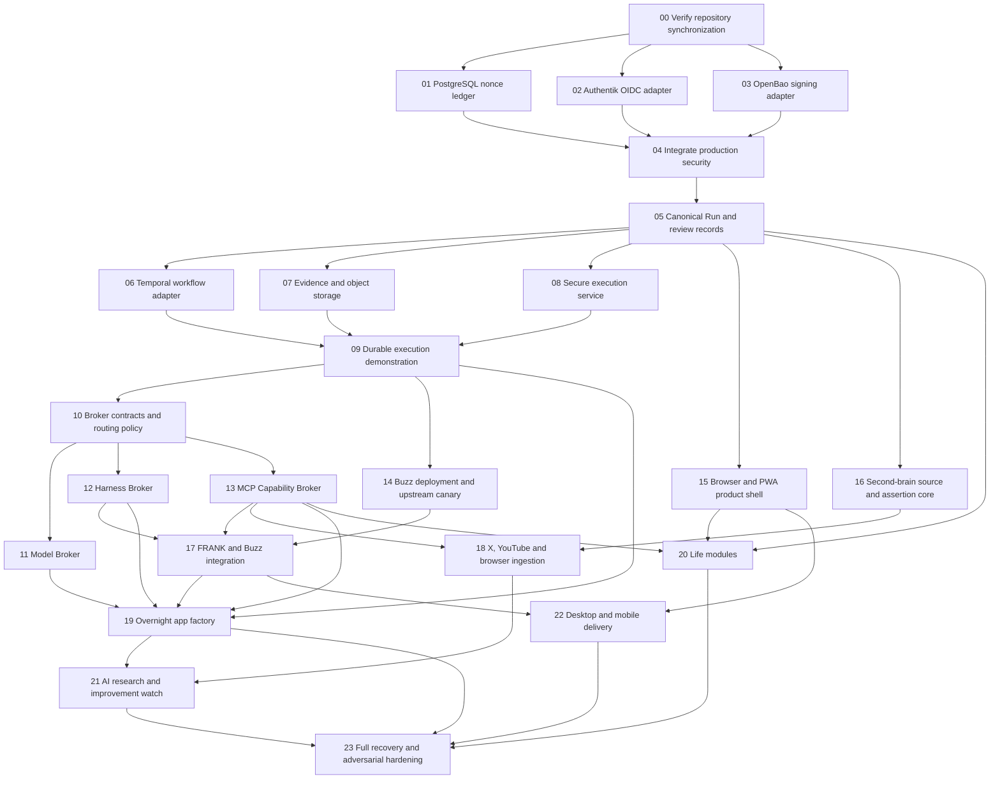

# FRANK Post-Synchronization Build Chunks and Agent Prompts

**Date:** 29 July 2026  
**Starts after:** `FRANK_GITHUB_REPOSITORY_UPDATE_PLAN.md` is complete and green  
**Repository:** `https://github.com/stevenshelley58-afk/frank`  
**Purpose:** Turn the full FRANK build into bounded jobs that low-context coding agents can execute safely.

## 1. The rule that makes parallel work safe

Parallelize independent implementations, not shared decisions.

The following are single-writer surfaces:

- `docs/product/FRANK_COMPLETE_BUILD_PLAN_AND_SPEC.md`
- `docs/requirements/registry.json`
- `packages/contracts/`
- root `package.json` and lockfile
- shared environment schema
- canonical database migration ordering
- `infra/compose/docker-compose.yml`
- API composition root

Only the integration agent may merge or reconcile these surfaces. A parallel agent that needs a shared contract change must describe the requested change in its handoff instead of editing the contract independently.

Every parallel job uses:

- its own branch;
- its own Git worktree or isolated clone;
- a distinct package/service directory;
- no shared development database;
- no production credentials;
- no deployment unless its prompt explicitly authorizes a canary or private service deployment.

Merge parallel branches one at a time. After every merge, run the full required checks before merging the next branch.

## 2. Dependency map



## 3. Parallel execution schedule

| Work group | Run together | Must wait for |
|---|---|---|
| Gate | 00 only | Repository update plan completed |
| Security lane | 01, 02 and 03 | 00 |
| Security integration | 04 only | 01, 02 and 03 merged |
| Durable record authority | 05 only | 04 |
| Execution lane | 06, 07 and 08 | 05 |
| Durable demonstration | 09 only | 06, 07 and 08 merged |
| Broker contract gate | 10 only | 09 |
| Platform lane | 11, 12, 13, 14, 15 and 16 | 10 for 11–13; 09 for 14; 05 for 15–16 |
| Product integration lane | 17, 18, 19 and 20 where their individual prerequisites are green | See dependency map |
| Continuous improvement | 21 | 18 and 19 |
| Client packaging | 22 | stable browser shell and Buzz integration |
| Whole-system hardening | 23 only | all intended FRANK functions above |

Maximum useful concurrency is normally three or four coding agents plus one integration agent. More agents will collide on shared contracts, migrations and infrastructure.

## 4. Standard instructions for every coding agent

Every prompt below includes the task-specific work. The dispatcher must also give every agent these standing instructions:

```text
Repository: stevenshelley58-afk/frank.

Read AGENTS.md, CLAUDE.md if present, README.md, the controlling specification,
the relevant ADRs, the requirement registry, and package-local instructions before editing.
Use the repository's pinned Node and pnpm versions. Never disable or weaken a gate.

Work only on the named chunk. Preserve unrelated user changes. Use a dedicated branch
and worktree. Do not commit secrets, .env files, databases, build output, node_modules,
or local agent state. Do not add an unpinned dependency. Do not deploy unless the task
explicitly says to deploy.

Start by recording the starting commit and inspecting existing implementations. Reuse
existing contracts and conventions. Do not invent a second source of truth. Add or update
requirement traces, tests, documentation and rollback notes. Run focused tests first,
then the repository's full required checks.

Use deterministic checks as the authority. Finish with a commit and report:
starting commit, ending commit, files changed, requirements addressed, migrations,
tests with pass/fail/skip counts, security implications, evidence, limitations,
rollback, and any exact external action still blocked.
```

---

## Chunk 00 — Verify the synchronization gate

**Runs:** Sequentially  
**Depends on:** Existing-repository update work  
**Blocks:** Everything else

### Prompt

```text
Audit whether the FRANK repository synchronization plan is actually complete. Do not add
new product features.

Read docs/product/FRANK_GITHUB_REPOSITORY_UPDATE_PLAN.md and verify every acceptance item
against the repository and GitHub state. Confirm:

1. specification 1.1 is committed and all authority links resolve;
2. the registry discovers normative requirement tables outside section 4;
3. MCP-001–MCP-010 and BUZZ-008–BUZZ-012 exist with honest ownership/status;
4. ADR-008 and ADR-011 contain the revised decisions and history;
5. lint and format gates are real;
6. PostgreSQL integration tests run in CI and cannot silently skip;
7. required GitHub checks protect main;
8. non-development composition rejects local identity, memory-only keys and
   process-only nonce state;
9. pnpm build produces runnable API output and the compiled startup smoke test passes;
10. Buzz and MCP boundary contracts exist without false implementation claims.

Run the clean-checkout verification using the pinned Node and pnpm versions. Inspect the
latest required GitHub workflow. Produce docs/evidence/post-sync-gate.md with exact
evidence and unresolved items.

If an acceptance item is incomplete, fix only small documentation or test-wiring defects.
For material missing implementation, stop feature work, mark the gate failed and provide
the exact corrective task. Do not declare the gate green with skipped tests or unavailable
checks.
```

**Exit gate:** Every item is evidenced and no required check is failing or absent.

---

## Chunk 01 — PostgreSQL-backed nonce ledger

**Runs:** In parallel with 02 and 03  
**Depends on:** 00  
**Must not edit:** Identity or OpenBao adapter packages

### Prompt

```text
Implement FRANK's durable shared SpentNonceLedger using PostgreSQL.

Scope:
- add the canonical migration and repository needed for atomic nonce claiming;
- key every record by cell_id and nonce;
- store envelope hash, retention time and the original policy decision needed for
  idempotent replay;
- use one atomic INSERT ... ON CONFLICT path, never read-then-write;
- preserve conflict semantics when the same nonce arrives with a different envelope;
- make recordDecision concurrency-safe;
- implement bounded sweeping without allowing a retained nonce to become claimable early;
- expose health/metrics without exposing nonce values.

Use the existing SpentNonceLedger port and storage conventions. Do not change the port
unless a proven incompatibility exists; request any shared-contract change in the handoff.

Tests must cover first claim, identical replay, mutated replay, two concurrent claimers,
cross-cell isolation, decision replay, expiry boundary, sweep, database restart and API
process concurrency. Run them against real PostgreSQL with FRANK_REQUIRE_INTEGRATION=1.

Add requirement traces and an operational rollback note. Do not wire the production
composition root; that belongs to Chunk 04.
```

**Exit gate:** Two API processes cannot both accept the same cell/nonce.

---

## Chunk 02 — Authentik OIDC identity adapter

**Runs:** In parallel with 01 and 03  
**Depends on:** 00  
**Must not edit:** Policy nonce or signing implementations

### Prompt

```text
Implement an Authentik-backed OIDC IdentityProvider adapter for FRANK.

Scope:
- use OIDC discovery from an explicitly configured issuer;
- validate issuer, audience, signature, expiry, not-before and allowed algorithms;
- map subject and groups/claims to FRANK principal, role and cell bindings through explicit
  configuration or canonical records;
- never trust a client-supplied cell or role;
- support key rotation and bounded JWKS caching;
- fail closed when discovery, keys, issuer, audience or binding is invalid;
- expose only safe provider health metadata;
- retain LocalSignedSessionProvider for development/test only.

Do not build authorization policy into the identity adapter. It authenticates and resolves
identity; the policy package authorizes actions.

Tests must cover valid session, wrong issuer, wrong audience, expired/not-yet-valid token,
algorithm confusion, unknown key, rotated key, stale JWKS, missing cell binding,
cross-cell claim, disabled principal, group escalation and Authentik outage.

Use a local test issuer or deterministic signed fixtures; never place a real token or
client secret in Git. Add deployment/configuration documentation using secret handles.
Do not wire the production composition root; Chunk 04 owns that integration.
```

**Exit gate:** A token cannot choose its own FRANK cell or privilege.

---

## Chunk 03 — OpenBao-backed signing and key resolution

**Runs:** In parallel with 01 and 02  
**Depends on:** 00  
**Must not edit:** Identity or nonce implementations

### Prompt

```text
Implement the OpenBao-backed key resolver and action-envelope signer for FRANK.

Scope:
- keep raw private/signing key material inside OpenBao;
- FRANK stores and passes opaque key handles only;
- bind signing requests to cell, principal/service, permitted purpose, payload digest,
  policy revision, expiry and idempotency key;
- return the signature plus a non-secret signing receipt;
- support rotation and revocation;
- distinguish retry-safe signing from a conflicting repeated request;
- fail closed on OpenBao outage, revoked handle, wrong purpose, wrong cell or altered digest;
- redact request and response logs.

Use the existing envelope signer/verifier and key-resolver ports where possible. Do not
weaken HMAC development tests. If asymmetric signing is required, add a versioned algorithm
identifier and compatibility fixtures rather than silently changing existing envelopes.

Provide an OpenBao dev-server integration test using disposable credentials generated
during the test. Test wrong cell, wrong purpose, expiry, altered digest, duplicate request,
rotation, revocation, service restart and unavailable OpenBao.

Document policies and secret-engine setup without committing tokens or unseal material.
Do not wire the production composition root; Chunk 04 owns that integration.
```

**Exit gate:** No production process needs access to raw signing keys.

---

## Chunk 04 — Integrate production security composition

**Runs:** Sequentially  
**Depends on:** 01, 02 and 03 merged  
**Blocks:** Canonical Run construction

### Prompt

```text
Integrate the completed PostgreSQL nonce ledger, Authentik OIDC provider and OpenBao signer
into FRANK's non-development composition root.

Do not reimplement the adapters. Resolve integration differences at their ports and keep
development/test composition intact.

Required behavior:
- preview, staging, production and recovery select only durable production adapters;
- configuration contains opaque secret handles, issuer/audience and service endpoints,
  never raw committed secrets;
- startup checks all required dependencies before binding a public port;
- dependency loss produces truthful degraded health and fails closed for affected actions;
- shutdown closes adapter resources in a deterministic order;
- logs redact authorization, keys, tokens, nonces and private content;
- development cannot accidentally point at production OpenBao or Authentik without an
  explicit safety override that is itself forbidden in production.

Add a production-shaped integration test using disposable PostgreSQL, Authentik-compatible
OIDC fixtures and OpenBao. Prove that each development adapter causes startup refusal in
production and that a compliant composition starts and handles one authenticated,
signed, replay-protected request.

Update environment validation, Compose wiring, runbooks, health reporting and evidence.
Run full CI-equivalent checks.
```

**Exit gate:** One production-shaped request authenticates, authorizes, signs and records its nonce without development fallback.

---

## Chunk 05 — Canonical Run, Action, Input, Review and Checkpoint records

**Runs:** Sequentially  
**Depends on:** 04  
**Blocks:** Workflow, evidence, execution and broker work

### Prompt

```text
Implement the canonical durable records that all FRANK agents and workflows share.

Use the controlling specification and existing contracts. Add or complete versioned
contracts, PostgreSQL schema, repositories and domain services for:
- Run and RunAttempt;
- Action;
- Checkpoint;
- InputRequest and InputResponse;
- ReviewDecision bound to actor, artifact digest, policy revision and expiry;
- EffectReceipt and outcome-unknown reconciliation;
- Assignment and artifact references.

Define explicit state machines and allowed transitions. Use compare-and-set/version fields
or equivalent concurrency control. Every row is cell-scoped. Every mutation emits a
transactional outbox event. A protocol task, Buzz event or harness session is a linked
transport record, never the canonical Run.

Tests must cover every legal transition, every illegal transition, duplicate commands,
concurrent updates, restart reconstruction, stale review, wrong actor, altered artifact,
expired input, cancellation/completion races, outcome unknown and cross-cell references.

Do not implement Temporal, Buzz, MCP or a harness in this chunk. Provide ports they can use.
Generate registry traces and migration rollback/recovery instructions.
```

**Exit gate:** A complete Run history can be reconstructed from PostgreSQL and outbox records without harness memory.

---

## Chunk 06 — Temporal workflow adapter

**Runs:** In parallel with 07 and 08  
**Depends on:** 05  
**Must not edit:** Canonical contracts or migrations without integration-owner approval

### Prompt

```text
Implement FRANK's WorkflowPort using Temporal.

Temporal owns durable scheduling, timers, retries, cancellation, compensation, pending
input and recovery orchestration. PostgreSQL remains the canonical FRANK Run record.

Implement:
- workflow start from a canonical Run;
- deterministic activity boundaries;
- heartbeat and checkpoint projection;
- retry policy by error class;
- cancellation and compensation;
- waiting for InputRequest and ReviewDecision signals;
- idempotent reconciliation between Temporal history and Run state;
- worker restart and workflow replay;
- versioning strategy for workflow-code upgrades;
- visibility/search attributes containing IDs but no private content.

Never call provider SDKs directly from workflow code. Activities call stable FRANK ports.
Never rely on wall-clock calls or nondeterministic libraries in workflow definitions.

Tests must cover worker death, API death, Temporal restart, duplicate signal, stale signal,
timer recovery, retry exhaustion, cancellation race, compensation failure, workflow code
upgrade and canonical-state reconciliation.

Use a disposable Temporal test environment. Add runbooks for stuck workflow diagnosis,
safe reset/replay and rollback. Do not implement sandbox execution or evidence storage.
```

**Exit gate:** A waiting or running job survives worker and Temporal service restarts without duplicate effects.

---

## Chunk 07 — Evidence manifests and object storage

**Runs:** In parallel with 06 and 08  
**Depends on:** 05  
**Must not edit:** Workflow or sandbox implementations

### Prompt

```text
Implement FRANK's content-addressed artifact and evidence storage behind ObjectStore and
EvidenceStore ports.

Use the repository's selected object-store deployment. PostgreSQL stores canonical metadata,
relationships, digests, retention and access policy; object storage holds immutable bytes.

Implement:
- streaming upload with digest calculation and size limits;
- content-addressed keys;
- immutable artifact versions;
- EvidenceManifest creation and sealing;
- links to Run, Action, review, source, test and build;
- data-class and cell enforcement;
- pre-signed access with narrow audience and expiry;
- deletion/tombstone and retention semantics;
- verification and corruption detection;
- encrypted backup and restore procedure.

Never put raw artifact content in logs, event payloads or telemetry. Never treat an
unverified uploaded digest as trusted.

Tests must cover altered bytes, duplicate upload, wrong digest, cross-cell access, expired
URL, retention lock, deletion, partial upload, storage outage, metadata/object mismatch,
backup restore and evidence-manifest verification.

Provide a small CLI or test helper that verifies an evidence manifest from a clean checkout.
Do not implement app-building logic in this chunk.
```

**Exit gate:** A sealed evidence pack detects any altered or missing artifact.

---

## Chunk 08 — Secure execution service

**Runs:** In parallel with 06 and 07  
**Depends on:** 05  
**Must not edit:** Workflow or evidence implementations

### Prompt

```text
Implement the SandboxProvider and secure execution service for agent-written code.

Scope:
- isolated workspace per Assignment/RunAttempt;
- dedicated unprivileged identity;
- read-only base image and disposable writable layer;
- CPU, memory, process, disk, network and wall-time limits;
- allowlisted network policy;
- no host Docker socket;
- no production filesystem mounts;
- short-lived scoped credential handles only;
- deterministic command and exit receipts;
- stdout/stderr limits and secret redaction;
- cancellation, cleanup and orphan reconciliation;
- artifact export by digest through the evidence boundary.

Prefer the execution technology already selected in the controlling ADR. If the full
microVM backend cannot run in local CI, implement its production adapter plus a strictly
labelled test backend; production composition must reject the test backend.

Tests must include filesystem escape, symlink escape, process fork bomb, memory/disk limit,
network denial, metadata-service access, secret exfiltration, timeout, cancellation,
service crash, orphan cleanup, malicious archive, artifact digest mismatch and
cross-cell/workspace access.

Do not run generated code on the FRANK API host or CI runner outside the approved test
isolation. Document threat boundaries and emergency kill switch.
```

**Exit gate:** Untrusted code cannot access the host, another workspace, unrestricted network or production secrets.

---

## Chunk 09 — Durable execution demonstration

**Runs:** Sequentially  
**Depends on:** 06, 07 and 08 merged  
**Blocks:** Broker implementation

### Prompt

```text
Integrate Temporal, evidence storage and secure execution into one truthful durable Run
demonstration. Do not add model or harness providers yet.

Create a deterministic test worker/activity that:
1. accepts a build-like request through the existing API;
2. creates a canonical Run and Assignment;
3. executes a fixed repository task in the sandbox;
4. records checkpoints;
5. stores output artifacts;
6. runs deterministic tests;
7. creates and seals an EvidenceManifest;
8. stops at an artifact-bound ReviewDecision;
9. never deploys.

Prove recovery by killing the API, worker and sandbox service at controlled points and
restarting them. Prove retries do not duplicate effects. Prove a stale or altered review
cannot resume the Run.

Add an end-to-end test, operator view/API response and evidence document containing exact
Run IDs, receipts and restart points. Keep all data synthetic.
```

**Exit gate:** A build-shaped Run survives process loss and arrives at review with one sealed evidence pack and no deployment.

---

## Chunk 10 — Broker contracts and routing policy

**Runs:** Sequentially  
**Depends on:** 09  
**Blocks:** Model, harness and capability brokers

### Prompt

```text
Freeze the shared contracts for FRANK's Model Broker, Harness Broker and Capability Broker
before provider implementations begin.

Define or complete versioned contracts for:
- ModelCapability and ModelRoutePolicy;
- ProviderAccount and SubscriptionEntitlement without raw credentials;
- ModelQuote, RouteDecision, UsageReceipt and QualityScore;
- AgentHarnessAdapter capabilities;
- HarnessAssignment, HarnessCheckpoint and normalized HarnessEvent;
- CapabilityServerRegistration and CapabilityCatalogueSnapshot;
- CapabilityGrant, InvocationRequest, InvocationReceipt and outcome reconciliation.

Separate model selection from harness selection. Include data class, region, privacy,
latency, quality, cost, subscription allowance, free-credit reliability, health, budget,
fallback and manual override. A cheap/free provider cannot receive disallowed data merely
because it is cheap.

Define binary conformance fixtures and an adapter certification interface. Do not add
Codex, Claude, Goose, Hermes, LiteLLM or an MCP SDK in this chunk.

Update ADRs/registry only where needed and generate types from the contract source of truth.
Test unknown versions, changed schemas, cross-cell grants, expired routes, budget breach,
provider outage, manual pin and unsafe fallback.
```

**Exit gate:** Three broker implementations can proceed without editing each other’s domain contracts.

---

## Chunk 11 — Model Broker

**Runs:** In parallel with 12, 13, 14, 15 and 16  
**Depends on:** 10  
**Must not edit:** Shared contracts

### Prompt

```text
Implement FRANK's Model Broker against the frozen broker contracts.

Place LiteLLM or the selected provider gateway below FRANK routing policy, not above it.
Implement provider adapters for the initially approved subscriptions and APIs using opaque
credential handles.

Routing must consider capability, measured quality, privacy/data class, location, context
size, latency, health, price, subscription allowance, verified free credits and budget.
Support automatic selection and a manual per-Run override. Record why a route was selected.

Implement circuit breakers, rate limits, retry/fallback rules, cost accounting and
outcome-unknown handling. Never retry a non-idempotent request blindly. Free deals enter a
quarantined provider record until endpoint ownership, terms, limits and security are verified.

Build an eval-backed routing test using deterministic provider doubles plus approved
integration probes. Test outage, price change, quota exhaustion, bad free endpoint,
privacy restriction, degraded quality, manual pin and fallback exhaustion.

Do not implement harness lifecycle or MCP tools. Return normalized usage and route receipts.
```

**Exit gate:** A Run can automatically select or manually pin a safe model and receives a reproducible route receipt.

---

## Chunk 12 — Harness Broker

**Runs:** In parallel with 11, 13, 14, 15 and 16  
**Depends on:** 10 and secure execution from 08  
**Must not edit:** Shared contracts

### Prompt

```text
Implement FRANK's Harness Broker against AgentHarnessAdapter.

Add initial adapters for the harnesses that can be legally and technically automated from
the VPS, prioritizing Codex, Claude Code, Goose and Hermes where their actual capabilities
pass probes. Treat Qoder or other subscription tools according to their automation terms.

Normalize:
- assignment start;
- prompt and steering input;
- streaming events;
- checkpoint/artifact capture;
- cancellation;
- process loss;
- resume capability;
- model/mode selection;
- cost/usage;
- tool receipts.

All harness work runs in the secure execution service. Harnesses receive only FRANK's
Capability Broker endpoint and scoped assignment context. Disable or quarantine native
cron, global memory writes and direct arbitrary MCP access in managed children.

Do not claim cross-harness hidden-state continuation. Resume from canonical Run,
checkpoint, repository and artifacts. Capability-probe each harness/version and store the
result.

Test process death, duplicate assignment, conflicting branch, unsupported resume,
cancellation, direct-tool bypass, model swap and harness swap.
```

**Exit gate:** One canonical Assignment can move between two certified harness adapters without losing durable state or bypassing policy.

---

## Chunk 13 — MCP 2026-07-28 Capability Broker

**Runs:** In parallel with 11, 12, 14, 15 and 16  
**Depends on:** 10  
**Must not edit:** Shared contracts

### Prompt

```text
Implement the FRANK Capability Broker using the committed MCP 2026-07-28 contracts and
conformance fixtures.

The broker is the sole managed MCP edge. Implement:
- stateless requests without initialize, Mcp-Session-Id or sticky routing;
- protocol, method, name, body, _meta and authenticated-principal validation;
- policy-filtered server discovery and catalogue snapshots;
- scoped short-lived credential issuance without raw token passthrough;
- action-boundary and invocation-ledger integration;
- Multi Round-Trip InputRequest handling;
- MCP Task links and restart reconciliation;
- cache scope, TTL and invalidation;
- isolated-origin MCP Apps host grants;
- issuer/audience-bound OAuth/OIDC;
- instrumented legacy compatibility boundary.

Pin the selected Tier-1 SDK and keep it adapter-contained. Do not let SDK types become
canonical domain records.

Run every committed conformance fixture plus live tests against synthetic MCP servers.
Test cross-replica retry, identity confusion, duplicate effect, stale schema, task crash,
input replay, cache poisoning, App sandbox escape and issuer mix-up.
```

**Exit gate:** Two broker replicas handle the same safe retry correctly, and no harness can invoke an ungranted capability.

---

## Chunk 14 — Buzz deployment and upstream canary

**Runs:** In parallel with 11, 12, 13, 15 and 16  
**Depends on:** 09 and completed Buzz boundary documentation  
**May deploy:** Private pinned Buzz and synthetic canary only

### Prompt

```text
Deploy Buzz for FRANK using maintained upstream assets. Do not fork or restyle Buzz.

Create two isolated deployments:
1. private production-shaped Buzz pinned to a reviewed immutable commit/image digest;
2. buzz-upstream-canary following upstream main with synthetic identities and data only.

Use official Compose unless the repository has already standardized on Kubernetes, in
which case use official Helm assets. Put Buzz behind the FRANK edge with TLS, payload and
connection limits, per-identity/room/event rate controls, redacted logs, isolated database
and media volumes, and encrypted off-host backup.

Canary automation must record upstream commit, migrations, dependency/security scan,
identity/signature tests, ACP compatibility, workflow behavior, Git-event behavior,
backup/restore, rate-limit behavior, promotion decision and rollback image.

Production never tracks a moving tag. Canary never receives production credentials or
private content. Document that server operators can read room content unless compatible
end-to-end encryption is later proven.

Perform a restore rehearsal to an isolated target. Do not connect Buzz to FRANK commands
or agents; Chunk 17 owns that boundary.
```

**Exit gate:** Pinned Buzz is recoverable, and upstream changes are tested separately without risking FRANK data.

---

## Chunk 15 — Browser and PWA product shell

**Runs:** In parallel with 11, 12, 13, 14 and 16  
**Depends on:** 05; integrate live execution after 09  
**Must not edit:** Broker implementations

### Prompt

```text
Build the FRANK browser/PWA product shell using the existing design direction: system
fonts, minimal visual noise and complete keyboard/accessibility support.

Implement the durable navigation and shared screen contracts for:
- Today;
- Ask;
- Capture;
- Work and Run detail;
- Reviews and Input Requests;
- Builds and evidence;
- Brain;
- Buzz links/rooms;
- Agents and routing;
- Automations;
- System health, cost and provider status.

Use generated API contracts. No button may imply an agent ran, approval occurred or
deployment shipped unless a canonical receipt confirms it. Show queued, running, waiting,
review-ready, degraded, failed, cancelled and outcome-unknown states.

Build responsive layouts for 360, 390, 768, 1280 and 1600 widths. Meet WCAG 2.2 AA,
keyboard navigation, focus management, reduced motion and safe text rendering.

Use contract-backed mock transport only where APIs are not yet merged, label synthetic
states in developer fixtures and replace mocks during integration. Add component, browser,
accessibility and screenshot tests.
```

**Exit gate:** The complete navigation and truthful Run/review state model works on desktop and mobile browsers without claiming unbuilt behavior.

---

## Chunk 16 — Second-brain source and assertion core

**Runs:** In parallel with 11, 12, 13, 14 and 15  
**Depends on:** 05  
**Must not edit:** Ingestion connector implementations

### Prompt

```text
Implement FRANK's canonical second-brain model without tying truth to a vector or graph
vendor.

Add Source, SourceRevision, Assertion, AssertionSupport, EntityReference, Correction,
Retraction, Collection and MemoryProjection records. Store canonical content/metadata in
PostgreSQL and object storage with cell scope, provenance, rights, data class, timestamps
and immutable source revisions.

Implement:
- extraction pipeline port;
- accepted/rejected assertion lifecycle;
- contradictory assertion representation;
- correction that persists;
- source deletion and derived-assertion retraction;
- PostgreSQL full-text/pgvector baseline projection;
- rebuild-from-canonical projection;
- evaluation interface for Cognee, Graphiti, Mem0 or later engines.

Retrieval must cite sources and distinguish source text, extracted assertion and model
inference. No memory engine may write canonical truth directly.

Test correction, contradiction, deletion, projection rebuild, embedding-version change,
cross-cell retrieval, poisoned source, missing rights metadata and unsupported content.
```

**Exit gate:** Delete or correct a source, rebuild the projection, and receive a cited answer that reflects the change.

---

## Chunk 17 — FRANK/Buzz identity, rooms, projections and assignments

**Runs:** After relevant platform-lane work; can run alongside 18, 19 or 20 only in separate directories  
**Depends on:** 12, 13 and 14  
**Must coordinate with:** Browser agent for shared UI integration

### Prompt

```text
Implement the small frank-buzz boundary using the committed BuzzPort contracts and the
pinned Buzz deployment.

Implement:
- cell-scoped FRANK identity to Nostr/Buzz identity binding;
- room provisioning/linking for projects, Runs and incidents;
- signed event verification and membership-at-event-time checks;
- immutable event references and projection cursors;
- transactional-outbox projection from FRANK to Buzz;
- signed idempotent ingress commands from Buzz to FRANK;
- bounded harness assignments, steering and cancellation;
- outage buffering and replay;
- branch/commit references without changing the authoritative forge.

A Buzz event is an untrusted proposal until FRANK validates actor, key, membership, room,
schema, replay, artifact digest and current policy. A reaction or message is never by
itself an approval or effect receipt. Buzz-native actions are limited to reversible
room-local collaboration.

Test forged/revoked keys, wrong room/cell, removed member, delayed replay, duplicate event,
altered artifact, relay outage, projection rebuild, assignment duplication and direct
capability escalation.

Expose Buzz rooms in the web shell through safe links or supported integration, not a
home-grown room clone.
```

**Exit gate:** A verified Buzz command creates one canonical FRANK action, and an outage loses neither Run state nor projected events.

---

## Chunk 18 — X bookmarks, YouTube history and browser capture

**Runs:** May run in parallel with 19 and 20 after prerequisites  
**Depends on:** 13 and 16  
**Must coordinate with:** Memory schema owner for any requested contract extension

### Prompt

```text
Implement the initial second-brain ingestion connectors through the Capability Broker:
X bookmarks, YouTube viewing/history intake and browser capture.

Use official APIs, user exports or explicit browser capture paths permitted by the service.
Do not scrape around authentication or platform restrictions.

For X bookmarks:
- ingest bookmark identity, URL, author, timestamps and accessible content;
- deduplicate and preserve provenance;
- classify and route useful items into research, project or reference collections.

For YouTube:
- ingest accessible history/export or explicit user-provided video URLs;
- fetch transcripts through permitted sources;
- preserve video/channel/time provenance and transcript rights;
- identify likely child content using configurable evidence;
- quarantine rather than delete uncertain child-content matches;
- generate a sourced wiki entry, summary, assertions and topic/entity links.

For browser capture:
- accept selected page, URL, metadata and optional snapshot;
- defend against prompt injection and unsafe active content.

All ingestion is idempotent, resumable and deletion-aware. Test duplicates, transcript
absence, deleted/private content, rights failure, kid-content uncertainty, malicious page,
connector outage and source retraction.
```

**Exit gate:** A permitted bookmark/video/page becomes a cited, correctable second-brain record and can be fully retracted.

---

## Chunk 19 — Overnight app factory

**Runs:** May run in parallel with 18 and 20 after prerequisites  
**Depends on:** 09, 11, 12, 13 and 17  
**Must coordinate with:** Web agent for build/review screens

### Prompt

```text
Implement FRANK's overnight app-building workflow using canonical Runs, the Model Broker,
Harness Broker, Capability Broker, secure execution and evidence service.

Workflow:
1. intake an idea/issue;
2. produce a requirement and technical plan;
3. create an isolated branch/worktree;
4. assign bounded implementation work;
5. build and test in the sandbox;
6. run deterministic checks;
7. run fresh-context review;
8. run a different-model-family review;
9. run security review;
10. fix within configured bounds and re-run deterministic checks;
11. seal code, test, review, cost, risk and rollback evidence;
12. present the completed result for review;
13. remain undeployed.

Approving a proposal must not start the expensive build. The default is build first in
isolation, then ask Steven to review the completed artifact. Deployment is a separate
artifact-bound action.

Implement budget, deadline, stop condition, checkpoint, cancellation, conflict and
outcome-unknown handling. Do not auto-merge or deploy in this chunk.

Test agent/provider failure, process restart, duplicate job, conflicting branch, failing
tests, reviewer disagreement, budget exhaustion, malicious generated code, stale review
and changed artifact after review.
```

**Exit gate:** An unattended synthetic issue becomes a tested, independently reviewed, sealed change set waiting undeployed for Steven.

---

## Chunk 20 — Calendar, email, contacts, reminders and personal administration

**Runs:** May run in parallel with 18 and 19 after prerequisites  
**Depends on:** 05, 13 and 15  
**Must keep each connector isolated**

### Prompt

```text
Implement FRANK's first life-management modules through stable module and connector ports:
calendar, email, contacts, reminders and recurring personal administration.

Build one module at a time behind a common module contract. Each module declares data
classes, read/write effects, credentials, recurrence, idempotency, confirmation policy,
health and deletion behavior.

Required capabilities:
- unified Today view;
- calendar search, availability, create/update/cancel with conflict protection;
- email search/read/draft and explicit send boundary;
- contact resolution with ambiguity handling;
- reminders and recurring administration through Temporal;
- plain-language review for consequential or ambiguous actions;
- receipts for every external change.

Use the Capability Broker for connector access. Never let an agent use raw OAuth tokens.
Reading does not imply permission to write. Drafting does not imply sending.

Test duplicate external requests, provider timeout, outcome unknown, changed calendar
event, wrong contact, ambiguous recipient, recurrence restart, revoked credential,
cross-cell data and deletion.

Do not place domain-specific business logic in the connector adapter.
```

**Exit gate:** FRANK can plan a day, draft communications and manage reminders while every external write is scoped, idempotent and receipted.

---

## Chunk 21 — AI research, deal monitoring and improvement candidates

**Runs:** Sequentially after ingestion and app factory are reliable  
**Depends on:** 18 and 19  
**May operate unattended:** Research and isolated builds only; never automatic production promotion

### Prompt

```text
Implement FRANK's continuous AI research and improvement system.

Monitor configured official sources for:
- OpenAI, Anthropic, Google, Meta, model providers and major labs;
- MCP, ACP, Buzz, Goose, Hermes and selected dependencies;
- model availability, pricing, quotas, subscriptions and verified free-credit offers;
- security advisories, releases, research and relevant product announcements.

Use feeds/APIs where available and respectful scheduled fetches otherwise. Record source,
publication time, observed time, content digest, licence/terms and confidence. Deduplicate
and distinguish announcements from independent evidence.

For each candidate:
1. map it to FRANK requirements/components;
2. score benefit, cost, privacy, security, maturity, lock-in and migration effort;
3. run capability and price probes where permitted;
4. reject scams, leaked/shared keys and unverifiable deals;
5. create a proposed change;
6. for approved policy classes, let the app factory build the change in isolation;
7. leave it undeployed with evidence for Steven.

Implement daily briefing and change-detection reports. Never execute code copied from a
post without sandboxing and review. Never treat a public API key as safe merely because
it was posted publicly.
```

**Exit gate:** A real source change produces one deduplicated, cited candidate and, where appropriate, an isolated undeployed change set.

---

## Chunk 22 — Desktop shell and mobile delivery

**Runs:** Can overlap late connector work  
**Depends on:** 15 and 17  
**Must preserve:** One browser product and one API contract

### Prompt

```text
Package the stable FRANK browser product for desktop and mobile without creating divergent
applications.

Desktop:
- build the Tauri shell around the web product;
- add only justified native capabilities such as secure local key storage, notifications,
  file selection, protocol links and controlled background presence;
- expose each native capability through a narrow permissioned bridge;
- sign and update through a staged, rollback-capable channel.

Mobile:
- make the PWA installable and complete first;
- support responsive layouts, offline-safe read cache, notifications and deep links where
  platform permissions allow;
- evaluate an iOS wrapper only for capabilities the PWA cannot provide;
- keep App Store packaging separate from server deployment.

Test Windows/macOS/Linux targets selected by the spec, iOS Safari/PWA behavior, Android
browser/PWA behavior, offline transitions, notification denial, lost device, secure-store
failure, malicious deep link and update rollback.

Do not duplicate domain logic or store canonical truth on the client.
```

**Exit gate:** Desktop and mobile users reach the same truthful FRANK state through one product contract.

---

## Chunk 23 — Whole-system recovery, security and adversarial hardening

**Runs:** Sequentially  
**Depends on:** All selected product chunks  
**Blocks:** Declaring FRANK ready for normal unattended operation

### Prompt

```text
Perform a whole-system recovery and adversarial hardening program for FRANK. Diagnose and
fix findings; do not add unrelated features.

Exercise:
- full VPS loss and clean restore;
- PostgreSQL point-in-time recovery;
- object-store restore and evidence verification;
- Temporal recovery/reconciliation;
- OpenBao recovery and key rotation;
- Authentik restore and session invalidation;
- Buzz database/media restore and projection replay;
- broker/provider outage;
- sandbox compromise attempt;
- cross-cell access;
- duplicate and outcome-unknown external effects;
- stale approvals and altered artifacts;
- connector revocation;
- model/harness substitution;
- upstream Buzz rollback;
- dependency and supply-chain compromise.

Run deterministic tests, secret/dependency/container/IaC scans, browser accessibility,
performance/load tests, fresh-context review, different-model-family review and focused
security review. Create signed evidence for exact versions, backups, restore times,
recovery points, failures, fixes, accepted risks and rollback.

No favourable AI review may override a failing deterministic gate. No unresolved Critical
or High finding may remain. Update runbooks so a low-context operator can perform each
recovery using explicit commands without exposing secrets.
```

**Exit gate:** FRANK is restored from clean infrastructure, resumes durable work without duplicate effects, and has no unresolved Critical or High finding.

---

## 5. Integration-agent prompt

Use one integration agent throughout all parallel work groups.

```text
You are the FRANK integration owner. Do not implement a feature assigned to another agent.

For each completed branch:
1. read its handoff and diff;
2. confirm it stayed within assigned files and requirements;
3. reject secrets, unpinned dependencies, fake implementation claims and weakened tests;
4. reconcile requested shared-contract changes centrally;
5. renumber or reorder database migrations safely;
6. merge one branch at a time;
7. run focused tests and then the full clean-checkout verification;
8. update the requirement registry and evidence;
9. record the merged commit and remaining dependency gates.

If two branches made competing architectural decisions, do not blend them. Apply the
controlling spec and ADRs, select one source of truth, document the decision and require
the losing branch to adapt.

At the end of each work group, produce a gate report listing completed chunks, exact
commits, tests, skipped checks, unresolved findings and which next chunks are now unblocked.
```

## 6. Recommended first dispatch

Do not dispatch all 24 chunks at once.

Start with:

1. Chunk 00 by itself.
2. When it is green, dispatch Chunks 01, 02 and 03 in three isolated worktrees.
3. Keep one integration agent available.
4. Merge and verify those branches one at a time.
5. Run Chunk 04 by itself.

That first dispatch creates the secure production foundation. Only then should the durable Run records and autonomous execution machinery begin.
